# OADP 1.2 Deep Dive

1. [Introduction](#introduction)
2. [Install and configure awscli](#install-and-configure-awscli)
3. [Installing the OADP operator](#installing-the-oadp-operator)
4. [Enable CSI snapshot feature](#enable-csi-snapshot-feature)
5. [Enabling the Data Mover feature](#enabling-the-data-mover-feature)
   1. [Data Mover backup process](#data-mover-backup-process)
   2. [Data Mover restore process](#data-mover-restore-process)
   3. [Data Mover installation](#data-mover-installation)
6. [Deploying DPA (Data Protection Application)](#deploying-dpa-data-protection-application)
   1. [Using AWS S3](#using-aws-s3)
   2. [Using Ceph RadosGW in ODF](#using-ceph-radosgw-in-odf)
   3. [Using external Ceph RadosGW](#using-external-ceph-radosgw)
   4. [Using MultiCloud Gateway (NooBaa)](#using-multicloud-gateway-noobaa)
7. [Install and configure s3cmd](#install-and-configure-s3cmd)
8. [OADP backup/restore examples](#oadp-backuprestore-examples)
   1. [Stateless application (nginx)](#stateless-application-nginx)
   2. [Stateful application (mysql)](#stateful-application-mysql)
9. [How OADP stores my backups?](#how-oadp-stores-my-backups)
10. [Ensuring a consistent state when backing up our workloads](#ensuring-a-consistent-state-when-backing-up-our-workloads)
    1. [Ensuring a consistent state when backing up MySQL workloads](#ensuring-a-consistent-state-when-backing-up-mysql-workloads)
    2. [Ensuring a consistent state when backing up MariaDB workloads](#ensuring-a-consistent-state-when-backing-up-mariadb-workloads)
    3. [Ensuring a consistent state when backing up PostgreSQL workloads](#ensuring-a-consistent-state-when-backing-up-postgresql-workloads)
    4. [Ensuring a consistent state when backing up MongoDB workloads](#ensuring-a-consistent-state-when-backing-up-mongodb-workloads)
    5. [Ensuring a consistent state when backing up ODF MultiCloud Gateway](#ensuring-a-consistent-state-when-backing-up-odf-multicloud-gateway)
11. [Restore granularity](#restore-granularity)
12. [Restore our backup in another namespace](#restore-our-backup-in-another-namespace)
13. [When to enable restic](#when-to-enable-restic)
14. [Backup of RWO PVCs (using RBD) with big files](#backup-of-rwo-pvcs-using-rbd-with-big-files)
    1. [Backup using CSI snapshots: One 10GB file](#backup-using-csi-snapshots-one-10gb-file)
    2. [Backup using CSI snapshots: Five 10GB file](#backup-using-csi-snapshots-five-10gb-file)
    3. [Backup using CSI snapshots: Ten 10GB file](#backup-using-csi-snapshots-ten-10gb-file)
    4. [Backup using restic: One 10GB file](#backup-using-restic-one-10gb-file)
    5. [Backup using restic: Five 10GB file](#backup-using-restic-five-10gb-file)
    6. [Backup using restic: Ten 10GB file](#backup-using-restic-ten-10gb-file)
    7. [Time comparison (RBD)](#time-comparison-rbd)
15. [OpenShift/K8s quota regarding CSI snapshots](#openshiftk8s-quota-regarding-csi-snapshots)
    1. [Does volumeSnapshot compute for storage quota?](#does-volumesnapshot-compute-for-storage-quota)
    2. [Is it possible to create resource quotas regarding volumeSnapshot?](#is-it-possible-to-create-resource-quotas-regarding-volumesnapshot)
16. [Executing backups and restores with multiple PVs](#executing-backups-and-restores-with-multiple-pvs)
17. [Schedule backups](#schedule-backups)
18. [Deleting backups](#deleting-backups)
19. [Deleting our backups automatically (setting TTL)](#deleting-our-backups-automatically-setting-ttl)
20. [Backup of RWX PVCs (using CephFS) with millions of files](#backup-of-rwx-pvcs-using-cephfs-with-millions-of-files)
    1. [Backup using CSI snapshots: One million files](#backup-using-csi-snapshots-one-million-files)
    2. [Backup using restic: One million files](#backup-using-restic-one-million-files)
    3. [Backup using restic: Five million files](#backup-using-restic-five-million-files)
    4. [Backup using restic: Ten million files](#backup-using-restic-ten-million-files)
    5. [Time comparison (CephFS)](#time-comparison-cephfs)
21. [Incremental backups](#incremental-backups)
    1. [Incremental backups using CSI snapshots and the Data Mover](#incremental-backups-using-csi-snapshots-and-the-data-mover)
    2. [Incremental backups using Restic](#incremental-backups-using-restic)
22. [Backup of ObjectBucketClaim](#backup-of-objectbucketclaim)
    1. [Backup of OBCs using OADP](#backup-of-obcs-using-oadp)
    2. [Ceph RadosGW archive zone](#ceph-radosgw-archive-zone)
    3. [Ceph archival to AWS S3](#ceph-archival-to-aws-s3)
    4. [MCG (NooBaa) replication](#mcg-noobaa-replication)
    5. [Backing up S3 buckets using rclone](#backing-up-s3-buckets-using-rclone)
23. [Backup of OpenShift workloads when working with the LVM Storage Operator](#backup-of-openshift-workloads-when-working-with-the-lvm-storage-operator)
    1. [Using CSI snapshots and Data Mover](#using-csi-snapshots-and-data-mover)
    2. [Using restic](#using-restic)
24. [Restoring our backups to another OpenShift cluster](#restoring-our-backups-to-another-openshift-cluster)
25. [Monitoring backups/restores in OpenShift](#monitoring-backupsrestores-in-openshift)


# Introduction

One of the current problems we are observing in our ODF environments is the fact that we cannot backup our current workloads. Red Hat since OpenShift 4.6 version provides a new framework called OADP to glanularly backup applications that covers cluster metadata and application persistent data.

The OADP operator uses different K8s components such as:
* Velero.
* Restic.
* OpenShift Backup/Restore Plugins.
* ODF Storage Plugins to perform snapshots (ODF is already installed in the cluster).

In this procedure we are going to focus in the following items:
* Install the OADP operator in OpenShift/ODF 4.10.
* Configure the OADP operator to store the backups using a Ceph Object Storage endpoint (S3).
* Prepare a configuration to backup a single namespace.
* Prepare a configuration to restore a single namespace.

Here are the versions of the different components we are using in this document:

| **Product** | **Version** |
|:-----------:|:-----------:|
| OpenShift   | 4.12.21     |
| ODF         | 4.12.4      |
| OADP        | 1.2.0       |
| Velero      | v1.11.0-OADP|
| Restic      | 0.15.0      |

**NOTE:** Please be aware that currently OADP has no plans to enable a user interface for end users for Data Protection. The operator was originally meant to be used by backup partners and these partners provides enterprise support through separate channels.  If a customer would like to use OADP and leverage a partner's UI, we suggest using [CloudCasa](https://cloudcasa.io/assets/CloudCasa-Red-Hat-OADP-datasheet.pdf).  Although end users can use OADP as a basic backup provider, there are several common backup traditional features not implemented yet.  More info in the [official documentation](https://docs.openshift.com/container-platform/4.12/backup_and_restore/application_backup_and_restore/installing/installing-oadp-ocs.html)

In this document we are going to use the Data Mover feature (which is in Tech Preview in OADP 1.1 and 1.2) to be able to export the ODF snapshots to an external location. In OADP 1.2 the Data Mover feature has been reimplemented for performance and on average the new Data Mover should perform 3-5 times faster than the Data Mover in OADP 1.1.

**NOTE:** In OADP 1.2 Data Mover `VolumeSnapshotBackups` (VSBs) and `VolumeSnapshotRestores` (VSRs) are queued using the `VolumeSnapshotMover` (VSM). The VSM's performance is improved, by specifying a concurrent number of VSBs and VSRs simultaneously in progress. After all async plugin operations are completed, the backup is marked as completed.

We recommend to explore the following articles written by Daniel Parkes to have an overview on how the new Data Mover feature works:

* [OADP v1.1. Backup and Restore an Application with the new Data Mover Feature](https://source.redhat.com/communities/communities_of_practice/infrastructure/storage_cop/storage_community_of_practice_blog/oadpv11_backup_and_restore_an_application_with_the_new_datamover_feature)
* [OADP Data Mover Backup Workflow](https://cloud.redhat.com/blog/an-overview-of-data-mover)
* [Additional OADP blog posts](https://cloud.redhat.com/blog/search-results?term=oadp)

Also, in the following [KCS](https://access.redhat.com/articles/5456281) you can find very useful information regarding OADP.

For a deeper insight on how Data Mover has been improved on OADP 1.2, I recommend this [presentation](https://docs.google.com/presentation/d/17S6wkyu0Kr6pLeMFrX4hqLMvwKWRhh210OE_scUnOts/edit?usp=sharing).

Finally, I have also created a [presentation](https://docs.google.com/presentation/d/1ZJKVcRbsGblia0SAjEW-lvcgK6i2sDytmck3g5LRFZQ/edit?usp=sharing) as a summary of all the testing in this document.

# Install and configure awscli

As sometimes we need to interact with AWS S3 endpoints (for example, for creating backup targets for OADP), we can install the `awscli` tool. We recommend to use `virtualenvs` as we are using `pip` to install the tool.

**NOTE:** `awscli` is not provided by Red Hat, thus you cannot install it as an official RPM package.

Install the `python3-virtualenv` RPM package:

**NOTE:** The `python3-virtualenv` RPM package is on the `rhel-8-for-x86_64-appstream-rpms` repo.

```
$ sudo dnf install -y python3-virtualenv
```

Create the target directory for the virtual environment:

```
$ mkdir -p ~/virtualenvs/awscli && cd ~/virtualenvs/awscli
```

Create the python virtual environment and load the configuration:

```
$ virtualenv -p python .virtualenv
$ source .virtualenv/bin/activate
```

Using `pip` install the `awscli` tool:

```
$ pip install awscli
```

Finally, configure the `awscli` tool with your credentials and your personal settings:

```
$ aws configure
AWS Access Key ID [None]: AK***VQ
AWS Secret Access Key [None]: U2***UB
Default region name [None]: us-east-2
Default output format [None]:
```

**TIP:** If you need to get (as a cluster-admin) your AWS S3 credentials from the OpenShift cluster you can use the following commands:

```
$ oc -n kube-system get secrets aws-creds -o go-template='{{.data.aws_access_key_id | base64decode }}'
$ oc -n kube-system get secrets aws-creds -o go-template='{{.data.aws_secret_access_key | base64decode }}'
$ oc -n kube-system get cm/cluster-config-v1 -o 'jsonpath={.data.install-config}' | grep region
```

Finally, verify everything is working properly:

```
$ aws s3 ls
```

# Installing the OADP operator

Our first task is to install OADP in a fresh OpenShift cluster. Currently, the OADP operator is located in the redhat-operators `OperatorSource`.

**NOTE:** We need to install the OADP operator as a cluster-admin

The first step is to install OADP using the OperatorHub:

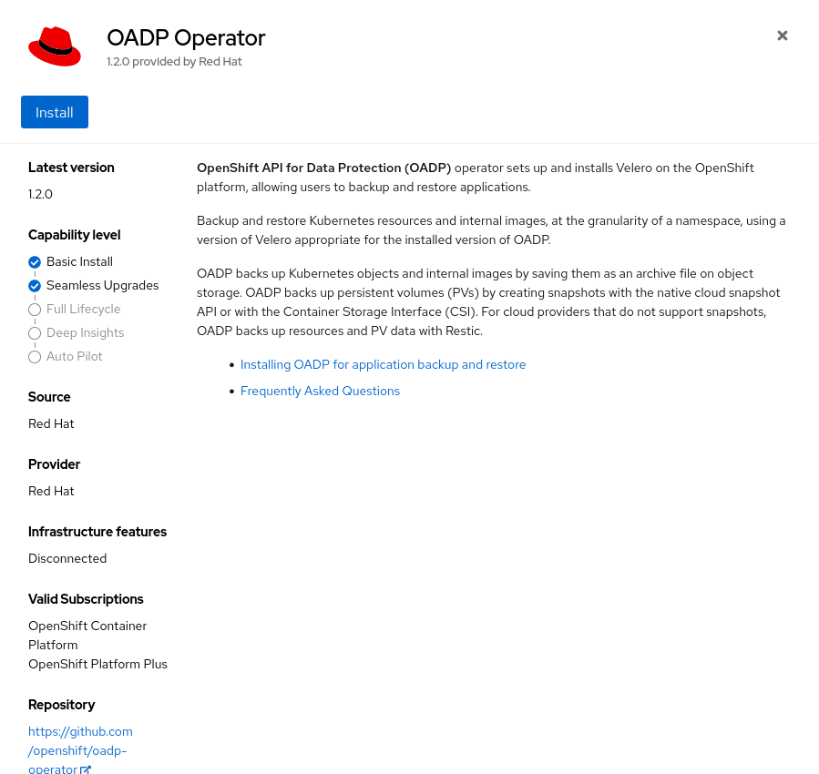

In the following page we are being asked about some details to install OADP:

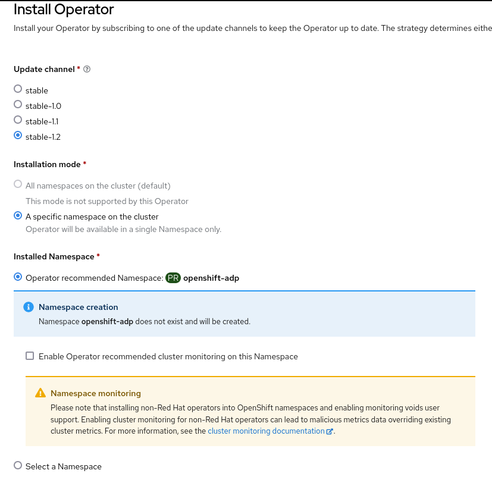

**NOTE:** If the namespace `openshift-adp` does not exist, it will be created.

Verify the OADP operator has been successfully installed:

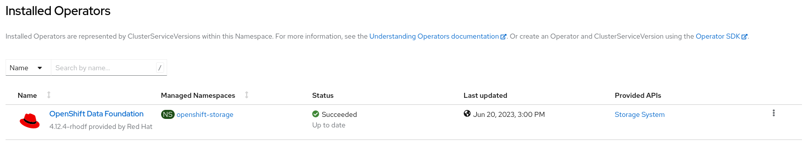

# Enable CSI snapshot feature

In order to enable CSI snapshot feature, we need to label our current `volumeSnapshotClass`. As we are using ODF, we have two different `volumeSnapshotClass` deployed, one for RBD volumes and the other one for CephFS volumes:

```
$ oc get volumesnapshotclass
NAME                                        DRIVER                                  DELETIONPOLICY   AGE
ocs-storagecluster-cephfsplugin-snapclass   openshift-storage.cephfs.csi.ceph.com   Delete           3m32s
ocs-storagecluster-rbdplugin-snapclass      openshift-storage.rbd.csi.ceph.com      Delete           3m32s
```

If we would like to use the CSI snapshot feature with velero, we need to label them before triggering any backup:

```
$ oc label VolumeSnapshotClass ocs-storagecluster-rbdplugin-snapclass velero.io/csi-volumesnapshot-class=true
$ oc label VolumeSnapshotClass ocs-storagecluster-cephfsplugin-snapclass velero.io/csi-volumesnapshot-class=true
```

Ensure the `volumeSnapshotClass` has been properly labeled before installing velero:

```
$ oc get volumesnapshotclass --show-labels
NAME                                        DRIVER                                  DELETIONPOLICY   AGE     LABELS
ocs-storagecluster-cephfsplugin-snapclass   openshift-storage.cephfs.csi.ceph.com   Delete           5m11s   velero.io/csi-volumesnapshot-class=true
ocs-storagecluster-rbdplugin-snapclass      openshift-storage.rbd.csi.ceph.com      Delete           5m11s   velero.io/csi-volumesnapshot-class=true
```


If we would like to preserve our CSI snapshots even if the namespace is deleted, we need to change the `deletionPolicy` parameter in our `volumeSnapshotClass`:

**NOTE:** This is valid for OADP 1.0, but since we are using the Data Mover, all our data is transfered to the external object storage location.

```
$ oc patch volumesnapshotclass ocs-storagecluster-rbdplugin-snapclass -p '{"deletionPolicy":"Retain"}' --type merge
$ oc patch volumesnapshotclass ocs-storagecluster-cephfsplugin-snapclass -p '{"deletionPolicy":"Retain"}' --type merge
$ oc get volumesnapshotclass 
NAME                                        DRIVER                                  DELETIONPOLICY   AGE
ocs-storagecluster-cephfsplugin-snapclass   openshift-storage.cephfs.csi.ceph.com   Retain           5m53s
ocs-storagecluster-rbdplugin-snapclass      openshift-storage.rbd.csi.ceph.com      Retain           5m53s
```

# Enabling the Data Mover feature

The Data Mover feature provides portability and durability of CSI volume snapshots by relocating snapshots into an object storage location during backup of a stateful application. These snapshots are then available for restore during instances of disaster scenarios. Remember that the Data Mover feature still on Tech Preview in OADP 1.1 and 1.2.

From this excellent [blog](https://cloud.redhat.com/blog/an-overview-of-data-mover) from Shubham Pampattiwar, Emily McMullan, Hiteshwari Patel and Wes Hayutin we can have an overview of the backup and restore workflows.

## Data Mover backup process

When velero backup is triggered, a snapshot of the application volume is created, followed by the associated `VolumeSnapshotContent` (VSC). This leads to the creation of a `VolumeSnapshotBackup` (VSB) per VSC, which triggers the Data Mover process as the `VolumeSnapshotMover` (VSM) controller begins reconciliation on these VSB instances.

During the Data Mover process, the `VolumeSnapshotMover` first validates the VSB and then clones the VSC, followed by VS, and PVC to the protected namespace (default: `openshift-adp`). The VSM controller uses the cloned PVC as the source PVC and creates a VolSync `ReplicationSource` CR. VolSync then performs reconciliation on the `ReplicationSource` CR.

Subsequently, VolSync initiates the transfer of data from the cluster to the target Remote Storage. Once the backup is completed, the VSB and VSC are transferred to S3 for the restore process. Finally, the VSM controller deletes all the extraneous resources that were created during the Data Mover backup process.

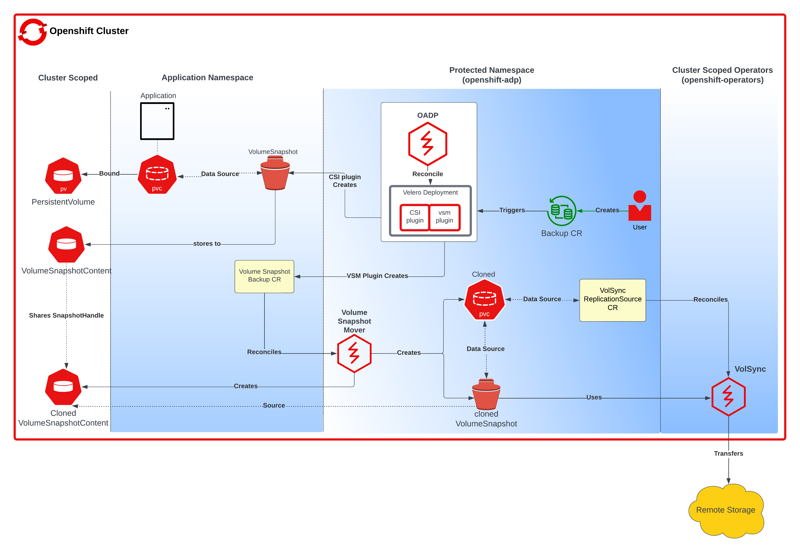

## Data Mover restore process

When velero restore is triggered, the Data Mover search for the VSB CR and the VSM plugin generates a VSR CR. The VSM controller then begins to reconcile on the VSR CR. Furthermore, the VSM controller creates a VolSync `ReplicationDestination` CR in the OADP Operator namespace, which facilitates the recovery of the `VolumeSnapshot` stored in the object storage location during the backup.

After the completion of the VolSync restore step, the Velero restore process continues as usual. However, the CSI plugin utilizes the `snapHandle` of the VolSync `VolumeSnapshot` as the data source for its corresponding PVC.

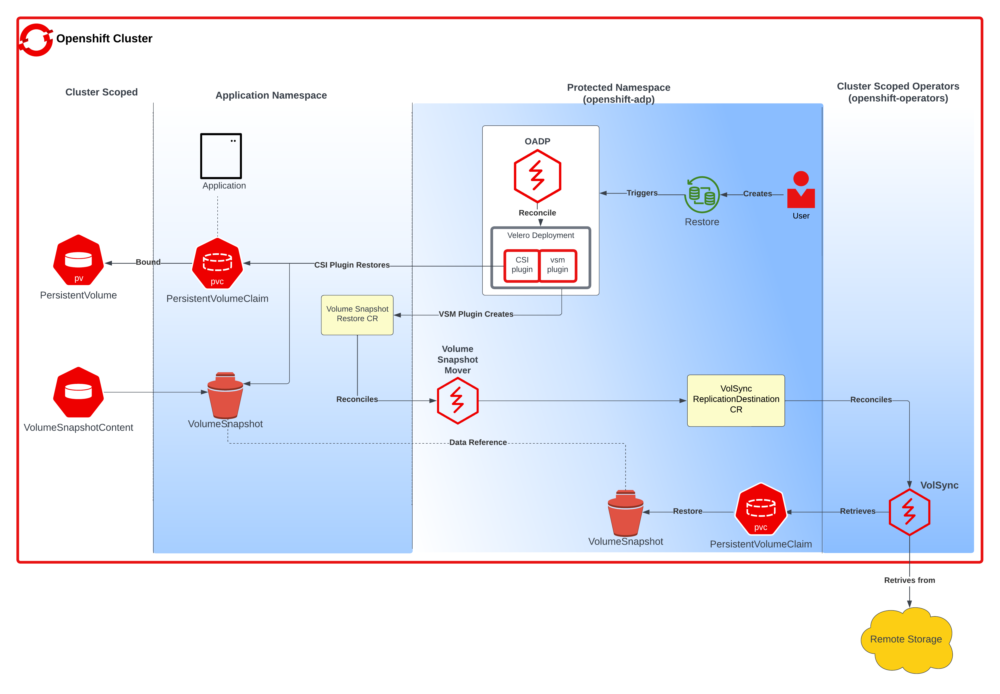

## Data Mover installation

When enabling the Data Mover feature, we need to install the Volsync operator as a dependency of OADP.

First, install the Volsync operator:

```
$ cat << EOF > ~/volsync-operator.yaml
apiVersion: operators.coreos.com/v1alpha1
kind: Subscription
metadata:
  name: volsync-product
  namespace: openshift-operators
spec:
  channel: stable
  installPlanApproval: Automatic
  name: volsync-product
  source: redhat-operators
  sourceNamespace: openshift-marketplace
EOF
$ oc create -f ~/volsync-operator.yaml
```

Verify the Volsync operator has been installed successfully in the `openshift-adp` namespace:

```
$ oc -n openshift-adp get csv
NAME                                    DISPLAY         VERSION                REPLACES                 PHASE
NAME                     DISPLAY         VERSION   REPLACES                 PHASE
oadp-operator.v1.2.0     OADP Operator   1.2.0                              Succeeded
volsync-product.v0.7.2   VolSync         0.7.2     volsync-product.v0.7.1   Succeeded
```

Once we have installed the Volsync operator, we need to create the Restic repository that contains the restic repo encryption password. By default OADP looks for a secret with the `dm-restic-secret` name:

```
$ cat << EOF > ~/restic-secret.yaml
apiVersion: v1
kind: Secret
metadata:
  name: dm-restic-secret
  namespace: openshift-adp
type: Opaque
stringData:
  # The repository encryption key
  RESTIC_PASSWORD: 'redhat'
EOF
$ oc create -f ~/restic-secret.yaml
```

Since OADP 1.2 the following parameters can be configured on our DPA:
* `.spec.features.dataMover.maxConcurrentBackupVolume`: User can customize number of concurrent queues for backup operations.
* `.spec.features.dataMover.maxConcurrentRestoreVolumes`: User can customize number of concurrent queues for restore operations.
* `.spec.features.dataMover.pruneInterval`: Defines how often to prune the snapshots from the restic repository.
* `.spec.features.dataMover.volumeOptions`: Allow custom accessModes, storageClassName used by Data Mover.

# Deploying DPA (Data Protection Application)

## Using AWS S3

First Cloud Provider we have prepared is AWS. The first task to do is locate our AWS credentials and store it in a file:

```
$ cat << EOF > ~/aws-velero-credentials.txt
[default]
aws_access_key_id=AWS_ACCESS_KEY_ID
aws_secret_access_key=AWS_SECRET_ACCESS_KEY
EOF
```

Next thing we need to do is to create a bucket using the `aws cli`:

```
$ aws s3 mb s3://ddomingu-oadp
make_bucket: ddomingu-oadp
```

Now we can create the `cloud-credentials` secret in the `openshift-adp` namespace:

```
$ oc -n openshift-adp create secret generic cloud-credentials --from-file cloud=~/aws-velero-credentials.txt
```

Finally, we can create the Data Protection Application (DPA) resource using an AWS S3 endpoint using the following information:

```
$ cat << EOF > ~/dpa.yaml
apiVersion: oadp.openshift.io/v1alpha1
kind: DataProtectionApplication
metadata:
  name: velero-dpa
  namespace: openshift-adp
spec:
  features:
    dataMover:
      credentialName: dm-restic-secret
      enable: true
      maxConcurrentBackupVolumes: "4"
      maxConcurrentRestoreVolumes: "4"
      pruneInterval: "1"
  configuration:
    velero:
      defaultPlugins:
        - aws
        - openshift
        - csi
        - vsm
    restic:
      enable: true 
  backupLocations:
    - velero:
        config:
          profile: "default"
          region: us-east-2
        provider: aws
        default: true
        credential:
          key: cloud
          name: cloud-credentials 
        objectStorage:
          bucket: ddomingu-oadp
          prefix: velero
EOF
$ oc create -f ~/dpa.yaml
```

Once the DPA is created, we should have different pods in the `openshift-adp` namespace:

* The `volume-snapshot-mover` pod will be available only when the Data Mover feature is enabled.
* The `restic` (or node-agent in OADP 1.2) pods will be available only when the Restic feature is enabled.

```
$ oc -n openshift-adp get pods
NAME                                                READY   STATUS    RESTARTS   AGE
node-agent-mwp5m                                    1/1     Running   0          94s
node-agent-pplwk                                    1/1     Running   0          94s
node-agent-tlptn                                    1/1     Running   0          94s
openshift-adp-controller-manager-76ddf8c5d5-mfd45   1/1     Running   2          46h
velero-868b8b7dc4-mwsgn                             1/1     Running   0          94s
volume-snapshot-mover-65df5f7c74-7qpz8              1/1     Running   0          94s
```

We need to verify that DPA resource `BackupStorageLocation` is set properly:

```
$ oc -n openshift-adp get backupstoragelocation
NAME           PHASE       LAST VALIDATED   AGE     DEFAULT
velero-dpa-1   Available   7s               2m44s   true
```

So, what we currently have in our configuration is:
* BackupStorageLocation: Is located in an S3 bucket provided by AWS. In our case the bucket name is `ddomingu-oadp`.

## Using Ceph RadosGW in ODF 

**NOTE:** Storing our backups in the same cluster as our data is a really bad idea. This is only useful for demo or PoC purposes.

If we are using Ceph RadosGW (deployed in ODF) as our Object/S3 Cloud Provider, we need to perform the following steps:

First thing we need to do is getting the S3 route:

**NOTE:** We can use the external route provided by OpenShift or the internal service. As OADP is connecting from the same OpenShift cluster, if we use the internal service we optimize network connectivity as we do not have to connect to the external endpoint.

```
$ oc -n openshift-storage get route ocs-storagecluster-cephobjectstore -o go-template --template='{{.spec.host}}'
ocs-storagecluster-cephobjectstore-openshift-storage.apps.cluster-7ffkw.dynamic.opentlc.com
```

**NOTE:** If ODF Ceph RadosGW is not exposed already we can execute the following command:

```
$ oc -n openshift-storage expose svc/rook-ceph-rgw-ocs-storagecluster-cephobjectstore --hostname s3-rgw.apps.cluster-7ffkw.dynamic.opentlc.com
```

Provision a new S3 bucket using the `ObjectBucketClaim` template:

**NOTE:** S3 bucket names must be unique.

* If we use the `bucketName` directive we must ensure the bucket name is unique.
* If we use the `generateBucketName` directive the value becomes the prefix for a randomly generated name.

```
$ cat << EOF > ~/oadp-obc.yaml
apiVersion: objectbucket.io/v1alpha1
kind: ObjectBucketClaim
metadata:
  name: oadp-s3-bucket
  namespace: openshift-adp
spec:
  bucketName: oadp-s3-bucket
  storageClassName: ocs-storagecluster-ceph-rgw
EOF
$ oc create -f ~/oadp-obc.yaml
```

To get the bucket name for a given `ObjectBucketClaim`:

```
$ oc -n openshift-adp get obc oadp-s3-bucket -o yaml -o go-template --template='{{.spec.bucketName}}'
oadp-s3-bucket
```

Finally, get the Ceph RadosGW S3 credentials (Access Key and Secret Key) from the `ObjectBucketClaim` secret:

**NOTE:** Remember to base64 decode the S3 credentials

```
$ oc -n openshift-adp get secrets oadp-s3-bucket -o go-template --template='{{.data.AWS_ACCESS_KEY_ID}}' | base64 -d
$ oc -n openshift-adp get secrets oadp-s3-bucket -o go-template --template='{{.data.AWS_SECRET_ACCESS_KEY}}' | base64 -d
```

Create a credentials file with the data we have obtained previously:

```
$ cat << EOF > ~/aws-velero-credentials.txt
[default]
aws_access_key_id=AWS_ACCESS_KEY_ID
aws_secret_access_key=AWS_SECRET_ACCESS_KEY
EOF
```

Now we can create the `cloud-credentials` secret in the `openshift-adp` namespace:

```
$ oc -n openshift-adp create secret generic cloud-credentials --from-file cloud=~/aws-velero-credentials.txt
```

Finally, we can create the Data Protection Application (DPA) resource with Ceph RadosGW (deployed in ODF) using the following information:

```
$ cat << EOF > ~/dpa.yaml
apiVersion: oadp.openshift.io/v1alpha1
kind: DataProtectionApplication
metadata:
  name: velero-dpa
  namespace: openshift-adp
spec:
  features:
    dataMover:
      credentialName: dm-restic-secret
      enable: true
      maxConcurrentBackupVolumes: "4"
      maxConcurrentRestoreVolumes: "4"
      pruneInterval: "1"
  configuration:
    velero:
      defaultPlugins:
        - aws
        - openshift 
        - csi
        - vsm
    restic:
      enable: true 
  backupLocations:
    - velero:
        config:
          profile: "default"
          region: rgw
          s3Url: http://ocs-storagecluster-cephobjectstore-openshift-storage.apps.cluster-7ffkw.dynamic.opentlc.com
          s3ForcePathStyle: "true"
        provider: aws
        default: true
        credential:
          key: cloud
          name: cloud-credentials 
        objectStorage:
          bucket: oadp-s3-bucket
          prefix: velero
EOF
$ oc create -f ~/dpa.yaml
```

Once the DPA is created, we should have different pods in the `openshift-adp` namespace:

* The `volume-snapshot-mover` pod will be available only when the Data Mover feature is enabled.
* The `restic` (or node-agent in OADP 1.2) pods will be available only when the Restic feature is enabled.

```
$ oc -n openshift-adp get pods
NAME                                              READY   STATUS    RESTARTS   AGE
openshift-adp-controller-manager-76445df88c-6drwq   1/1     Running   0          31m
restic-626h4                                        1/1     Running   0          11m
restic-c824v                                        1/1     Running   0          11m
restic-hg7tv                                        1/1     Running   0          11m
velero-66d69b4699-sc6w7                             1/1     Running   0          11m
volume-snapshot-mover-5cc4c7c6f6-tgtgp              1/1     Running   0          11m
```

We need to verify that DPA resource `BackupStorageLocation` is set properly:

```
$ oc -n openshift-adp get backupstoragelocation
NAME           PHASE       LAST VALIDATED   AGE     DEFAULT
velero-dpa-1   Available   37s              12m   true
```

So, what we currently have in our configuration is:
* BackupStorageLocation: Is located in an S3 bucket provided by ODF Ceph RadosGW. In our case the bucket name is `oadp-s3-bucket`.

## Using external Ceph RadosGW

If we would like to use an external Ceph RadosGW as our Object/S3 Cloud Provider, we need to perform the following steps:

**NOTE:** Request the following info to Ceph administrators:

* **Access key:** 1K5***T17
* **Secret key:** oPC***UTD
* **Ceph RadosGW endpoint:** http://s3-rgw.apps.cluster-7ffkw.dynamic.opentlc.com
* **Bucket name:** oadp-s3-bucket-external

Create a credentials file with the data we have obtained previously:

```
$ cat << EOF > ~/aws-velero-credentials.txt
[default]
aws_access_key_id=AWS_ACCESS_KEY_ID
aws_secret_access_key=AWS_SECRET_ACCESS_KEY
EOF
```

Now we can create the `cloud-credentials` secret in the `openshift-adp` namespace:

```
$ oc -n openshift-adp create secret generic cloud-credentials --from-file cloud=~/aws-velero-credentials.txt
secret/cloud-credentials created
```

Finally, we can create the Data Protection Application (DPA) resource with Ceph external RadosGW using the following information:

```
$ cat << EOF > ~/dpa.yaml
apiVersion: oadp.openshift.io/v1alpha1
kind: DataProtectionApplication
metadata:
  name: velero-dpa
  namespace: openshift-adp
spec:
  features:
    dataMover:
      credentialName: dm-restic-secret
      enable: true
      maxConcurrentBackupVolumes: "4"
      maxConcurrentRestoreVolumes: "4"
      pruneInterval: "1"
  configuration:
    velero:
      defaultPlugins:
        - aws
        - openshift 
        - csi
        - vsm
    restic:
      enable: true 
  backupLocations:
    - velero:
        config:
          profile: "default"
          region: rgw
          s3Url: http://s3-rgw.apps.cluster-7ffkw.dynamic.opentlc.com
          s3ForcePathStyle: "true"
        provider: aws
        default: true
        credential:
          key: cloud
          name: cloud-credentials 
        objectStorage:
          bucket: oadp-s3-bucket-external
          prefix: velero
EOF
$ oc create -f ~/dpa.yaml
```

Once the DPA is created, we should have different pods in the openshift-adp namespace:

* The `volume-snapshot-mover` pod will be available only when the Data Mover feature is enabled.
* The `restic` (or node-agent in OADP 1.2) pods will be available only when the Restic feature is enabled.

```
$ oc -n openshift-adp get pods
NAME                                              READY   STATUS    RESTARTS   AGE
openshift-adp-controller-manager-7cd9c9d-tbvl7   1/1     Running   0          42m
restic-2jprc                                     1/1     Running   0          86s
restic-c5sjt                                     1/1     Running   0          86s
restic-qc48w                                     1/1     Running   0          86s
velero-66d69b4699-nhmjd                          1/1     Running   0          86s
volume-snapshot-mover-5cc4c7c6f6-5hk2w           1/1     Running   0          86s
```

We need to verify that DPA resource `BackupStorageLocation` is set properly:

```
$ oc -n openshift-adp get backupstoragelocation
NAME           PHASE       LAST VALIDATED   AGE     DEFAULT
velero-dpa-1   Available   16s              117s   true
```

So, what we currently have in our configuration is:
* BackupStorageLocation: Is located in an S3 bucket provided by an external Ceph RadosGW. In our case the bucket name is `oadp-s3-bucket-external`.

## Using MultiCloud Gateway (NooBaa)

**NOTE:** Storing our backups in the same cluster as our data is a really bad idea. This is only useful for demo or PoC purposes.

The last S3 Cloud Provider we want to document is the MultiCloud Gateway (NooBaa) as one of ODF Object Storage providers. First thing we need to do is getting the S3 route:

**NOTE:** We can use the external route provided by OpenShift or the internal service. As OADP is connecting from the same OpenShift cluster, if we use the internal service we optimize network connectivity as we do not have to connect to the external endpoint.

```
$ oc -n openshift-storage get route s3 -o go-template --template='{{.spec.host}}'
s3-openshift-storage.apps.cluster-zdmcg.dynamic.opentlc.com
```

Provision a new S3 bucket using the template `ObjectBucketClaim`:

**NOTE:** S3 bucket names must be unique.

* If we use the `bucketName` directive we must ensure the bucket name is unique.
* If we use the `generateBucketName` directive the value becomes the prefix for a randomly generated name.

```
$ cat << EOF > ~/oadp-obc.yaml
apiVersion: objectbucket.io/v1alpha1
kind: ObjectBucketClaim
metadata:
  name: oadp-s3-bucket
  namespace: openshift-adp
spec:
  generateBucketName: oadp-s3-bucket
  storageClassName: openshift-storage.noobaa.io
EOF
$ oc create -f ~/oadp-obc.yaml
```

To get the bucket name for a given `ObjectBucketClaim`:

```
$ oc -n openshift-adp get obc oadp-s3-bucket -o yaml -o go-template --template='{{.spec.bucketName}}'
oadp-s3-bucket-63c35593-b134-432b-86d9-279bf6ed3eba
```

Finally, get the MultiCloud Gateway (NooBaa) S3 credentials (Access Key and Secret Key) from the `ObjectBucketClaim` secret:

**NOTE:** Remember to base64 decode the S3 credentials

```
$ oc -n openshift-adp get secrets oadp-s3-bucket -o go-template --template='{{.data.AWS_ACCESS_KEY_ID}}' | base64 -d
$ oc -n openshift-adp get secrets oadp-s3-bucket -o go-template --template='{{.data.AWS_SECRET_ACCESS_KEY}}' | base64 -d
```

Create a credentials file with the data we have obtained previously:

```
$ cat << EOF > ~/aws-velero-credentials.txt
[default]
aws_access_key_id=AWS_ACCESS_KEY_ID
aws_secret_access_key=AWS_SECRET_ACCESS_KEY
EOF
```

Now we can create the `cloud-credentials` secret in the `openshift-adp` namespace:

```
$ oc -n openshift-adp create secret generic cloud-credentials --from-file cloud=~/aws-velero-credentials.txt
```

Finally, we can create the Data Protection Application (DPA) resource with MultiCloud Gateway (deployed in ODF) using the following information:

```
$ cat << EOF > ~/dpa.yaml
apiVersion: oadp.openshift.io/v1alpha1
kind: DataProtectionApplication
metadata:
  name: velero-dpa
  namespace: openshift-adp
spec:
  features:
    dataMover:
      credentialName: dm-restic-secret
      enable: true
      maxConcurrentBackupVolumes: "4"
      maxConcurrentRestoreVolumes: "4"
      pruneInterval: "1"
  configuration:
    velero:
      defaultPlugins:
        - aws
        - openshift 
        - csi
        - vsm
    restic:
      enable: true 
  backupLocations:
    - velero:
        config:
          profile: "default"
          region: noobaa
          s3Url: https://s3-openshift-storage.apps.cluster-zdmcg.dynamic.opentlc.com
          s3ForcePathStyle: "true"
          insecureSkipTLSVerify: "true"
        provider: aws
        default: true
        credential:
          key: cloud
          name: cloud-credentials 
        objectStorage:
          bucket: oadp-s3-bucket-63c35593-b134-432b-86d9-279bf6ed3eba
          prefix: velero
EOF
$ oc create -f ~/dpa.yaml
```

Once the DPA is created, we should have different pods in the `openshift-adp` namespace:

* The `volume-snapshot-mover` pod will be available only when the Data Mover feature is enabled.
* The `restic` (or node-agent in OADP 1.2) pods will be available only when the Restic feature is enabled.

```
$ oc -n openshift-adp get pods
NAME                                                READY   STATUS    RESTARTS   AGE
openshift-adp-controller-manager-5d58598df6-lq9wq   1/1     Running   0          10m
restic-fzgz2                                        1/1     Running   0          112s
restic-hnps4                                        1/1     Running   0          112s
restic-rppmb                                        1/1     Running   0          112s
velero-67b4484757-22frj                             1/1     Running   0          112s
volume-snapshot-mover-c547b575d-228z9               1/1     Running   0          111s
```

We need to verify that DPA resource `BackupStorageLocation` is set properly:

```
$ oc -n openshift-adp get backupstoragelocation
NAME           PHASE       LAST VALIDATED   AGE     DEFAULT
velero-dpa-1   Available   55s              2m31s   true
```

So, what we currently have in our configuration is:
* BackupStorageLocation: Is located in an S3 bucket provided by the MultiCloud Gateway (NooBaa). In our case the bucket name is `oadp-s3-bucket-63c35593-b134-432b-86d9-279bf6ed3eba`.

# Install and configure s3cmd

Install the `s3cmd` RPM package:

**NOTE:** The `s3cmd` RPM package is on the `rhceph-4-tools-for-rhel-8-x86_64-rpms` and `rhceph-5-tools-for-rhel-8-x86_64-rpms` repos.

```
$ sudo dnf install -y s3cmd
```

Configure `s3cmd` with the proper configuration depending on your Object/S3 Cloud Provider:

```
$ cat << EOF > ~/object.s3cfg
access_key = AWS_ACCESS_KEY_ID
host_base = s3-rgw.apps.cluster-7ffkw.dynamic.opentlc.com
host_bucket = s3-rgw.apps.cluster-7ffkw.dynamic.opentlc.com
secret_key = AWS_SECRET_ACCESS_KEY
use_https = False
#check_ssl_certificate = False
#check_ssl_hostname = False
EOF
```

Verify we have access to the S3 bucket:

```
$ s3cmd -c ~/object.s3cfg ls
2023-05-09 11:07  s3://oadp-s3-bucket
```

# OADP backup/restore examples

## Stateless application (nginx)

Our first test is a simple one: how to backup and restore a stateless application using OADP capabilities.

The first task is to deploy in OpenShift a nginx application:

```
$ wget https://gitlab.consulting.redhat.com/ddomingu/oadp/-/raw/main/files/nginx/nginx-deployment.yaml -O nginx-deployment.yaml
i
$ oc create -f nginx-deployment.yaml
```

This example will create the following OpenShift resources:
* **Namespace:** nginx-example
* **Deployment:** nginx-deployment
* **Service:** my-nginx
* **Route:** my-nginx

Before triggering our backup, ensure all these resources have been properly created:

```
$ oc -n nginx-example get all
NAME                                    READY   STATUS    RESTARTS   AGE
pod/nginx-deployment-56b7785cc7-hkk9c   1/1     Running   0          23s
pod/nginx-deployment-56b7785cc7-rt29q   1/1     Running   0          23s

NAME               TYPE           CLUSTER-IP      EXTERNAL-IP   PORT(S)          AGE
service/my-nginx   LoadBalancer   172.30.157.16   <pending>     8080:31652/TCP   23s

NAME                               READY   UP-TO-DATE   AVAILABLE   AGE
deployment.apps/nginx-deployment   2/2     2            2           23s

NAME                                          DESIRED   CURRENT   READY   AGE
replicaset.apps/nginx-deployment-56b7785cc7   2         2         2       23s

NAME                                HOST/PORT                                                       PATH   SERVICES   PORT   TERMINATION   WILDCARD
route.route.openshift.io/my-nginx   my-nginx-nginx-example.apps.cluster-7ffkw.dynamic.opentlc.com          my-nginx   8080                 None
```

Once we have verified our deployment is properly set up, trigger the backup in our recently created `nginx-example` namespace:

```
$ wget https://gitlab.consulting.redhat.com/ddomingu/oadp/-/raw/main/files/nginx/nginx-stateless-backup.yaml -O nginx-stateless-backup.yaml
$ oc create -f nginx-stateless-backup.yaml
```

Make sure the backup has completed:

```
$ oc -n openshift-adp get backup nginx-stateless -o jsonpath='{.status.phase}'
Completed
$ oc -n openshift-adp get backup nginx-stateless -o jsonpath='{.status}' | jq
{
  "completionTimestamp": "2023-06-22T14:27:24Z",
  "expiration": "2023-07-22T14:27:17Z",
  "formatVersion": "1.1.0",
  "phase": "Completed",
  "startTimestamp": "2023-06-22T14:27:17Z",
  "version": 1
}
```

Once we have ensured the backup has completed, we want to test the restore process. First, delete completely the `nginx-example` project:

```
$ oc delete -f nginx-deployment.yaml
```

Trigger the restore process of our backup:

```
$ wget https://gitlab.consulting.redhat.com/ddomingu/oadp/-/raw/main/files/nginx/nginx-stateless-restore.yaml -O nginx-stateless-restore.yaml
$ oc create -f nginx-stateless-restore.yaml
```

Ensure the restore process has been completed:

```
$ oc -n openshift-adp get restore nginx-stateless -o jsonpath='{.status.phase}'
Completed
$ oc -n openshift-adp get restore nginx-stateless -o jsonpath='{.status}' | jq
{
  "completionTimestamp": "2023-06-22T14:29:32Z",
  "phase": "Completed",
  "progress": {
    "itemsRestored": 28,
    "totalItems": 28
  },
  "startTimestamp": "2023-06-22T14:29:11Z",
  "warnings": 11
}
```

Finally, verify all our OpenShift resources have been recreated in the restore process:

```
$ oc -n nginx-example get all
NAME                                    READY   STATUS    RESTARTS   AGE
pod/nginx-deployment-56b7785cc7-8c7vf   1/1     Running   0          108s
pod/nginx-deployment-56b7785cc7-z8xzg   1/1     Running   0          108s

NAME               TYPE           CLUSTER-IP      EXTERNAL-IP   PORT(S)          AGE
service/my-nginx   LoadBalancer   172.30.242.87   <pending>     8080:30778/TCP   107s

NAME                               READY   UP-TO-DATE   AVAILABLE   AGE
deployment.apps/nginx-deployment   2/2     2            2           108s

NAME                                          DESIRED   CURRENT   READY   AGE
replicaset.apps/nginx-deployment-56b7785cc7   2         2         2       108s

NAME                                HOST/PORT                                                       PATH   SERVICES   PORT   TERMINATION   WILDCARD
route.route.openshift.io/my-nginx   my-nginx-nginx-example.apps.cluster-7ffkw.dynamic.opentlc.com          my-nginx   8080                 None
```

## Stateful application (mysql)

Our second test is how to backup and restore a more complex application such as MySQL.

The first task is to deploy in OpenShift a MySQL database:

**NOTE:** The storage class used in this example is `ocs-storagecluster-ceph-rbd`. In case your storage class name is different, change the parameter `storageClassName` in the `mysql-persistent-template.yaml` file.

```
$ wget https://gitlab.consulting.redhat.com/ddomingu/oadp/-/raw/main/files/mysql/mysql-persistent-template.yaml -O mysql-persistent-template.yaml
$ oc create -f mysql-persistent-template.yaml
```

This example will create the following OpenShift resources:
* **Namespace:** mysql-persistent
* **Secret:** mysql
* **Service:** mysql
* **PersistentVolumeClaim:** mysql (RBD)
* **Deployment:** mysql

Before triggering our backup, ensure all these resources have been properly created:

```
$ oc -n mysql-persistent get all,pvc
NAME                         READY   STATUS    RESTARTS   AGE
pod/mysql-66cb6cc587-n8jmk   1/1     Running   0          14s

NAME            TYPE        CLUSTER-IP      EXTERNAL-IP   PORT(S)    AGE
service/mysql   ClusterIP   172.30.57.227   <none>        3306/TCP   14s

NAME                    READY   UP-TO-DATE   AVAILABLE   AGE
deployment.apps/mysql   1/1     1            1           14s

NAME                               DESIRED   CURRENT   READY   AGE
replicaset.apps/mysql-66cb6cc587   1         1         1       14s

NAME    STATUS   VOLUME                                     CAPACITY   ACCESS MODES   STORAGECLASS                  AGE
mysql   Bound    pvc-d5027275-2c81-4c4d-8646-48913b80e1a8   10Gi       RWO            ocs-storagecluster-ceph-rbd   21s
```

Once we have verified our deployment is properly set up, we would like to enter some data in our MySQL database to ensure the backup and restore process is done properly:

```
$ mkdir /tmp/mysql
$ wget https://downloads.mysql.com/docs/world-db.tar.gz -O /tmp/mysql/world-db.tar.gz
$ oc -n mysql-persistent rsync /tmp/mysql/ $(oc -n mysql-persistent get pods -l app=mysql -o name):/tmp/
$ oc -n mysql-persistent rsh $(oc -n mysql-persistent get pods -l app=mysql -o name)
bash$ tar -xzvf /tmp/world-db.tar.gz -C /tmp/
bash$ mysql -u root
mysql> source /tmp/world-db/world.sql;
mysql> use world;
mysql> show tables;
+-----------------+
| Tables_in_world |
+-----------------+
| city            |
| country         |
| countrylanguage |
+-----------------+
3 rows in set (0.00 sec)
```

Once we have data in our MySQL database, trigger the backup in our recently created `mysql-persistent` namespace:

```
$ wget https://gitlab.consulting.redhat.com/ddomingu/oadp/-/raw/main/files/mysql/mysql-persistent-backup.yaml -O mysql-persistent-backup.yaml
$ oc create -f mysql-persistent-backup.yaml
```

Make sure the backup has completed:

```
$ oc -n openshift-adp get backup mysql-persistent -o jsonpath='{.status.phase}'
Completed
$ oc -n openshift-adp get backup mysql-persistent -o jsonpath='{.status}' | jq
{
  "backupItemOperationsAttempted": 1,
  "backupItemOperationsCompleted": 1,
  "completionTimestamp": "2023-06-22T15:11:31Z",
  "csiVolumeSnapshotsAttempted": 1,
  "csiVolumeSnapshotsCompleted": 1,
  "expiration": "2023-07-22T15:10:30Z",
  "formatVersion": "1.1.0",
  "phase": "Completed",
  "startTimestamp": "2023-06-22T15:10:30Z",
  "version": 1
}
```

Once we have ensured the backup has completed, we want to test the restore process. First, delete completely the `mysql-persistent` project:

```
$ oc delete -f mysql-persistent-template.yaml
```

Trigger the restore process of our backup:

```
$ wget https://gitlab.consulting.redhat.com/ddomingu/oadp/-/raw/main/files/mysql/mysql-persistent-restore.yaml -O mysql-persistent-restore.yaml
$ oc create -f mysql-persistent-restore.yaml
```

Ensure the restore process has been completed:

```
$ oc -n openshift-adp get restore mysql-persistent -o jsonpath='{.status.phase}'
Completed
$ oc -n openshift-adp get restore mysql-persistent -o jsonpath='{.status}' | jq
{
  "completionTimestamp": "2023-06-22T15:13:37Z",
  "phase": "Completed",
  "progress": {
    "itemsRestored": 33,
    "totalItems": 33
  },
  "restoreItemOperationsAttempted": 1,
  "restoreItemOperationsCompleted": 1,
  "startTimestamp": "2023-06-22T15:12:38Z",
  "warnings": 11
}
```

Verify all our OpenShift resources have been recreated in the restore process:

```
$ oc -n mysql-persistent get all,pvc
NAME                         READY   STATUS    RESTARTS   AGE
pod/mysql-66cb6cc587-b5c5f   1/1     Running   0          40s

NAME            TYPE        CLUSTER-IP      EXTERNAL-IP   PORT(S)    AGE
service/mysql   ClusterIP   172.30.52.202   <none>        3306/TCP   40s

NAME                    READY   UP-TO-DATE   AVAILABLE   AGE
deployment.apps/mysql   1/1     1            1           40s

NAME                               DESIRED   CURRENT   READY   AGE
replicaset.apps/mysql-66cb6cc587   1         1         1       40s

NAME    STATUS   VOLUME                                     CAPACITY   ACCESS MODES   STORAGECLASS                  AGE
mysql   Bound    pvc-dd078261-7535-4c74-9bc9-5056b782f4ee   10Gi       RWO            ocs-storagecluster-ceph-rbd   44s
```

Ensure the data we have previously imported in our MySQL database is there after the restore process:

```
$ oc -n mysql-persistent rsh $(oc -n mysql-persistent get pods -l app=mysql -o name)
bash$ mysql -u root
mysql> use world;
mysql> show tables;
+-----------------+
| Tables_in_world |
+-----------------+
| city            |
| country         |
| countrylanguage |
+-----------------+
3 rows in set (0.00 sec)
```

# How OADP stores my backups?

OADP stores our backups in the S3 bucket we provide in the configuration file. We will have two different folders/prefixes in our backup target resource, the `velero/backups` folder is the standard place where OADP backups (objects,csi-snapshot metadata,etc) are stored. The `openshift-adp` folder is created when the Data Mover is enabled, it stores the full content of each backed-up PVC.

For example, after the previous example we will have the following content in our S3 bucket:

```
$ s3cmd -c ~/object.s3cfg ls s3://oadp-s3-bucket
                       DIR   s3://oadp-s3-bucket/openshift-adp/
                       DIR   s3://oadp-s3-bucket/velero/
$ s3cmd -c ~/object.s3cfg ls s3://oadp-s3-bucket/velero/backups/mysql-persistent/
2023-05-09 14:13       492   s3://oadp-s3-bucket/velero/backups/mysql-persistent/mysql-persistent-csi-volumesnapshotclasses.json.gz
2023-05-09 14:13       777   s3://oadp-s3-bucket/velero/backups/mysql-persistent/mysql-persistent-csi-volumesnapshotcontents.json.gz
2023-05-09 14:13        29   s3://oadp-s3-bucket/velero/backups/mysql-persistent/mysql-persistent-csi-volumesnapshots.json.gz
2023-05-09 14:13     10653   s3://oadp-s3-bucket/velero/backups/mysql-persistent/mysql-persistent-logs.gz
2023-05-09 14:13        29   s3://oadp-s3-bucket/velero/backups/mysql-persistent/mysql-persistent-podvolumebackups.json.gz
2023-05-09 14:13       790   s3://oadp-s3-bucket/velero/backups/mysql-persistent/mysql-persistent-resource-list.json.gz
2023-05-09 14:13        29   s3://oadp-s3-bucket/velero/backups/mysql-persistent/mysql-persistent-volumesnapshots.json.gz
2023-05-09 14:13    189577   s3://oadp-s3-bucket/velero/backups/mysql-persistent/mysql-persistent.tar.gz
2023-05-09 14:13      2666   s3://oadp-s3-bucket/velero/backups/mysql-persistent/velero-backup.json
$ s3cmd -c ~/object.s3cfg ls s3://oadp-s3-bucket/openshift-adp/snapcontent-5c2985db-259c-4653-9f7e-08dfc0f3c33c-pvc/
                       DIR   s3://oadp-s3-bucket/openshift-adp/snapcontent-5c2985db-259c-4653-9f7e-08dfc0f3c33c-pvc/data/
                       DIR   s3://oadp-s3-bucket/openshift-adp/snapcontent-5c2985db-259c-4653-9f7e-08dfc0f3c33c-pvc/index/
                       DIR   s3://oadp-s3-bucket/openshift-adp/snapcontent-5c2985db-259c-4653-9f7e-08dfc0f3c33c-pvc/keys/
                       DIR   s3://oadp-s3-bucket/openshift-adp/snapcontent-5c2985db-259c-4653-9f7e-08dfc0f3c33c-pvc/snapshots/
2023-05-09 14:12       155   s3://oadp-s3-bucket/openshift-adp/snapcontent-5c2985db-259c-4653-9f7e-08dfc0f3c33c-pvc/config
```

# Ensuring a consistent state when backing up our workloads

When speaking about backup, it is important to talk about quiescence. To quiesce is to pause or alter a device or application to achieve a consistent state, usually in preparation for a backup or other maintenance.

Quiescence is very important when backing up real world applications because in flight or cached write operations of the filesystem during the backup process can cause corruption of the backed up data. It is a common mistake for engineers to back up their data without quiescing the filesystem and noticing corruption when they need to restore from that backup.

A simple form of quiescence is the command `fsfreeze`, but in most cases, application specific quiescence should be used instead. The good news here is that OADP/Velero is prepared to run pre and post backup hooks and it is customizable.

In this example we are going to perform a backup/restore process with a stateful application such as MySQL but we are going to use the quiescence to ensure our backup is consistent.

We have included the following anotations in our `ocsloadgenerator` deployment:

```
spec:
...
  template:
    metadata:
      annotations:
        pre.hook.backup.velero.io/command: '["/sbin/fsfreeze", "--freeze", "/mnt/pv"]'
        post.hook.backup.velero.io/command: '["/sbin/fsfreeze", "--unfreeze", "/mnt/pv"]'
...
```

Once we have prepared our `ocsloadgenerator` deployment, let's create it:

```
$ wget https://gitlab.consulting.redhat.com/ddomingu/oadp/-/raw/main/files/ocsloadgenerator-quiesce/ocsloadgenerator-persistent-template-quiesce.yaml -O ocsloadgenerator-persistent-template-quiesce.yaml
$ oc create -f ocsloadgenerator-persistent-template-quiesce.yaml
```

**NOTE:** The storage class used in this example is `ocs-storagecluster-ceph-rbd`. In case your storage class name is different, change the parameter `storageClassName` in the `ocsloadgenerator-persistent-template-quiesce.yaml` file.

This example will create the following OpenShift resources:
* **Namespace:** ocsloadgenerator
* **PersistentVolumeClaim:** rbd-write-workload-generator-pv-claim (RBD)
* **Deployment:** rbd-write-workload-generator

Before triggering our backup, ensure all these resources have been properly created:

```
$ oc -n ocsloadgenerator get all,pvc
NAME                                                READY   STATUS    RESTARTS   AGE
pod/rbd-write-workload-generator-56fdf5bbf9-mn8bl   1/1     Running   0          61s

NAME                                           READY   UP-TO-DATE   AVAILABLE   AGE
deployment.apps/rbd-write-workload-generator   1/1     1            1           62s

NAME                                                      DESIRED   CURRENT   READY   AGE
replicaset.apps/rbd-write-workload-generator-56fdf5bbf9   1         1         1       62s

NAME                                                          STATUS   VOLUME                                     CAPACITY   ACCESS MODES   STORAGECLASS                  AGE
persistentvolumeclaim/rbd-write-workload-generator-pv-claim   Bound    pvc-f6ae8ec7-adb2-49e0-a7ef-0c8b21e2302b   10Gi       RWO            ocs-storagecluster-ceph-rbd   62s
```

Once we have ensured all our objects have been created successfully, trigger the backup with the pre and post backup hooks in our recently created `ocsloadgenerator` namespace:

```
$ wget https://gitlab.consulting.redhat.com/ddomingu/oadp/-/raw/main/files/ocsloadgenerator-quiesce/ocsloadgenerator-persistent-backup-quiesce.yaml -O ocsloadgenerator-persistent-backup-quiesce.yaml 
$ oc create -f ocsloadgenerator-persistent-backup-quiesce.yaml
```

Checking velero pod in the `openshift-adp` namespace we can see our approach is not working properly as we are getting the error `Operation not permitted` when executing the command `fsfreeze`:

```
$ oc -n openshift-adp logs $(oc -n openshift-adp get pods -l app.kubernetes.io/name=velero -o name) | grep freeze
time="2023-05-09T15:05:35Z" level=info msg="running exec hook" backup=openshift-adp/ocsloadgenerator-persistent-quiesce hookCommand="[/sbin/fsfreeze --freeze /mnt/pv]" hookContainer=rbdwriteworkloadgenerator hookName="<from-annotation>" hookOnError=Fail hookPhase=pre hookSource=annotation hookTimeout="{30s}" hookType=exec logSource="/remote-source/velero/app/pkg/podexec/pod_command_executor.go:126" name=rbd-write-workload-generator-56fdf5bbf9-mn8bl namespace=ocsloadgenerator resource=pods
time="2023-05-09T15:05:35Z" level=info msg="stdout: " backup=openshift-adp/ocsloadgenerator-persistent-quiesce hookCommand="[/sbin/fsfreeze --freeze /mnt/pv]" hookContainer=rbdwriteworkloadgenerator hookName="<from-annotation>" hookOnError=Fail hookPhase=pre hookSource=annotation hookTimeout="{30s}" hookType=exec logSource="/remote-source/velero/app/pkg/podexec/pod_command_executor.go:173" name=rbd-write-workload-generator-56fdf5bbf9-mn8bl namespace=ocsloadgenerator resource=pods
time="2023-05-09T15:05:35Z" level=info msg="stderr: fsfreeze: /mnt/pv: freeze failed: Operation not permitted\n" backup=openshift-adp/ocsloadgenerator-persistent-quiesce hookCommand="[/sbin/fsfreeze --freeze /mnt/pv]" hookContainer=rbdwriteworkloadgenerator hookName="<from-annotation>" hookOnError=Fail hookPhase=pre hookSource=annotation hookTimeout="{30s}" hookType=exec logSource="/remote-source/velero/app/pkg/podexec/pod_command_executor.go:174" name=rbd-write-workload-generator-56fdf5bbf9-mn8bl namespace=ocsloadgenerator resource=pods
time="2023-05-09T15:07:19Z" level=info msg="running exec hook" backup=openshift-adp/ocsloadgenerator-persistent-quiesce hookCommand="[/sbin/fsfreeze --unfreeze /mnt/pv]" hookContainer=rbdwriteworkloadgenerator hookName="<from-annotation>" hookOnError=Fail hookPhase=post hookSource=annotation hookTimeout="{30s}" hookType=exec logSource="/remote-source/velero/app/pkg/podexec/pod_command_executor.go:126" name=rbd-write-workload-generator-56fdf5bbf9-mn8bl namespace=ocsloadgenerator resource=pods
time="2023-05-09T15:07:19Z" level=info msg="stdout: " backup=openshift-adp/ocsloadgenerator-persistent-quiesce hookCommand="[/sbin/fsfreeze --unfreeze /mnt/pv]" hookContainer=rbdwriteworkloadgenerator hookName="<from-annotation>" hookOnError=Fail hookPhase=post hookSource=annotation hookTimeout="{30s}" hookType=exec logSource="/remote-source/velero/app/pkg/podexec/pod_command_executor.go:173" name=rbd-write-workload-generator-56fdf5bbf9-mn8bl namespace=ocsloadgenerator resource=pods
time="2023-05-09T15:07:19Z" level=info msg="stderr: fsfreeze: /mnt/pv: unfreeze failed: Operation not permitted\n" backup=openshift-adp/ocsloadgenerator-persistent-quiesce hookCommand="[/sbin/fsfreeze --unfreeze /mnt/pv]" hookContainer=rbdwriteworkloadgenerator hookName="<from-annotation>" hookOnError=Fail hookPhase=post hookSource=annotation hookTimeout="{30s}" hookType=exec logSource="/remote-source/velero/app/pkg/podexec/pod_command_executor.go:174" name=rbd-write-workload-generator-56fdf5bbf9-mn8bl namespace=ocsloadgenerator resource=pods
```

The command `fsfreeze` is not working properly as OpenShift security context constraints (SCC):
* Do not allow containers running as root.
* Do not allow containers to run in privileged mode.

To allow our container to be run as root, we need to allow it explicitly (as cluster admin):

* Before modifying the `anyuid` SCC:

```
$ oc -n ocsloadgenerator rsh $(oc -n ocsloadgenerator get pods -l app=rbd-write-workload-generator -o name)
(app-root) sh-4.4$ whoami 
1000710000
```

* After modifying the `anyuid` SCC:

```
$ oc -n ocsloadgenerator create sa ocsloadgenerator
$ oc -n ocsloadgenerator adm policy add-scc-to-user anyuid -z ocsloadgenerator
clusterrole.rbac.authorization.k8s.io/system:openshift:scc:anyuid added: "ocsloadgenerator"
$ oc -n ocsloadgenerator set sa deployment rbd-write-workload-generator ocsloadgenerator
$ oc -n ocsloadgenerator rsh $(oc -n ocsloadgenerator get pods -l app=rbd-write-workload-generator -o name)
(app-root) sh-4.4# whoami 
root
(app-root) sh-4.4# fsfreeze --freeze /mnt/pv
fsfreeze: /mnt/pv: freeze failed: Operation not permitted
```

So, only allowing our pod to be run as root is not enough. We also need to grant our pods in our project to be run as privileged pods:

```
$ oc -n ocsloadgenerator adm policy add-scc-to-user privileged -z ocsloadgenerator
clusterrole.rbac.authorization.k8s.io/system:openshift:scc:privileged added: "ocsloadgenerator"
$ oc -n ocsloadgenerator edit deployment rbd-write-workload-generator
...
    spec:
      containers:
      - image: quay.io/ddomingu/ocsloadgeneratorroot
        securityContext:
          privileged: true
...
$ oc -n ocsloadgenerator rsh $(oc -n ocsloadgenerator get pods -l app=rbd-write-workload-generator -o name)
(app-root) sh-4.4# whoami 
root
(app-root) sh-4.4# fsfreeze --freeze /mnt/pv
(app-root) sh-4.4# fsfreeze --unfreeze /mnt/pv
```

**NOTE:** In OpenShift 4.12 we cannot create the privileged port due to the following warning:

```
$ oc -n ocsloadgenerator edit deployment rbd-write-workload-generator
W0622 15:34:53.378755    4225 warnings.go:70] would violate PodSecurity "baseline:v1.24": privileged (container "rbdwriteworkloadgenerator" must not set securityContext.privileged=true)
deployment.apps/rbd-write-workload-generator edited
```

Once we have modified our SCCs to allow our pods to be run as root and in privileged mode, trigger the backup again:

```
$ wget https://gitlab.consulting.redhat.com/ddomingu/oadp/-/raw/main/files/ocsloadgenerator-quiesce/ocsloadgenerator-persistent-backup-quiesce-after-scc.yaml -O ocsloadgenerator-persistent-backup-quiesce-after-scc.yaml
$ oc create -f ocsloadgenerator-persistent-backup-quiesce-after-scc.yaml
```

Ensure in the velero logs how the hooks have been executed:

```
$ oc -n openshift-adp logs $(oc -n openshift-adp get pods -l app.kubernetes.io/name=velero -o name) | grep freeze
time="2023-05-09T15:21:43Z" level=info msg="running exec hook" backup=openshift-adp/ocsloadgenerator-persistent-quiesce-after-scc hookCommand="[/sbin/fsfreeze --freeze /mnt/pv]" hookContainer=rbdwriteworkloadgenerator hookName="<from-annotation>" hookOnError=Fail hookPhase=pre hookSource=annotation hookTimeout="{30s}" hookType=exec logSource="/remote-source/velero/app/pkg/podexec/pod_command_executor.go:126" name=rbd-write-workload-generator-5b86d8979b-6vlk8 namespace=ocsloadgenerator resource=pods
time="2023-05-09T15:21:43Z" level=info msg="stdout: " backup=openshift-adp/ocsloadgenerator-persistent-quiesce-after-scc hookCommand="[/sbin/fsfreeze --freeze /mnt/pv]" hookContainer=rbdwriteworkloadgenerator hookName="<from-annotation>" hookOnError=Fail hookPhase=pre hookSource=annotation hookTimeout="{30s}" hookType=exec logSource="/remote-source/velero/app/pkg/podexec/pod_command_executor.go:173" name=rbd-write-workload-generator-5b86d8979b-6vlk8 namespace=ocsloadgenerator resource=pods
time="2023-05-09T15:21:43Z" level=info msg="stderr: " backup=openshift-adp/ocsloadgenerator-persistent-quiesce-after-scc hookCommand="[/sbin/fsfreeze --freeze /mnt/pv]" hookContainer=rbdwriteworkloadgenerator hookName="<from-annotation>" hookOnError=Fail hookPhase=pre hookSource=annotation hookTimeout="{30s}" hookType=exec logSource="/remote-source/velero/app/pkg/podexec/pod_command_executor.go:174" name=rbd-write-workload-generator-5b86d8979b-6vlk8 namespace=ocsloadgenerator resource=pods
time="2023-05-09T15:23:37Z" level=info msg="running exec hook" backup=openshift-adp/ocsloadgenerator-persistent-quiesce-after-scc hookCommand="[/sbin/fsfreeze --unfreeze /mnt/pv]" hookContainer=rbdwriteworkloadgenerator hookName="<from-annotation>" hookOnError=Fail hookPhase=post hookSource=annotation hookTimeout="{30s}" hookType=exec logSource="/remote-source/velero/app/pkg/podexec/pod_command_executor.go:126" name=rbd-write-workload-generator-5b86d8979b-6vlk8 namespace=ocsloadgenerator resource=pods
time="2023-05-09T15:23:37Z" level=info msg="stdout: " backup=openshift-adp/ocsloadgenerator-persistent-quiesce-after-scc hookCommand="[/sbin/fsfreeze --unfreeze /mnt/pv]" hookContainer=rbdwriteworkloadgenerator hookName="<from-annotation>" hookOnError=Fail hookPhase=post hookSource=annotation hookTimeout="{30s}" hookType=exec logSource="/remote-source/velero/app/pkg/podexec/pod_command_executor.go:173" name=rbd-write-workload-generator-5b86d8979b-6vlk8 namespace=ocsloadgenerator resource=pods
time="2023-05-09T15:23:37Z" level=info msg="stderr: " backup=openshift-adp/ocsloadgenerator-persistent-quiesce-after-scc hookCommand="[/sbin/fsfreeze --unfreeze /mnt/pv]" hookContainer=rbdwriteworkloadgenerator hookName="<from-annotation>" hookOnError=Fail hookPhase=post hookSource=annotation hookTimeout="{30s}" hookType=exec logSource="/remote-source/velero/app/pkg/podexec/pod_command_executor.go:174" name=rbd-write-workload-generator-5b86d8979b-6vlk8 namespace=ocsloadgenerator resource=pods
```

In the logs of our `ocsloadgenerator` app we can see how the filesystem was frozen between `15:22:43` and `15:23:37`:

```
$ oc -n ocsloadgenerator logs $(oc -n ocsloadgenerator get pods -l app=rbd-write-workload-generator -o name)
2023-05-09 15:20:12.249830 - 5b86d8979b-6vlk8 - rbd - write: Starting workload generator.
	Using file/s: /mnt/pv/rbd_write_rbd-write-workload-generator-5b86d8979b-6vlk8-data.log /mnt/pv/rbd_write_rbd-write-workload-generator-5b86d8979b-6vlk8-metadata.log
2023-05-09 15:20:12.249830 - 5b86d8979b-6vlk8 - rbd - write: All I/O operations longer than 1 second/s will be logged here :)
2023-05-09 15:22:43.804136 - 5b86d8979b-6vlk8 - rbd - write - Iteration number: 88. Elapsed data write data file (seconds): 60 - elapsed_microsec: 60000723
2023-05-09 15:23:37.775356 - 5b86d8979b-6vlk8 - rbd - write - Iteration number: 89. Elapsed data write data file (seconds): 52 - elapsed_microsec: 52970205
```

Modifying OpenShift SCCs works well but allowing all our namespaces where we want to ensure backup consistency to run pods as root and privileged is against all security restrictions so we need to find out another methods to quiesce/unquiesce our applications to ensure backup consistency.

## Ensuring a consistent state when backing up MySQL workloads

**NOTE:** It is recommended to set up read-only mode at the application layer or ensuring your app is configured to send only read queries to the database to ensure a smooth experience for the end user. Setting read-only mode at the database layer is for demonstration purposes.

In this section we are going to include some pre and post hooks in our backup definition to ensure that we are obtaining an application-consistent snapshot when taking backups of MySQL workloads.

The first task is to deploy in OpenShift a MySQL database:

**NOTE:** The storage class used in this example is `ocs-storagecluster-ceph-rbd`. In case your storage class name is different, change the parameter `storageClassName` in the `mysql-persistent-template.yaml` file.

```
$ wget https://gitlab.consulting.redhat.com/ddomingu/oadp/-/raw/main/files/mysql-hooks/mysql-hooks-template.yaml -O mysql-hooks-template.yaml
$ oc create -f mysql-hooks-template.yaml
```

This example will create the following OpenShift resources:
* **Namespace:** mysql-hooks
* **Secret:** mysql
* **Service:** mysql
* **PersistentVolumeClaim:** mysql (RBD)
* **Deployment:** mysql

We have included the following annotations in our `mysql` deployment:
* We are setting the whole database as read-only by using the `set global read_only=1;` command.
    * **NOTE:** This command will make the database running in read-only mode, except for the super users, who can still do writes. Ensure you are not using a super user when connecting to the database from your application. Follow this [link](https://adminuser.wordpress.com/2013/01/08/check-if-make-a-mysql-instance-read-only/) for further info.
* Also, we are executing the command `flush tables` to ensure that all non-transactional tables are properly flushed to disk before the snapshot is done.
    * **NOTE:** In several resources on the Internet, only the `flush tables with read lock` command is used but this is not sufficient as the MySQL session is released after executing the command, so the global read-only lock is released before taking the snapshot. Follow this [link](https://blog.tracelog.in/technical/2017/03/08/MySQL-FLUSH-TABLES-WITH-READ-LOCK.html) for further info.
* In the post hook we are disabling the read-only option.

Further information on the following sources:
* [Velero documentation](https://velero.io/docs/v1.9/backup-hooks/)
* [Veritas documentation](https://www.veritas.com/support/en_US/article.100054625)
* [Velero issue](https://github.com/vmware-tanzu/velero/issues/2763)

```
spec:
...
  template:
    metadata:
      annotations:
        pre.hook.backup.velero.io/command: '["/bin/bash", "-c", "mysql -u root -e \"set global read_only=1;flush tables\""]'
        post.hook.backup.velero.io/command: '["/bin/bash", "-c", "mysql -u root -e \"set global read_only=0\""]'
...
```

Before triggering our backup, ensure all these resources have been properly created:

```
$ oc -n mysql-hooks get all,pvc
NAME                        READY   STATUS    RESTARTS      AGE
pod/mysql-b96b4fbbd-7pqm8   1/1     Running   1 (36s ago)   90s

NAME            TYPE        CLUSTER-IP       EXTERNAL-IP   PORT(S)    AGE
service/mysql   ClusterIP   172.30.112.117   <none>        3306/TCP   90s

NAME                    READY   UP-TO-DATE   AVAILABLE   AGE
deployment.apps/mysql   1/1     1            1           90s

NAME                              DESIRED   CURRENT   READY   AGE
replicaset.apps/mysql-b96b4fbbd   1         1         1       90s

NAME                          STATUS   VOLUME                                     CAPACITY   ACCESS MODES   STORAGECLASS                  AGE
persistentvolumeclaim/mysql   Bound    pvc-d73d2588-a79e-4149-a357-eea99919c1a6   20Gi       RWO            ocs-storagecluster-ceph-rbd   90s
```

Once we have verified our deployment is properly set up, we would like to enter some data in our MySQL database to ensure the backup and restore process is done properly:

```
$ mkdir /tmp/mysql
$ wget https://downloads.mysql.com/docs/world-db.tar.gz -O /tmp/mysql/world-db.tar.gz
$ oc -n mysql-hooks rsync /tmp/mysql/ $(oc -n mysql-hooks get pods -l app=mysql -o name):/tmp/
$ oc -n mysql-hooks rsh $(oc -n mysql-hooks get pods -l app=mysql -o name)
bash$ tar -xzvf /tmp/world-db.tar.gz -C /tmp/
bash$ mysql -u root
mysql> source /tmp/world-db/world.sql;
mysql> use world;
mysql> show tables;
+-----------------+
| Tables_in_world |
+-----------------+
| city            |
| country         |
| countrylanguage |
+-----------------+
3 rows in set (0.00 sec)
mysql> grant all on world.* to 'MYSQL_USER'@'localhost';
```

Once we have data in our MySQL database, trigger the backup in our recently created `mysql-hooks` namespace:

```
$ wget https://gitlab.consulting.redhat.com/ddomingu/oadp/-/raw/main/files/mysql-hooks/mysql-hooks-backup.yaml -O mysql-hooks-backup.yaml
$ oc create -f mysql-hooks-backup.yaml
```

At this point and during the execution of the pre and post velero hooks, we can verify our MySQL instance is set as read-only, preventing any modification in our data while taking our backup:

```
$ oc -n mysql-hooks rsh $(oc -n mysql-hooks get pods -l app=mysql -o name)
$ mysql -u MYSQL_USER
mysql> use world;
mysql> insert into `city` values (4080,'Test','ESP','Test',100);
ERROR 1290 (HY000): The MySQL server is running with the --read-only option so it cannot execute this statement
```

Make sure the backup has completed:

```
$ oc -n openshift-adp get backup mysql-hooks -o jsonpath='{.status.phase}'
Completed
$ oc -n openshift-adp get backup mysql-hooks -o jsonpath='{.status}' | jq
{
  "backupItemOperationsAttempted": 1,
  "backupItemOperationsCompleted": 1,
  "completionTimestamp": "2023-06-22T16:21:41Z",
  "csiVolumeSnapshotsAttempted": 1,
  "csiVolumeSnapshotsCompleted": 1,
  "expiration": "2023-07-22T16:20:31Z",
  "formatVersion": "1.1.0",
  "phase": "Completed",
  "startTimestamp": "2023-06-22T16:20:31Z",
  "version": 1
}
```

## Ensuring a consistent state when backing up MariaDB workloads

**NOTE:** It is recommended to set up read-only mode at the application layer or ensuring your app is configured to send only read queries to the database to ensure a smooth experience for the end user. Setting read-only mode at the database layer is for demonstration purposes.

In this section we are going to include some pre and post hooks in our backup definition to ensure that we are obtaining an application-consistent snapshot when taking backups of MariaDB workloads.

The first task is to deploy in OpenShift a MariaDB database:

**NOTE:** The storage class used in this example is `ocs-storagecluster-ceph-rbd`. In case your storage class name is different, change the parameter `storageClassName` in the `mysql-persistent-template.yaml` file.

```
$ wget https://gitlab.consulting.redhat.com/ddomingu/oadp/-/raw/main/files/mariadb-hooks/mariadb-hooks-template.yaml -O mariadb-hooks-template.yaml
$ oc create -f mariadb-hooks-template.yaml
```

This example will create the following OpenShift resources:
* **Namespace:** mariadb-hooks
* **Secret:** mysql
* **Service:** mysql
* **PersistentVolumeClaim:** mysql (RBD)
* **Deployment:** mysql

We have included the following annotations in our `mariadb` deployment:
* We are setting the whole database as read-only by using the `set global read_only=1;` command.
    * **NOTE:** This command will make the database running in read-only mode, except for the super users, who can still do writes. Ensure you are not using a super user when connecting to the database from your application. Follow this [link](https://adminuser.wordpress.com/2013/01/08/check-if-make-a-mysql-instance-read-only/) for further info.
* Also, we are executing the command `flush tables` to ensure that all non-transactional tables are properly flushed to disk before the snapshot is done.
    * **NOTE:** In several resources on the Internet, only the `flush tables with read lock` command is used but this is not sufficient as the MySQL session is released after executing the command, so the global read-only lock is released before taking the snapshot. Follow this [link](https://blog.tracelog.in/technical/2017/03/08/MySQL-FLUSH-TABLES-WITH-READ-LOCK.html) for further info.
* Using MariaDB `backup stage` commands are not useful either as we are not keeping our session when using velero hooks and we can see the following note on [MariaDB docs](https://mariadb.com/kb/en/backup-stage/): `A disconnect will automatically release backup stages`.
* In the post hook we are disabling the read-only option.

Further information on the following sources:
* [Velero documentation](https://velero.io/docs/v1.9/backup-hooks/)
* [Veritas documentation](https://www.veritas.com/support/en_US/article.100054625)
* [Velero issue](https://github.com/vmware-tanzu/velero/issues/2763)

```
spec:
...
  template:
    metadata:
      annotations:
        pre.hook.backup.velero.io/command: '["/bin/bash", "-c", "mysql -u root -e \"set global read_only=1;flush tables\""]'
        post.hook.backup.velero.io/command: '["/bin/bash", "-c", "mysql -u root -e \"set global read_only=0\""]'
...
```

Before triggering our backup, ensure all these resources have been properly created:

```
$ oc -n mariadb-hooks get all,pvc
NAME                         READY   STATUS    RESTARTS   AGE
pod/mysql-6b974bd6f8-9q9ch   1/1     Running   0          59s

NAME            TYPE        CLUSTER-IP      EXTERNAL-IP   PORT(S)    AGE
service/mysql   ClusterIP   172.30.42.204   <none>        3306/TCP   59s

NAME                    READY   UP-TO-DATE   AVAILABLE   AGE
deployment.apps/mysql   1/1     1            1           59s

NAME                               DESIRED   CURRENT   READY   AGE
replicaset.apps/mysql-6b974bd6f8   1         1         1       59s

NAME                          STATUS   VOLUME                                     CAPACITY   ACCESS MODES   STORAGECLASS                  AGE
persistentvolumeclaim/mysql   Bound    pvc-5b77b4be-9d94-4588-976c-c223a61f7b58   20Gi       RWO            ocs-storagecluster-ceph-rbd   59s
```

Once we have verified our deployment is properly set up, we would like to enter some data in our MariaDB database to ensure the backup and restore process is done properly:

```
$ mkdir /tmp/mysql
$ wget https://downloads.mysql.com/docs/world-db.tar.gz -O /tmp/mysql/world-db.tar.gz
$ oc -n mariadb-hooks rsync /tmp/mysql/ $(oc -n mariadb-hooks get pods -l app=mysql -o name):/tmp/
$ oc -n mariadb-hooks rsh $(oc -n mariadb-hooks get pods -l app=mysql -o name)
bash$ tar -xzvf /tmp/world-db.tar.gz -C /tmp/
bash$ mysql -u root
MariaDB [(none)]> source /tmp/world-db/world.sql;
MariaDB [world]> use world;
MariaDB [world]> show tables;
+-----------------+
| Tables_in_world |
+-----------------+
| city            |
| country         |
| countrylanguage |
+-----------------+
3 rows in set (0.00 sec)
MariaDB [world]> grant all on world.* to 'MYSQL_USER'@'%';
```

Once we have data in our MariaDB database, trigger the backup in our recently created `mariadb-hooks` namespace:

```
$ wget https://gitlab.consulting.redhat.com/ddomingu/oadp/-/raw/main/files/mariadb-hooks/mariadb-hooks-backup.yaml -O mariadb-hooks-backup.yaml
$ oc create -f mariadb-hooks-backup.yaml
```

At this point and during the execution of the pre and post velero hooks, we can verify our MySQL instance is set as read-only, preventing any modification in our data while taking our backup:

```
$ oc -n mariadb-hooks rsh $(oc -n mariadb-hooks get pods -l app=mysql -o name)
$ mysql -u MYSQL_USER -p'MYSQL_PASSWORD'
MariaDB [world]> use world;
MariaDB [world]> insert into `city` values (4080,'Test','ESP','Test',100);
ERROR 1290 (HY000): The MariaDB server is running with the --read-only option so it cannot execute this statement
```

Make sure the backup has completed:

```
$ oc -n openshift-adp get backup mariadb-hooks -o jsonpath='{.status.phase}'
Completed
$ oc -n openshift-adp get backup mariadb-hooks -o jsonpath='{.status}' | jq
{
  "backupItemOperationsAttempted": 1,
  "backupItemOperationsCompleted": 1,
  "completionTimestamp": "2023-06-23T05:00:22Z",
  "csiVolumeSnapshotsAttempted": 1,
  "csiVolumeSnapshotsCompleted": 1,
  "expiration": "2023-07-23T04:59:05Z",
  "formatVersion": "1.1.0",
  "phase": "Completed",
  "startTimestamp": "2023-06-23T04:59:05Z",
  "version": 1
}
```

## Ensuring a consistent state when backing up PostgreSQL workloads

**NOTE:** It is recommended to set up read-only mode at the application layer or ensuring your app is configured to send only read queries to the database to ensure a smooth experience for the end user. Setting read-only mode at the database layer is for demonstration purposes.

In this section we are going to include some pre and post hooks in our backup definition to ensure that we are obtaining an application-consistent snapshot when taking backups of PostgreSQL workloads.

The first task is to deploy in OpenShift a PostgreSQL database:

**NOTE:** The storage class used in this example is `ocs-storagecluster-ceph-rbd`. In case your storage class name is different, change the parameter `storageClassName` in the `mysql-persistent-template.yaml` file.

```
$ wget https://gitlab.consulting.redhat.com/ddomingu/oadp/-/raw/main/files/postgresql-hooks/postgresql-hooks-template.yaml -O postgresql-hooks-template.yaml
$ oc create -f postgresql-hooks-template.yaml
```

This example will create the following OpenShift resources:
* **Namespace:** postgresql-hooks
* **Secret:** postgresql
* **Service:** postgresql
* **PersistentVolumeClaim:** postgresql (RBD)
* **Deployment:** postgresql

In PostgreSQL there is no exact equivalent to freeze (or configure read-only mode) the whole instance. We can see all the problems we can have with File System Level Backup at [PostrgreSQL official documentation](https://www.postgresql.org/docs/current/backup-file.html). From this [dba.stackexchange.com thread](https://dba.stackexchange.com/questions/44260/postgresql-freeze-unfreeze-command-equivalents) we can explore the different options we have to take an application-consistent snapshot (directly taken from the previous web page):
* **Atomic file-system snapshot:** If you're using an atomic file system snapshot you don't need to freeze the database. It might make recovery a little faster if you force a `CHECKPOINT` first, but that's about it. When you take a filesystem snapshot and copy it, then start the copy, to PostgreSQL it's as if it crashed and is starting back up. That's perfectly fine, it's crash safe and designed to work that way. This approach is only valid if the snapshot is atomic - it's all at the same virtual instant. You can't get an atomic snapshot across multiple file systems (on Linux, at least), so if your DB is split across multiple tablespaces or WAL is on a separate disk to the heap you cannot use this approach.
* **pg_start_backup/pg_stop_backup:** If you can't do an atomic snapshot you can enable WAL archiving, run `pg_start_backup`, copy the DB, run `pg_stop_backup` and capture the last WAL archives generated. It's a bit more complicated, but it gives you a consistent backup without stopping writes and without needing file-system level atomic snapshots. Also, you can check the following [link](https://www.2ndquadrant.com/en/blog/what-does-pg_start_backup-do/) to further understand this tool.
* **pg_basebackup:** An alternative to using `pg_start_backup` and `pg_stop_backup` is to use `pg_basebackup` to do a *streaming* copy of the DB over the PostgreSQL replication protocol with `--xlog-method=stream`. This requires *only* a PostgreSQL replication connection, doesn't require the DB to be stopped, and is pretty seamless. `--xlog-method=stream` was only added in pretty recent versions, and `pg_basebackup` its self is fairly new.
* **pg_dump:** I didn't initially mention it because you were looking for external tools, but there's always `pg_dump`, which gets a `SERIALIZABLE` snapshot of the database and dumps it. The DB keeps running like normal (it can still accept writes) and the dump is entirely internally consistent from the time you started the dump.
* **Write quiescence:** Stopping all incoming transactions won't stop PostgreSQL writing. It'll still have `VACUUM` work to do with autovacuum, checkpoints to perform, stats to write, etc. There's no feature in Pg to stop all writes at this point. It might be nice to add, but I'm not aware of anyone working on it. Some file systems, like XFS, support write freezing at the file system level; this causes all writes to block until the freeze is released. It's safe to freeze all file systems then copy all file systems.

We were trying to set up read-only mode but we were not able to make it work properly and we have seen the following problems:
* [Read-only mode for PostgreSQL](https://jkatz05.com/post/postgres/postgres-read-only/): the main problem is that you cannot execute an `alter system` statement inside a transaction block. This is the configuration we have tested using velero pre and post hooks:

```
spec:
...
  template:
    metadata:
      annotations:
        pre.hook.backup.velero.io/command: '["/bin/bash", "-c", "psql -c \"alter system set default_transaction_read_only to on;select pg_reload_conf();\""]'
        post.hook.backup.velero.io/command: '["/bin/bash", "-c", "psql -c \"alter system set default_transaction_read_only to off;select pg_reload_conf();\""]'
...
```

And this is the error we can see in our velero logs:

```
time="2023-06-26T14:36:17Z" level=info msg="stderr: ERROR:  ALTER SYSTEM cannot run inside a transaction block\n" backup=openshift-adp/postgresql-hooks hookCommand="[/bin/bash -c psql -c \"alter system set default_transaction_read_only to on;select pg_reload_conf();\"]" hookContainer=postgresql hookName="<from-annotation>" hookOnError=Fail hookPhase=pre hookSource=annotation hookTimeout="{30s}" hookType=exec logSource="/remote-source/velero/app/pkg/podexec/pod_command_executor.go:174" name=postgresql-844654f47b-4nxd4 namespace=postgresql-hooks resource=pods
```

* [Setting a single database on read-only mode](https://www.googlecloudcommunity.com/gc/Databases/Read-only-PostgreSQL-instance/m-p/600372): This is only valid for new connections as all the current and persistent connections are not affected for this configuration. This is the configuration we have tested using velero pre and post hooks:

```
spec:
...
  template:
    metadata:
      annotations:
        pre.hook.backup.velero.io/command: '["/bin/bash", "-c", "psql -c \"alter database dvdrental set default_transaction_read_only to on;select pg_reload_conf();\""]'
        post.hook.backup.velero.io/command: '["/bin/bash", "-c", "psql -c \"alter database dvdrental set default_transaction_read_only to off;select pg_reload_conf();\""]'
...
```

But with this configuration we were able to execute `INSERT` statements in our PostgreSQL database during the execution of the pre and post velero hooks. So, we have concluded that this is not a valid option. Thus, we have decided to finally only execute a `CHECKPOINT` statement to force a write-ahead log checkpoint as we are working on the same file system. For further information about `CHECKPOINT`, we can read the [PostgreSQL official documentation](https://www.postgresql.org/docs/current/sql-checkpoint.html):

```
spec:
...
  template:
    metadata:
      annotations:
        pre.hook.backup.velero.io/command: '["/bin/bash", "-c", "psql -c \"CHECKPOINT;\""]'
...
```

Before triggering our backup, ensure all these resources have been properly created:

```
$ oc -n postgresql-hooks get all,pvc
NAME                              READY   STATUS    RESTARTS   AGE
pod/postgresql-844654f47b-p8wbj   1/1     Running   0          31s

NAME                 TYPE        CLUSTER-IP      EXTERNAL-IP   PORT(S)    AGE
service/postgresql   ClusterIP   172.30.205.67   <none>        5432/TCP   32s

NAME                         READY   UP-TO-DATE   AVAILABLE   AGE
deployment.apps/postgresql   1/1     1            1           32s

NAME                                    DESIRED   CURRENT   READY   AGE
replicaset.apps/postgresql-844654f47b   1         1         1       31s

NAME                               STATUS   VOLUME                                     CAPACITY   ACCESS MODES   STORAGECLASS                  AGE
persistentvolumeclaim/postgresql   Bound    pvc-511a4016-2f66-4e2c-be7b-7a6902308984   20Gi       RWO            ocs-storagecluster-ceph-rbd   32s
```

Once we have verified our deployment is properly set up, we would like to enter some data in our PostgreSQL database to ensure the backup and restore process is done properly:

```
$ mkdir /tmp/postgresql
$ wget https://www.postgresqltutorial.com/wp-content/uploads/2019/05/dvdrental.zip -O /tmp/postgresql/dvdrental.zip
$ unzip /tmp/postgresql/dvdrental.zip -d /tmp/postgresql/
$ rm -f /tmp/postgresql/dvdrental.zip
$ oc -n postgresql-hooks rsync /tmp/postgresql/ $(oc -n postgresql-hooks get pods -l app=postgresql -o name):/tmp/
$ oc -n postgresql-hooks rsh $(oc -n postgresql-hooks get pods -l app=postgresql -o name)
bash$ psql -c "create database dvdrental;"
bash$ pg_restore -d dvdrental /tmp/dvdrental.tar
bash$ psql
postgres=# \l
                                 List of databases
   Name    |  Owner   | Encoding |  Collate   |   Ctype    |   Access privileges   
-----------+----------+----------+------------+------------+-----------------------
 dvdrental | postgres | UTF8     | en_US.utf8 | en_US.utf8 | 
postgres=# \c dvdrental
dvdrental=# \dt
             List of relations
 Schema |     Name      | Type  |  Owner   
--------+---------------+-------+----------
 public | actor         | table | postgres
 public | address       | table | postgres
 public | category      | table | postgres
 public | city          | table | postgres
 public | country       | table | postgres
 public | customer      | table | postgres
 public | film          | table | postgres
 public | film_actor    | table | postgres
 public | film_category | table | postgres
 public | inventory     | table | postgres
 public | language      | table | postgres
 public | payment       | table | postgres
 public | rental        | table | postgres
 public | staff         | table | postgres
 public | store         | table | postgres
(15 rows)
```

Once we have data in our PostgreSQL database, trigger the backup in our recently created `postgresql-hooks` namespace:

```
$ wget https://gitlab.consulting.redhat.com/ddomingu/oadp/-/raw/main/files/postgresql-hooks/postgresql-hooks-backup.yaml -O postgresql-hooks-backup.yaml
$ oc create -f postgresql-hooks-backup.yaml
```

Make sure the backup has completed:

```
$ oc -n openshift-adp get backup postgresql-hooks -o jsonpath='{.status.phase}'
Completed
$ oc -n openshift-adp get backup postgresql-hooks -o jsonpath='{.status}' | jq
{
  "backupItemOperationsAttempted": 1,
  "backupItemOperationsCompleted": 1,
  "completionTimestamp": "2023-06-27T10:09:02Z",
  "csiVolumeSnapshotsAttempted": 1,
  "csiVolumeSnapshotsCompleted": 1,
  "expiration": "2023-07-27T10:07:51Z",
  "formatVersion": "1.1.0",
  "phase": "Completed",
  "startTimestamp": "2023-06-27T10:07:51Z",
  "version": 1
}
```

Once we have ensured the backup has completed, we want to test the restore process. First, delete completely the `postgresql-hooks` project:

```
$ oc delete -f postgresql-hooks-template.yaml
```

Trigger the restore process of our backup:

```
$ wget https://gitlab.consulting.redhat.com/ddomingu/oadp/-/raw/main/files/postgresql-hooks/postgresql-hooks-restore.yaml -O postgresql-hooks-restore.yaml
$ oc create -f postgresql-hooks-restore.yaml
```

Ensure the restore process has been completed:

```
$ oc -n openshift-adp get restore postgresql-hooks -o jsonpath='{.status.phase}'
Completed
$ oc -n openshift-adp get restore postgresql-hooks -o jsonpath='{.status}' | jq
{
  "phase": "Completed",
  "progress": {
    "itemsRestored": 33,
    "totalItems": 33
  },
  "restoreItemOperationsAttempted": 1,
  "restoreItemOperationsCompleted": 1,
  "startTimestamp": "2023-06-27T11:59:39Z",
  "warnings": 11
}
```

Verify all our OpenShift resources have been recreated in the restore process:

```
$ oc -n postgresql-hooks get all,pvc
NAME                              READY   STATUS    RESTARTS   AGE
pod/postgresql-66857c87db-5c57j   1/1     Running   0          69s

NAME                 TYPE        CLUSTER-IP      EXTERNAL-IP   PORT(S)    AGE
service/postgresql   ClusterIP   172.30.84.238   <none>        5432/TCP   69s

NAME                         READY   UP-TO-DATE   AVAILABLE   AGE
deployment.apps/postgresql   1/1     1            1           69s

NAME                                    DESIRED   CURRENT   READY   AGE
replicaset.apps/postgresql-66857c87db   1         1         1       69s

NAME                               STATUS   VOLUME                                     CAPACITY   ACCESS MODES   STORAGECLASS                  AGE
persistentvolumeclaim/postgresql   Bound    pvc-defa5daf-a07e-4597-b41d-5411aaf404ae   20Gi       RWO            ocs-storagecluster-ceph-rbd   69s
```

Ensure the data we have previously imported in our PostgreSQL database is there after the restore process:

```
$ oc -n postgresql-hooks rsh $(oc -n postgresql-hooks get pods -l app=postgresql -o name)
sh-4.4$ psql
postgres=# \l
                                 List of databases
   Name    |  Owner   | Encoding |  Collate   |   Ctype    |   Access privileges   
-----------+----------+----------+------------+------------+-----------------------
 db        | dani     | UTF8     | en_US.utf8 | en_US.utf8 | 
 dvdrental | postgres | UTF8     | en_US.utf8 | en_US.utf8 | 
 postgres  | postgres | UTF8     | en_US.utf8 | en_US.utf8 | 
 template0 | postgres | UTF8     | en_US.utf8 | en_US.utf8 | =c/postgres          +
           |          |          |            |            | postgres=CTc/postgres
 template1 | postgres | UTF8     | en_US.utf8 | en_US.utf8 | =c/postgres          +
           |          |          |            |            | postgres=CTc/postgres
(5 rows)
postgres=# \c dvdrental
You are now connected to database "dvdrental" as user "postgres".
dvdrental=# \dt
             List of relations
 Schema |     Name      | Type  |  Owner   
--------+---------------+-------+----------
 public | actor         | table | postgres
 public | address       | table | postgres
 public | category      | table | postgres
 public | city          | table | postgres
 public | country       | table | postgres
 public | customer      | table | postgres
 public | film          | table | postgres
 public | film_actor    | table | postgres
 public | film_category | table | postgres
 public | inventory     | table | postgres
 public | language      | table | postgres
 public | payment       | table | postgres
 public | rental        | table | postgres
 public | staff         | table | postgres
 public | store         | table | postgres
(15 rows)
```

# Ensuring a consistent state when backing up MongoDB workloads

**NOTE:** It is recommended to set up read-only mode at the application layer or ensuring your app is configured to send only read queries to the database to ensure a smooth experience for the end user. Setting read-only mode at the database layer is for demonstration purposes.

In this section we are going to include some pre and post hooks in our backup definition to ensure that we are obtaining an application-consistent snapshot when taking backups of MongoDB workloads.

The first task is to deploy in OpenShift a MongoDB database:

**NOTE:** The storage class used in this example is `ocs-storagecluster-ceph-rbd`. In case your storage class name is different, change the parameter `storageClassName` in the `mongodb-persistent-template.yaml` file.

```
$ wget https://gitlab.consulting.redhat.com/ddomingu/oadp/-/raw/main/files/mongodb-hooks/mongodb-hooks-template.yaml -O mongodb-hooks-template.yaml
$ oc create -f mongodb-hooks-template.yaml
```

This example will create the following OpenShift resources:
* **Namespace:** mongodb-hooks
* **Secret:** mongodb
* **Service:** mongodb
* **PersistentVolumeClaim:** mongodb (RBD)
* **Deployment:** mongodb

We have included the following annotations in our `mongodb` deployment:

```
spec:
...
  template:
    metadata:
      annotations:
        pre.hook.backup.velero.io/command: '["/bin/bash", "-c", "mongo -u admin -p $MONGODB_ADMIN_PASSWORD --authenticationDatabase admin --eval \"db.fsyncLock()\""]'
        post.hook.backup.velero.io/command: '["/bin/bash","-c","mongo -u admin -p $MONGODB_ADMIN_PASSWORD --authenticationDatabase admin --eval \"db.fsyncUnlock()\""]'
...
```

Before triggering our backup, ensure all these resources have been properly created:

```
$ oc -n mongodb-hooks get all,pvc
NAME                           READY   STATUS    RESTARTS   AGE
pod/mongodb-7d87899c78-dgmzd   1/1     Running   0          110s

NAME              TYPE        CLUSTER-IP       EXTERNAL-IP   PORT(S)     AGE
service/mongodb   ClusterIP   172.30.189.227   <none>        27017/TCP   110s

NAME                      READY   UP-TO-DATE   AVAILABLE   AGE
deployment.apps/mongodb   1/1     1            1           110s

NAME                                 DESIRED   CURRENT   READY   AGE
replicaset.apps/mongodb-7d87899c78   1         1         1       110s

NAME                            STATUS   VOLUME                                     CAPACITY   ACCESS MODES   STORAGECLASS                  AGE
persistentvolumeclaim/mongodb   Bound    pvc-7b2fa20a-3280-4f1a-9314-149aa33a71f4   10Gi       RWO            ocs-storagecluster-ceph-rbd   110s
```

Once we have verified our deployment is properly set up, we would like to enter some data in our MongoDB database to ensure the backup and restore process is done properly:

```
$ mkdir /tmp/mongodb
$ wget https://media.mongodb.org/zips.json -O /tmp/mongodb/zips.json
$ oc -n mongodb-hooks rsync /tmp/mongodb/ $(oc -n mongodb-hooks get pods -l app=mongodb -o name):/tmp/
$ oc -n mongodb-hooks rsh $(oc -n mongodb-hooks get pods -l app=mongodb -o name)
sh-4.2$ mongoimport -u $MONGODB_USER -p $MONGODB_PASSWORD --db $MONGODB_DATABASE --collection zips < /tmp/zips.json
sh-4.2$ mongo -u $MONGODB_USER -p $MONGODB_PASSWORD --authenticationDatabase $MONGODB_DATABASE $MONGODB_DATABASE
> show collections
system.indexes
zips
```

Once we have data in our MongoDB database, trigger the backup in our recently created `mongodb-hooks` namespace:

```
$ wget https://gitlab.consulting.redhat.com/ddomingu/oadp/-/raw/main/files/mongodb-hooks/mongodb-hooks-backup.yaml -O mongodb-hooks-backup.yaml
$ oc create -f mongodb-hooks-backup.yaml
```

At this point and during the execution of the pre and post velero hooks, we can verify our MongoDB instance is set as read-only, preventing any modification in our data while taking our backup:

```
$ oc -n mongodb-hooks rsh $(oc -n mongodb-hooks get pods -l app=mongodb -o name)
sh-4.2$ mongo -u $MONGODB_USER -p $MONGODB_PASSWORD --authenticationDatabase $MONGODB_DATABASE $MONGODB_DATABASE
> db.zips.insert({ "_id" : "99952", "city" : "TEST", "loc" : [ -72.571499, 42.36062 ], "pop" : 4232, "state" : "TEST" })
```

**NOTE:** The insert command above will not return successfully until a `db.fsyncUnlock()` command is executed in MongoDB.

Make sure the backup has completed:

```
$ oc -n openshift-adp get backup mongodb-hooks -o jsonpath='{.status.phase}'
Completed
$ oc -n openshift-adp get backup mongodb-hooks -o jsonpath='{.status}' | jq
{
  "backupItemOperationsAttempted": 1,
  "backupItemOperationsCompleted": 1,
  "completionTimestamp": "2023-07-11T17:03:46Z",
  "csiVolumeSnapshotsAttempted": 1,
  "csiVolumeSnapshotsCompleted": 1,
  "expiration": "2023-08-10T17:02:30Z",
  "formatVersion": "1.1.0",
  "phase": "Completed",
  "startTimestamp": "2023-07-11T17:02:30Z",
  "version": 1
}
```

Once we have ensured the backup has completed, we want to test the restore process. F
irst, delete completely the `mongodb-hooks` project:

```
$ oc delete -f mongodb-hooks-template.yaml
```

Trigger the restore process of our backup:

```
$ wget https://gitlab.consulting.redhat.com/ddomingu/oadp/-/raw/main/files/mongodb-hooks/mongodb-hooks-restore.yaml -O mongodb-hooks-restore.yaml
$ oc create -f mongodb-hooks-restore.yaml
```

Ensure the restore process has been completed:

```
$ oc -n openshift-adp get restore mongodb-hooks -o jsonpath='{.status.phase}'
Completed
$ oc -n openshift-adp get restore mongodb-hooks -o jsonpath='{.status}' | jq
{
  "phase": "Completed",
  "progress": {
    "itemsRestored": 35,
    "totalItems": 35
  },
  "restoreItemOperationsAttempted": 1,
  "restoreItemOperationsCompleted": 1,
  "startTimestamp": "2023-07-11T17:08:05Z",
  "warnings": 11
}
```

Verify all our OpenShift resources have been recreated in the restore process:

```
$ oc -n mongodb-hooks get all,pvc
NAME                           READY   STATUS    RESTARTS   AGE
pod/mongodb-6d945b7976-j65lk   1/1     Running   0          82s

NAME              TYPE        CLUSTER-IP      EXTERNAL-IP   PORT(S)     AGE
service/mongodb   ClusterIP   172.30.87.182   <none>        27017/TCP   82s

NAME                      READY   UP-TO-DATE   AVAILABLE   AGE
deployment.apps/mongodb   1/1     1            1           82s

NAME                                 DESIRED   CURRENT   READY   AGE
replicaset.apps/mongodb-6d945b7976   1         1         1       82s

NAME                            STATUS   VOLUME                                     CAPACITY   ACCESS MODES   STORAGECLASS                  AGE
persistentvolumeclaim/mongodb   Bound    pvc-c6bc8d15-ca12-423a-ad70-a8ea5fb70efa   10Gi       RWO            ocs-storagecluster-ceph-rbd   83s
```

Ensure the data we have previously imported in our MongoDB database is there after the restore process:

```
$ oc -n mongodb-hooks rsh $(oc -n mongodb-hooks get pods -l app=mongodb -o name)
sh-4.2$ mongo -u $MONGODB_USER -p $MONGODB_PASSWORD --authenticationDatabase $MONGODB_DATABASE $MONGODB_DATABASE
> db.zips.find().sort({"_id":-1}).limit(1);
{ "_id" : "99952", "city" : "TEST", "loc" : [ -72.571499, 42.36062 ], "pop" : 4232, "state" : "TEST" }
```

# Ensuring a consistent state when backing up ODF MultiCloud Gateway

**NOTE:** This section is based on the wonderful article written by Daniel Parkes at the [Source](https://source.redhat.com/communities/communities_of_practice/infrastructure/storage_cop/storage_community_of_practice_blog/backup_your_mcgnoobaa_postgresql_database_with_oadp). Check out this blog post for further information on this topic.

With ODF MultiCloud Gateway, we can use different bucket types depending on our use case:
* **Data buckets:** When we upload objects through the Multicloud Object Gateway (MCG) S3 endpoint to a data bucket, MCG deduplicates, compresses, and encrypts our data. To access the data we have uploaded to our MCG bucket, we need specific information/metadata stored in the MCG PostgreSQL database.
* **Namespace buckets:** When we upload objects through the Multicloud Object Gateway (MCG) S3 endpoint to a namespace bucket, MCG is not touching the data, it remains as it was uploaded in plain text. Because the data uploaded is not being modified by MCG, we can access the bucket data from other endpoints without querying the MCG metadata saved in the PostgreSQL database.

As you can imagine, the health of the PostgreSQL database is critical when we are working with data buckets. If our MCG database is not accessible, we will not be able to access our S3 objects stored in MCG using data buckets. To reinforce this message, if we lose our MCG database for whatever reason, like database corruption, all the stored data in our buckets will be lost and cannot be recovered.  

Although important, the MCG database is not critical for accessing your data using namespace buckets. Even if you lose the MCG database, you will be able to access the information directly from a different endpoint than MCG. For example, if we are using an AWS S3 bucket for our namespace store, we can access the data in the bucket through the AWS S3 endpoint.

**NOTE:** Installing ODF is out of scope of this document. As a prerequisite before following this example, ODF must be properly installed and fully functional.

1. Insert some data into our MCG database.

* The first task is to create a new namespace and create a new `ObjectBucketClaim`. In this case we are using the default configuration so this bucket is a Data Bucket:

```
$ oc new-project test-mcg-data-bucket
$ cat << EOF > ~/obc.yaml
apiVersion: objectbucket.io/v1alpha1
kind: ObjectBucketClaim
metadata:
  name: obc-data-bucket
spec:
  generateBucketName: obc-data-bucket
  storageClassName: openshift-storage.noobaa.io
EOF
$ oc create -f ~/obc.yaml
```

* Verify the OBC has been created properly and get the credentials information:

```
$ oc get obc
NAME              STORAGE-CLASS                 PHASE   AGE
obc-data-bucket   openshift-storage.noobaa.io   Bound   2s
$ S3_ENDPOINT=$(oc get route s3 -n openshift-storage -o 'jsonpath={.spec.host}')
$ BUCKET_NAME=$(oc get cm obc-data-bucket -o 'jsonpath={.data.BUCKET_NAME}')
$ ACCESS_KEY=$(oc get secrets obc-data-bucket -o go-template='{{.data.AWS_ACCESS_KEY_ID | base64decode }}')
$ SECRET_KEY=$(oc get secrets obc-data-bucket -o go-template='{{.data.AWS_SECRET_ACCESS_KEY | base64decode }}')
```

* Configure and use `s3cmd` to upload some objects to our recently created bucket:

```
$ mkdir -p ~/.s3cfg/
$ cat << EOF > ~/.s3cfg/obc
[default]
access_key = ${ACCESS_KEY}
secret_key = ${SECRET_KEY}
host_base = ${S3_ENDPOINT}
host_bucket = ${S3_ENDPOINT}
use_https = True
EOF
$ s3cmd -c ~/.s3cfg/obc ls
2023-07-17 08:59  s3://obc-data-bucket-81ea8604-c822-497f-974e-288bdf393154
$ s3cmd -c ~/.s3cfg/obc put /etc/redhat-release /etc/hosts s3://obc-data-bucket-81ea8604-c822-497f-974e-288bdf393154/
```

2. Once we have uploaded a couple of objects to our MCG endpoint, let's create a new backup.

**NOTE:** We are backing up the MCG/NooBaa objects in the `openshift-storage` namespace. In this specific case we are not creating a backup of our recently created project `test-mcg-data-bucket`.

```
$ wget https://gitlab.consulting.redhat.com/ddomingu/oadp/-/raw/main/files/mcg/mcg-backup.yaml -O mcg-backup.yaml
$ oc create -f mcg-backup.yaml
```

* Make sure the backup has completed:

```
$ oc -n openshift-adp get backup backup-mcg-db -o jsonpath='{.status.phase}' 
Completed
$ oc -n openshift-adp get backup back -o jsonpath='{.status}' | jq
{
  "backupItemOperationsAttempted": 1,
  "backupItemOperationsCompleted": 1,
  "completionTimestamp": "2023-07-17T09:40:01Z",
  "csiVolumeSnapshotsAttempted": 1,
  "csiVolumeSnapshotsCompleted": 1,
  "expiration": "2023-08-16T09:38:56Z",
  "formatVersion": "1.1.0",
  "phase": "Completed",
  "startTimestamp": "2023-07-17T09:38:56Z",
  "version": 1
}
```

3. Simulate the disaster, let's delete the MCG database.

* List the MCG database:

```
$ oc -n openshift-storage exec -it noobaa-db-pg-0 -c db -- psql nbcore -c '\list ' | grep nbcore
 nbcore    | noobaa   | UTF8     | C       | en_US.utf8 |
```

* The PostgreSQL version currently used by MCG doesn't have the force flag, so we have to terminate all current database connections before we can delete it:

```
$ oc -n openshift-storage exec -it noobaa-db-pg-0 -c db -- psql nbcore -c "UPDATE pg_database SET datallowconn = 'false' WHERE datname = 'nbcore';"
$ oc -n openshift-storage exec -it noobaa-db-pg-0 -c db -- dropdb nbcore
```

* Verify the MCG database is gone and we cannot access our bucket objects:

```
$ oc -n openshift-storage exec -it noobaa-db-pg-0 -c db -- psql nbcore -c '\list ' | grep nbcore
psql: error: FATAL:  database "nbcore" does not exist
$ s3cmd -c ~/.s3cfg/obc ls s3://obc-data-bucket-81ea8604-c822-497f-974e-288bdf393154/
WARNING: Retrying failed request: /?location (500 (InternalError): We encountered an internal error. Please try again.)
WARNING: Waiting 3 sec...
```

4. Now,we have to restore our MCG database using OADP.

* Configure the ODF operator not to reconcile MCG during the restore process: First, we will set MCG to unmanaged in the ODF storagecluster, so we remove the pods for the MCG DB and delete the PVC/PV.

```
$ oc -n openshift-storage patch storagecluster ocs-storagecluster -p '{ "spec": { "multiCloudGateway": { "reconcileStrategy": "ignore"  }}}' --type merge
storagecluster.ocs.openshift.io/ocs-storagecluster patched
$ oc -n openshift-storage scale statefulset.apps/noobaa-db-pg --replicas=0
statefulset.apps/noobaa-db-pg scaled
$ oc -n openshift-storage delete pvc db-noobaa-db-pg-0
persistentvolumeclaim "db-noobaa-db-pg-0" deleted
```

* Restore the MCG database:

```
$ wget https://gitlab.consulting.redhat.com/ddomingu/oadp/-/raw/main/files/mcg/mcg-restore.yaml -O mcg-restore.yaml
$ oc create -f mcg-restore.yaml
```

* Make sure the restore has completed:

```
$ oc -n openshift-adp get restore backup-mcg-db -o jsonpath='{.status.phase}' 
Completed
$ oc -n openshift-adp get restore backup-mcg-db -o jsonpath='{.status}' | jq
{
  "completionTimestamp": "2023-07-17T09:56:37Z",
  "phase": "Completed",
  "progress": {
    "itemsRestored": 50,
    "totalItems": 50
  },
  "restoreItemOperationsAttempted": 1,
  "restoreItemOperationsCompleted": 1,
  "startTimestamp": "2023-07-17T09:55:42Z",
  "warnings": 18
}
```

* Scale up the replicas of the noobaa-DB-pg to 1:

```
$ oc -n openshift-storage scale statefulset.apps/noobaa-db-pg --replicas=1
statefulset.apps/noobaa-db-pg scaled
```

* Once the restore has finished, we can check that the PV has been restored and our database `nbcore` is available again:

```
$ oc -n openshift-storage exec -it noobaa-db-pg-0 -c db -- psql nbcore -c '\list ' | grep nbcore
 nbcore    | noobaa   | UTF8     | C       | en_US.utf8 |
```

* Now try and access your bucket, we can see that we have all our objects available again:

```
$ s3cmd -c ~/.s3cfg/obc ls s3://obc-data-bucket-81ea8604-c822-497f-974e-288bdf393154/
2023-07-17 08:59          159  s3://obc-data-bucket-81ea8604-c822-497f-974e-288bdf393154/hosts
2023-07-17 08:59           45  s3://obc-data-bucket-81ea8604-c822-497f-974e-288bdf393154/redhat-release
```

* Finally, don't forget to remove the `reconcileStrategy: ignore` we had set on the storage cluster for MCG:

```
$ oc -n openshift-storage edit storagecluster ocs-storagecluster
...
spec:
...
  multiCloudGateway:
    reconcileStrategy: ignore
...
```

5. Schedule a periodic backup of the MCG database.

Configure a backup of the MCG database every day at 6AM. We are using a pre-hook that runs a `psql checkpoint` command that forces all the changes in the database cache to be flushed. This is an expensive operation regarding performance.

The schedule values, TTL, and timeout configurations that we are using in this backup are just an example and should be configured as needed depending on requirements.

We use `labelSelectors` to filter the resources we want to be backed up by OADP. In the following example, we use the label `app: noobaa` to select the objects we want to backup. This label will exclude anything in the `openshift-storage` namespace not related to MCG/NooBaa, and also will take care of including all the NooBaa secrets needed for the restore to work like for example the root master key.

```
$ wget https://gitlab.consulting.redhat.com/ddomingu/oadp/-/raw/main/files/mcg/mcg-schedule.yaml -O mcg-schedule.yaml
$ oc create -f mcg-schedule.yaml
```

# Restore granularity

One of the most common questions is the granularity when we restore our workloads. Do I need to restore a full namespace? Can I restore specific components?

In the following example we are going to create the following OpenShift resources:
* **Namespace:** mysql-persistent-granular
* **Secret:** mysql
* **Service:** mysql
* **PersistentVolumeClaim:** mysql (RBD)
* **Deployment:** mysql

Once we have performed our backup we are going to manually delete specific components (mainly the `deployment` and the `PersistentVolumeClaim` objects) and we will trigger a restore process in order to recover such components.

So, the first step is to deploy our application:

**NOTE:** The storage class used in this example is `ocs-storagecluster-ceph-rbd`. In case your storage class name is different, change the parameter `storageClassName` in the `mysql-persistent-template.yaml` file.

```
$ wget https://gitlab.consulting.redhat.com/ddomingu/oadp/-/raw/main/files/mysql-granular/mysql-persistent-template-granular.yaml -O mysql-persistent-template-granular.yaml
$ oc create -f mysql-persistent-template-granular.yaml
```

Before triggering our backup, ensure all these resources have been properly created:

```
$ oc -n mysql-persistent-granular get all,pvc
NAME                         READY   STATUS    RESTARTS   AGE
pod/mysql-66cb6cc587-ln5g9   1/1     Running   0          13s

NAME            TYPE        CLUSTER-IP       EXTERNAL-IP   PORT(S)    AGE
service/mysql   ClusterIP   172.30.200.213   <none>        3306/TCP   14s

NAME                    READY   UP-TO-DATE   AVAILABLE   AGE
deployment.apps/mysql   1/1     1            1           14s

NAME                               DESIRED   CURRENT   READY   AGE
replicaset.apps/mysql-66cb6cc587   1         1         1       14s

NAME                          STATUS   VOLUME                                     CAPACITY   ACCESS MODES   STORAGECLASS                  AGE
persistentvolumeclaim/mysql   Bound    pvc-ca9ece1b-5358-48fd-91a1-2cd06d711be6   10Gi       RWO            ocs-storagecluster-ceph-rbd   14s
```

Once we have verified our deployment is properly set up, we would like to enter some data in our MySQL database to ensure the backup and restore process is done properly:

```
$ mkdir /tmp/mysql
$ wget https://downloads.mysql.com/docs/world-db.tar.gz -O /tmp/mysql/world-db.tar.gz
$ oc -n mysql-persistent-granular rsync /tmp/mysql/ $(oc -n mysql-persistent-granular get pods -l app=mysql -o name):/tmp/
$ oc -n mysql-persistent-granular rsh $(oc -n mysql-persistent-granular get pods -l app=mysql -o name)
bash$ tar -xzvf /tmp/world-db.tar.gz -C /tmp/
bash$ mysql -u root
mysql> source /tmp/world-db/world.sql;
mysql> use world;
mysql> show tables;
+-----------------+
| Tables_in_world |
+-----------------+
| city            |
| country         |
| countrylanguage |
+-----------------+
3 rows in set (0.00 sec)
```

Once we have data in our MySQL database, trigger the backup in our recently created `mysql-persistent-granular` namespace:

```
$ wget https://gitlab.consulting.redhat.com/ddomingu/oadp/-/raw/main/files/mysql-granular/mysql-persistent-backup-granular.yaml -O mysql-persistent-backup-granular.yaml
$ oc create -f mysql-persistent-backup-granular.yaml
```

Make sure the backup has completed:

```
$ oc -n openshift-adp get backup mysql-persistent-granular -o jsonpath='{.status.phase}'
Completed
$ oc -n openshift-adp get backup mysql-persistent-granular -o jsonpath='{.status}' | jq
{
  "backupItemOperationsAttempted": 1,
  "backupItemOperationsCompleted": 1,
  "completionTimestamp": "2023-06-23T05:16:42Z",
  "csiVolumeSnapshotsAttempted": 1,
  "csiVolumeSnapshotsCompleted": 1,
  "expiration": "2023-07-23T05:15:37Z",
  "formatVersion": "1.1.0",
  "phase": "Completed",
  "startTimestamp": "2023-06-23T05:15:37Z",
  "version": 1
}
```

Once we have ensured the backup has completed, we want to test the restore process of certain components. Delete manually the `deployment` and the `PersistentVolumeClaim` objects:

```
$ oc -n mysql-persistent-granular delete deployment.apps/mysql persistentvolumeclaim/mysql
deployment.apps "mysql" deleted
persistentvolumeclaim "mysql" deleted
```

Trigger the restore process of our backup:

```
$ wget https://gitlab.consulting.redhat.com/ddomingu/oadp/-/raw/main/files/mysql-granular/mysql-persistent-restore-granular.yaml -O mysql-persistent-restore-granular.yaml
$ oc create -f mysql-persistent-restore-granular.yaml
```

Ensure the restore process has been completed:

```
$ oc -n openshift-adp get restore mysql-persistent-granular -o jsonpath='{.status.phase}'
Completed
$ oc -n openshift-adp get restore mysql-persistent-granular -o jsonpath='{.status}' | jq
{
  "phase": "Completed",
  "progress": {
    "itemsRestored": 32,
    "totalItems": 32
  },
  "restoreItemOperationsAttempted": 1,
  "restoreItemOperationsCompleted": 1,
  "startTimestamp": "2023-06-23T05:19:56Z",
  "warnings": 5
}
```

Verify all our OpenShift resources have been recreated in the restore process:

```
$ oc -n mysql-persistent-granular get all,pvc
NAME                         READY   STATUS    RESTARTS   AGE
pod/mysql-66cb6cc587-86phz   1/1     Running   0          28s

NAME            TYPE        CLUSTER-IP       EXTERNAL-IP   PORT(S)    AGE
service/mysql   ClusterIP   172.30.200.213   <none>        3306/TCP   19m

NAME                    READY   UP-TO-DATE   AVAILABLE   AGE
deployment.apps/mysql   1/1     1            1           28s

NAME                               DESIRED   CURRENT   READY   AGE
replicaset.apps/mysql-66cb6cc587   1         1         1       28s

NAME                          STATUS   VOLUME                                     CAPACITY   ACCESS MODES   STORAGECLASS                  AGE
persistentvolumeclaim/mysql   Bound    pvc-a59359bc-588f-4f64-b218-11f735dea135   10Gi       RWO            ocs-storagecluster-ceph-rbd   29s
```

Ensure the data we have previously imported in our MySQL database is there after the restore process:

```
$ oc -n mysql-persistent-granular rsh $(oc -n mysql-persistent-granular get pods -l app=mysql -o name)
bash$ mysql -u root
mysql> use world;
mysql> show tables;
+-----------------+
| Tables_in_world |
+-----------------+
| city            |
| country         |
| countrylanguage |
+-----------------+
3 rows in set (0.00 sec)
```

# Restore our backup in another namespace

Sometimes our end users accidentally delete some content that must be retrieved. In the following example we are going to show how to restore our backup to another namespace in order to cherry pick specific files.

In the following example we are going to create the following OpenShift resources:
* **Namespace:** mysql-persistent-specific
* **Secret:** mysql
* **Service:** mysql
* **PersistentVolumeClaim:** mysql (RBD)
* **Deployment:** mysql

Once we have performed our backup we are going to manually delete a table in our MySQL database and we will trigger a restore process in another namespace in order to recover only the specific table.

So, the first step is to deploy our application:

**NOTE:** The storage class used in this example is `ocs-storagecluster-ceph-rbd`. In case your storage class name is different, change the parameter `storageClassName` in the `mysql-persistent-template.yaml` file.

```
$ wget https://gitlab.consulting.redhat.com/ddomingu/oadp/-/raw/main/files/mysql-specific/mysql-persistent-template-specific.yaml -O mysql-persistent-template-specific.yaml
$ oc create -f mysql-persistent-template-specific.yaml
```

Ensure all the resources have been properly created:

```
$ oc -n mysql-persistent-specific get all,pvc
NAME                         READY   STATUS    RESTARTS      AGE
pod/mysql-66cb6cc587-ggxrn   1/1     Running   1 (14s ago)   60s

NAME            TYPE        CLUSTER-IP      EXTERNAL-IP   PORT(S)    AGE
service/mysql   ClusterIP   172.30.252.61   <none>        3306/TCP   61s

NAME                    READY   UP-TO-DATE   AVAILABLE   AGE
deployment.apps/mysql   1/1     1            1           60s

NAME                               DESIRED   CURRENT   READY   AGE
replicaset.apps/mysql-66cb6cc587   1         1         1       60s

NAME                          STATUS   VOLUME                                     CAPACITY   ACCESS MODES   STORAGECLASS                  AGE
persistentvolumeclaim/mysql   Bound    pvc-e39ee50f-a23c-4d32-8935-64db69c35c2c   10Gi       RWO            ocs-storagecluster-ceph-rbd   62s
```

Once we have verified our deployment is properly set up, we would like to enter some data in our MySQL database to ensure the backup and restore process is done properly:

```
$ mkdir /tmp/mysql
$ wget https://downloads.mysql.com/docs/world-db.tar.gz -O /tmp/mysql/world-db.tar.gz
$ oc -n mysql-persistent-specific rsync /tmp/mysql/ $(oc -n mysql-persistent-specific get pods -l app=mysql -o name):/tmp/
$ oc -n mysql-persistent-specific rsh $(oc -n mysql-persistent-specific get pods -l app=mysql -o name)
bash$ tar -xzvf /tmp/world-db.tar.gz -C /tmp/
bash$ mysql -u root
mysql> source /tmp/world-db/world.sql;
mysql> use world;
mysql> show tables;
+-----------------+
| Tables_in_world |
+-----------------+
| city            |
| country         |
| countrylanguage |
+-----------------+
3 rows in set (0.00 sec)
```

Once we have data in our MySQL database, trigger the backup in our recently created `mysql-persistent-specific` namespace:

```
$ wget https://gitlab.consulting.redhat.com/ddomingu/oadp/-/raw/main/files/mysql-specific/mysql-persistent-backup-specific.yaml -O mysql-persistent-backup-specific.yaml
$ oc create -f mysql-persistent-backup-specific.yaml
```

Make sure the backup has completed:

```
$ oc -n openshift-adp get backup mysql-persistent-specific -o jsonpath='{.status.phase}'
Completed
$ oc -n openshift-adp get backup mysql-persistent-specific -o jsonpath='{.status}' | jq
{
  "backupItemOperationsAttempted": 1,
  "backupItemOperationsCompleted": 1,
  "completionTimestamp": "2023-06-23T05:39:22Z",
  "csiVolumeSnapshotsAttempted": 1,
  "csiVolumeSnapshotsCompleted": 1,
  "expiration": "2023-07-23T05:38:15Z",
  "formatVersion": "1.1.0",
  "phase": "Completed",
  "startTimestamp": "2023-06-23T05:38:15Z",
  "version": 1
}
```

Once we have ensured the backup has completed, we want to delete the table `city` in our `world` database:

```
$ oc -n mysql-persistent-specific rsh $(oc -n mysql-persistent-specific get pods -l app=mysql -o name)
bash$ mysql -u root
mysql> use world;
mysql> show tables;
+-----------------+
| Tables_in_world |
+-----------------+
| city            |
| country         |
| countrylanguage |
+-----------------+
3 rows in set (0.00 sec)
mysql> drop table city;
Query OK, 0 rows affected (0.06 sec)
mysql> show tables;
+-----------------+
| Tables_in_world |
+-----------------+
| country         |
| countrylanguage |
+-----------------+
2 rows in set (0.01 sec)
```

As the deletion of our table `city` was accidental, we want to restore our backup in another namespace in order to get a `mysqldump` of the `city` table. To do so, we need to include the parameter `namespaceMapping` as:

```
$ cat mysql-persistent-restore-specific.yaml
...
spec:
  backupName: mysql-persistent-specific
  namespaceMapping:
    mysql-persistent-specific: mysql-persistent-specific-restore
...
```

Where:
* `mysql-persistent-specific`: It is the namespace where the backup was taken from.
* `mysql-persistent-specific-restore`: It is the namespace where we want to restore our backup.

So, restore our previous backup in a brand new `mysql-persistent-specific-restore` namespace:

```
$ wget https://gitlab.consulting.redhat.com/ddomingu/oadp/-/raw/main/files/mysql-specific/mysql-persistent-restore-specific.yaml -O mysql-persistent-restore-specific.yaml
$ oc create -f mysql-persistent-restore-specific.yaml
```

Ensure the restore process has been completed:

```
$ oc -n openshift-adp get restore mysql-persistent-specific -o jsonpath='{.status.phase}'
Completed
$ oc -n openshift-adp get restore mysql-persistent-specific -o jsonpath='{.status}' | jq
{
  "phase": "Completed",
  "progress": {
    "itemsRestored": 33,
    "totalItems": 33
  },
  "restoreItemOperationsAttempted": 1,
  "restoreItemOperationsCompleted": 1,
  "startTimestamp": "2023-06-23T05:41:47Z",
  "warnings": 11
}
```

Verify all our OpenShift resources have been recreated in the restore process in our brand new `mysql-persistent-specific-restore` namespace:

```
$ oc -n mysql-persistent-specific-restore get all,pvc
NAME                         READY   STATUS    RESTARTS   AGE
pod/mysql-66cb6cc587-fljxt   1/1     Running   0          41s

NAME            TYPE        CLUSTER-IP       EXTERNAL-IP   PORT(S)    AGE
service/mysql   ClusterIP   172.30.217.167   <none>        3306/TCP   41s

NAME                    READY   UP-TO-DATE   AVAILABLE   AGE
deployment.apps/mysql   1/1     1            1           41s

NAME                               DESIRED   CURRENT   READY   AGE
replicaset.apps/mysql-66cb6cc587   1         1         1       41s

NAME                          STATUS   VOLUME                                     CAPACITY   ACCESS MODES   STORAGECLASS                  AGE
persistentvolumeclaim/mysql   Bound    pvc-2e4baa48-648e-4433-a621-5b6ac1fcac9d   10Gi       RWO            ocs-storagecluster-ceph-rbd   42s
```

Now, we can access the new pod and retrieve the MySQL table `city` deleted accidentally:

```
$ mkdir /tmp/mysql-backup/
$ oc -n mysql-persistent-specific-restore rsh $(oc -n mysql-persistent-specific-restore get pods -l app=mysql -o name)
$ mysql -u root
mysql> use world;
mysql> show tables;
+-----------------+
| Tables_in_world |
+-----------------+
| city            |
| country         |
| countrylanguage |
+-----------------+
3 rows in set (0.01 sec)
mysql> exit
Bye
$ mysqldump -u root world city > /tmp/city.sql
$ gzip /tmp/city.sql
$ exit
$ oc -n mysql-persistent-specific-restore rsync $(oc -n mysql-persistent-specific-restore get pods -l app=mysql -o name):/tmp/ /tmp/mysql-backup/
```

Now, we have the dump file generated by `mysqldump` in our `/tmp/mysql-backup/` folder. Import the table `city` to our original workload:

```
$ oc -n mysql-persistent-specific rsh $(oc -n mysql-persistent-specific get pods -l app=mysql -o name)
$ mysql -u root
mysql> use world;
mysql> show tables;
+-----------------+
| Tables_in_world |
+-----------------+
| country         |
| countrylanguage |
+-----------------+
2 rows in set (0.00 sec)
mysql> exit
Bye
$ exit
$ oc -n mysql-persistent-specific rsync /tmp/mysql-backup/ $(oc -n mysql-persistent-specific get pods -l app=mysql -o name):/tmp/
city.sql.gz
$ oc -n mysql-persistent-specific rsh $(oc -n mysql-persistent-specific get pods -l app=mysql -o name)
$ gzip -d /tmp/city.sql.gz
$ mysql -u root
mysql> use world;
mysql> source /tmp/city.sql
mysql> show tables;
+-----------------+
| Tables_in_world |
+-----------------+
| city            |
| country         |
| countrylanguage |
+-----------------+
3 rows in set (0.00 sec)
```

# When to enable restic

OADP and Velero is capable to work with [restic](https://velero.io/docs/main/restic/) and this allow us to have an out-of-the-box solution for backing up and restoring almost any type of OpenShift/K8s volume. It is important to notice that this integration is an addition to OADP/Velero’s capabilities, not a replacement for existing functionality.

It is important to be aware of certain restic [limitations](https://velero.io/docs/main/restic/#limitations) such as:

* Local persistent volumes are supported but `hostPath` volumes are not supported.
* Restic scans each file in a single thread. This means that large files (such as ones storing a database) will take a long time to scan for data deduplication, even if the actual difference is small.
* If you plan to use the Velero restic integration to backup 100GB of data or more, you may need to customize the resource limits to make sure backups complete successfully.

# Backup of RWO PVCs (using RBD) with big files

As we have seen before, enabling restic allow us to take backups of certain `PersistentVolumes` that does not have a native snapshot concept but we would like to measure the amount of time it takes to backup our data using restic and using CSI snapshots.

In this tests we are going to deploy a MySQL database in OpenShift with a `PersistentVolumeClaim` using `200Gi`. Then, we are going to create different number of 10 GB files in our persistent volume and measure the amount of time it takes to backup our data using restic and CSI snapshots.

## Backup using CSI snapshots: One 10GB file

In the following example we are going to create the following OpenShift resources:
* **Namespace:** mysql-persistent-csi-snapshot
* **Secret:** mysql
* **Service:** mysql
* **PersistentVolumeClaim:** mysql (RBD)
* **Deployment:** mysql

**NOTE:** The storage class used in this example is `ocs-storagecluster-ceph-rbd`. In case your storage class name is different, change the parameter `storageClassName` in the `mysql-persistent-template.yaml` file.

```
$ wget https://gitlab.consulting.redhat.com/ddomingu/oadp/-/raw/main/files/mysql-csi-snapshot/mysql-persistent-csi-snapshot-template.yaml -O mysql-persistent-csi-snapshot-template.yaml
$ oc create -f mysql-persistent-csi-snapshot-template.yaml
```

Ensure all the resources have been properly created:

```
$ oc -n mysql-persistent-csi-snapshot get all,pvc
NAME                         READY   STATUS    RESTARTS   AGE
pod/mysql-7f579b989c-j5gwr   1/1     Running   0          29s

NAME            TYPE        CLUSTER-IP       EXTERNAL-IP   PORT(S)    AGE
service/mysql   ClusterIP   172.30.163.195   <none>        3306/TCP   29s

NAME                    READY   UP-TO-DATE   AVAILABLE   AGE
deployment.apps/mysql   1/1     1            1           29s

NAME                               DESIRED   CURRENT   READY   AGE
replicaset.apps/mysql-7f579b989c   1         1         1       29s

NAME                          STATUS   VOLUME                                     CAPACITY   ACCESS MODES   STORAGECLASS                  AGE
persistentvolumeclaim/mysql   Bound    pvc-19f309e6-9534-4cd2-a2ea-5db38b229b58   200Gi      RWO            ocs-storagecluster-ceph-rbd   29s
```

In order to be able to measure how long it takes our backup and the amount of time we set our application as read-only, we have included `velero` pre and post hooks in the definition of our MySQL workload:

```
...
spec:
...
  template:
    metadata:
      annotations:
        pre.hook.backup.velero.io/command: '["/bin/echo", "Executing pre-hook: Freeze"]'
        post.hook.backup.velero.io/command: '["/bin/echo", "Executing post-hook: Unfreeze"]'
...
```

Between executions with different number of files we are redeploying our MySQL workload in order to start fresh.

Once we have verified our deployment is properly set up, we would like to create a 10 GB file in our persistent volume:

```
$ oc -n mysql-persistent-csi-snapshot rsh $(oc -n mysql-persistent-csi-snapshot get pods -l app=mysql -o name)
$ bash
1000690000@mysql-7f579b989c-nfrlk:/$ dd if=/dev/urandom of=/var/lib/mysql/big_file_1 bs=1M count=10000
10000+0 records in
10000+0 records out
10485760000 bytes (10 GB, 9.8 GiB) copied, 75.6586 s, 139 MB/s
```

Now we can trigger the backup in our recently created `mysql-persistent-csi-snapshot` namespace and measure the amount of time it takes when working with CSI snapshots:

```
$ wget https://gitlab.consulting.redhat.com/ddomingu/oadp/-/raw/main/files/mysql-csi-snapshot/mysql-persistent-csi-snapshot-backup-1-file.yaml -O mysql-persistent-csi-snapshot-backup-1-file.yaml
$ oc create -f mysql-persistent-csi-snapshot-backup-1-file.yaml
```

* **OADP 1.1:**

Make sure the backup has completed:

```
$ oc -n openshift-adp get backup mysql-persistent-csi-snapshot-1-file -o jsonpath='{.status.phase}'
Completed
$ oc -n openshift-adp get backup mysql-persistent-csi-snapshot-1-file -o jsonpath='{.status}' | jq
{
  "completionTimestamp": "2023-05-17T07:27:36Z",
  "csiVolumeSnapshotsAttempted": 1,
  "csiVolumeSnapshotsCompleted": 1,
  "expiration": "2023-06-16T07:23:02Z",
  "formatVersion": "1.1.0",
  "phase": "Completed",
  "progress": {
    "itemsBackedUp": 50,
    "totalItems": 50
  },
  "startTimestamp": "2023-05-17T07:23:02Z",
  "version": 1
}
```

Get backup creation and termination time:

```
$ oc -n openshift-adp get backup mysql-persistent-csi-snapshot-1-file -o jsonpath='{.metadata.creationTimestamp}'
2023-05-17T07:23:02Z
$ oc -n openshift-adp get backup mysql-persistent-csi-snapshot-1-file -o jsonpath='{.status.completionTimestamp}'
2023-05-17T07:27:36Z
```

So, as we have seen it took 4 minutes and 34 seconds to get our backup using CSI snapshots. But the main question is, how long was my application as read-only in order to ensure an application-consistent snapshot? We have to check the logs from the `velero` pod to get the amount of seconds between the execution of the pre and post hooks:

```
$ oc -n openshift-adp logs $(oc -n openshift-adp get pods -l app.kubernetes.io/name=velero -o name) | grep -i freeze
time="2023-05-17T07:23:41Z" level=info msg="stderr: " backup=openshift-adp/mysql-persistent-csi-snapshot-1-file hookCommand="[/bin/echo Executing pre-hook: Freeze]" hookContainer=mysql hookName="<from-annotation>" hookOnError=Fail hookPhase=pre hookSource=annotation hookTimeout="{30s}" hookType=exec logSource="/remote-source/velero/app/pkg/podexec/pod_command_executor.go:174" name=mysql-7f579b989c-nfrlk namespace=mysql-persistent-csi-snapshot resource=pods
time="2023-05-17T07:25:35Z" level=info msg="running exec hook" backup=openshift-adp/mysql-persistent-csi-snapshot-1-file hookCommand="[/bin/echo Executing post-hook: Unfreeze]" hookContainer=mysql hookName="<from-annotation>" hookOnError=Fail hookPhase=post hookSource=annotation hookTimeout="{30s}" hookType=exec logSource="/remote-source/velero/app/pkg/podexec/pod_command_executor.go:126" name=mysql-7f579b989c-nfrlk namespace=mysql-persistent-csi-snapshot resource=pods
```

As we can see, it took almost two minutes to create the snapshot, at least this is the time between executions of pre and post hooks in `velero`.

* **OADP 1.2:**

Make sure the backup has completed:

```
$ oc -n openshift-adp get backup mysql-persistent-csi-snapshot-1-file -o jsonpath='{.status.phase}'
Completed
$ oc -n openshift-adp get backup mysql-persistent-csi-snapshot-1-file -o jsonpath='{.status}' | jq
{
  "backupItemOperationsAttempted": 1,
  "backupItemOperationsCompleted": 1,
  "completionTimestamp": "2023-06-23T06:07:02Z",
  "csiVolumeSnapshotsAttempted": 1,
  "csiVolumeSnapshotsCompleted": 1,
  "expiration": "2023-07-23T06:04:52Z",
  "formatVersion": "1.1.0",
  "phase": "Completed",
  "startTimestamp": "2023-06-23T06:04:52Z",
  "version": 1
}
```

Get backup creation and termination time:

```
$ oc -n openshift-adp get backup mysql-persistent-csi-snapshot-1-file -o jsonpath='{.metadata.creationTimestamp}'
2023-06-23T06:04:52Z
$ oc -n openshift-adp get backup mysql-persistent-csi-snapshot-1-file -o jsonpath='{.status.completionTimestamp}'
2023-06-23T06:07:02Z
```

So, as we have seen it took 2 minutes and 10 seconds to get our backup using CSI snapshots. But the main question is, how long was my application as read-only in order to ensure an application-consistent snapshot? We have to check the logs from the `velero` pod to get the amount of seconds between the execution of the pre and post hooks:

```
$ oc -n openshift-adp logs $(oc -n openshift-adp get pods -l app.kubernetes.io/name=velero -o name) | grep -i freeze
time="2023-06-23T06:04:57Z" level=info msg="stderr: " backup=openshift-adp/mysql-persistent-csi-snapshot-1-file hookCommand="[/bin/echo Executing pre-hook: Freeze]" hookContainer=mysql hookName="<from-annotation>" hookOnError=Fail hookPhase=pre hookSource=annotation hookTimeout="{30s}" hookType=exec logSource="/remote-source/velero/app/pkg/podexec/pod_command_executor.go:174" name=mysql-56894d47b-5mjd5 namespace=mysql-persistent-csi-snapshot resource=pods
time="2023-06-23T06:05:08Z" level=info msg="running exec hook" backup=openshift-adp/mysql-persistent-csi-snapshot-1-file hookCommand="[/bin/echo Executing post-hook: Unfreeze]" hookContainer=mysql hookName="<from-annotation>" hookOnError=Fail hookPhase=post hookSource=annotation hookTimeout="{30s}" hookType=exec logSource="/remote-source/velero/app/pkg/podexec/pod_command_executor.go:126" name=mysql-56894d47b-5mjd5 namespace=mysql-persistent-csi-snapshot resource=pods
```

As we can see, it took 11 seconds to create the snapshot, at least this is the time between executions of pre and post hooks in `velero`.

## Backup using CSI snapshots: Five 10GB file

Once we have verified our deployment is properly set up, we would like to create five 10 GB files in our persistent volume:

```
$ oc -n mysql-persistent-csi-snapshot rsh $(oc -n mysql-persistent-csi-snapshot get pods -l app=mysql -o name)
$ bash
1000700000@mysql-7f579b989c-dcgtr:/$ for i in {0..4};do dd if=/dev/urandom of=/var/lib/mysql/big_file_${i} bs=1M count=10000;done
10000+0 records in
10000+0 records out
10485760000 bytes (10 GB, 9.8 GiB) copied, 107.508 s, 97.5 MB/s
10000+0 records in
10000+0 records out
10485760000 bytes (10 GB, 9.8 GiB) copied, 106.345 s, 98.6 MB/s
10000+0 records in
10000+0 records out
10485760000 bytes (10 GB, 9.8 GiB) copied, 106.741 s, 98.2 MB/s
10000+0 records in
10000+0 records out
10485760000 bytes (10 GB, 9.8 GiB) copied, 106.201 s, 98.7 MB/s
10000+0 records in
10000+0 records out
10485760000 bytes (10 GB, 9.8 GiB) copied, 107.696 s, 97.4 MB/s
```

Now we can trigger the backup in our recently created `mysql-persistent-csi-snapshot` namespace and measure the amount of time it takes when working with CSI snapshots:

```
$ wget https://gitlab.consulting.redhat.com/ddomingu/oadp/-/raw/main/files/mysql-csi-snapshot/mysql-persistent-csi-snapshot-backup-5-files.yaml -O mysql-persistent-csi-snapshot-backup-5-files.yaml
$ oc create -f mysql-persistent-csi-snapshot-backup-5-files.yaml
```

* **OADP 1.1:**

Make sure the backup has completed:

```
$ oc -n openshift-adp get backup mysql-persistent-csi-snapshot-5-files -o jsonpath='{.status.phase}'
Completed
$ oc -n openshift-adp get backup mysql-persistent-csi-snapshot-5-files -o jsonpath='{.status}' | jq
{
  "completionTimestamp": "2023-05-17T08:41:20Z",
  "csiVolumeSnapshotsAttempted": 1,
  "csiVolumeSnapshotsCompleted": 1,
  "expiration": "2023-06-16T08:33:27Z",
  "formatVersion": "1.1.0",
  "phase": "Completed",
  "progress": {
    "itemsBackedUp": 48,
    "totalItems": 48
  },
  "startTimestamp": "2023-05-17T08:33:27Z",
  "version": 1
}
```

Get backup creation and termination time:

```
$ oc -n openshift-adp get backup mysql-persistent-csi-snapshot-5-files -o jsonpath='{.metadata.creationTimestamp}'
2023-05-17T08:30:48Z
$ oc -n openshift-adp get backup mysql-persistent-csi-snapshot-5-files -o jsonpath='{.status.completionTimestamp}'
2023-05-17T08:41:20Z
```

So, as we have seen it took 10 minutes and 32 seconds to get our backup using CSI snapshots. But the main question is, how long was my application as read-only in order to ensure an application-consistent snapshot? We have to check the logs from the `velero` pod to get the amount of seconds between the execution of the pre and post hooks:

```
$ oc -n openshift-adp logs $(oc -n openshift-adp get pods -l app.kubernetes.io/name=velero -o name) | grep -i freeze
time="2023-05-17T08:34:05Z" level=info msg="stderr: " backup=openshift-adp/mysql-persistent-csi-snapshot-5-files hookCommand="[/bin/echo Executing pre-hook: Freeze]" hookContainer=mysql hookName="<from-annotation>" hookOnError=Fail hookPhase=pre hookSource=annotation hookTimeout="{30s}" hookType=exec logSource="/remote-source/velero/app/pkg/podexec/pod_command_executor.go:174" name=mysql-7f579b989c-hxddh namespace=mysql-persistent-csi-snapshot resource=pods
time="2023-05-17T08:35:59Z" level=info msg="running exec hook" backup=openshift-adp/mysql-persistent-csi-snapshot-5-files hookCommand="[/bin/echo Executing post-hook: Unfreeze]" hookContainer=mysql hookName="<from-annotation>" hookOnError=Fail hookPhase=post hookSource=annotation hookTimeout="{30s}" hookType=exec logSource="/remote-source/velero/app/pkg/podexec/pod_command_executor.go:126" name=mysql-7f579b989c-hxddh namespace=mysql-persistent-csi-snapshot resource=pods
```

As we can see, it took almost two minutes to create the snapshot, at least this is the time between executions of pre and post hooks in `velero`.

* **OADP 1.2:**

Make sure the backup has completed:

```
$ oc -n openshift-adp get backup mysql-persistent-csi-snapshot-5-files -o jsonpath='{.status.phase}'
Completed
$ oc -n openshift-adp get backup mysql-persistent-csi-snapshot-5-files -o jsonpath='{.status}' | jq
{
  "backupItemOperationsAttempted": 1,
  "backupItemOperationsCompleted": 1,
  "completionTimestamp": "2023-06-23T06:25:52Z",
  "csiVolumeSnapshotsAttempted": 1,
  "csiVolumeSnapshotsCompleted": 1,
  "expiration": "2023-07-23T06:20:30Z",
  "formatVersion": "1.1.0",
  "phase": "Completed",
  "startTimestamp": "2023-06-23T06:20:30Z",
  "version": 1
}
```

Get backup creation and termination time:

```
$ oc -n openshift-adp get backup mysql-persistent-csi-snapshot-5-files -o jsonpath='{.metadata.creationTimestamp}'
2023-06-23T06:20:30Z
$ oc -n openshift-adp get backup mysql-persistent-csi-snapshot-5-files -o jsonpath='{.status.completionTimestamp}'
2023-06-23T06:25:52Z
```

So, as we have seen it took 5 minutes and 22 seconds to get our backup using CSI snapshots. But the main question is, how long was my application as read-only in order to ensure an application-consistent snapshot? We have to check the logs from the `velero` pod to get the amount of seconds between the execution of the pre and post hooks:

```
$ oc -n openshift-adp logs $(oc -n openshift-adp get pods -l app.kubernetes.io/name=velero -o name) | grep -i freeze
time="2023-06-23T06:20:35Z" level=info msg="stderr: " backup=openshift-adp/mysql-persistent-csi-snapshot-5-files hookCommand="[/bin/echo Executing pre-hook: Freeze]" hookContainer=mysql hookName="<from-annotation>" hookOnError=Fail hookPhase=pre hookSource=annotation hookTimeout="{30s}" hookType=exec logSource="/remote-source/velero/app/pkg/podexec/pod_command_executor.go:174" name=mysql-56894d47b-k8s6s namespace=mysql-persistent-csi-snapshot resource=pods
time="2023-06-23T06:20:46Z" level=info msg="running exec hook" backup=openshift-adp/mysql-persistent-csi-snapshot-5-files hookCommand="[/bin/echo Executing post-hook: Unfreeze]" hookContainer=mysql hookName="<from-annotation>" hookOnError=Fail hookPhase=post hookSource=annotation hookTimeout="{30s}" hookType=exec logSource="/remote-source/velero/app/pkg/podexec/pod_command_executor.go:126" name=mysql-56894d47b-k8s6s namespace=mysql-persistent-csi-snapshot resource=pods
```

As we can see, it took 11 seconds to create the snapshot, at least this is the time between executions of pre and post hooks in `velero`.

## Backup using CSI snapshots: Ten 10GB file

Once we have verified our deployment is properly set up, we would like to create ten 10 GB files in our persistent volume:

```
$ oc -n mysql-persistent-csi-snapshot rsh $(oc -n mysql-persistent-csi-snapshot get pods -l app=mysql -o name)
$ bash
1000710000@mysql-7f579b989c-qq742:/$ for i in {0..9};do dd if=/dev/urandom of=/var/lib/mysql/big_file_${i} bs=1M count=10000;done
10000+0 records in
10000+0 records out
10485760000 bytes (10 GB, 9.8 GiB) copied, 104.205 s, 101 MB/s
10000+0 records in
10000+0 records out
10485760000 bytes (10 GB, 9.8 GiB) copied, 104.233 s, 101 MB/s
10000+0 records in
10000+0 records out
10485760000 bytes (10 GB, 9.8 GiB) copied, 105.046 s, 99.8 MB/s
10000+0 records in
10000+0 records out
10485760000 bytes (10 GB, 9.8 GiB) copied, 106.734 s, 98.2 MB/s
10000+0 records in
10000+0 records out
10485760000 bytes (10 GB, 9.8 GiB) copied, 106.444 s, 98.5 MB/s
10000+0 records in
10000+0 records out
10485760000 bytes (10 GB, 9.8 GiB) copied, 106.295 s, 98.6 MB/s
10000+0 records in
10000+0 records out
10485760000 bytes (10 GB, 9.8 GiB) copied, 106.048 s, 98.9 MB/s
10000+0 records in
10000+0 records out
10485760000 bytes (10 GB, 9.8 GiB) copied, 105.48 s, 99.4 MB/s
10000+0 records in
10000+0 records out
10485760000 bytes (10 GB, 9.8 GiB) copied, 106.239 s, 98.7 MB/s
10000+0 records in
10000+0 records out
10485760000 bytes (10 GB, 9.8 GiB) copied, 108.812 s, 96.4 MB/s
```

Now we can trigger the backup in our recently created `mysql-persistent-csi-snapshot` namespace and measure the amount of time it takes when working with CSI snapshots:

```
$ wget https://gitlab.consulting.redhat.com/ddomingu/oadp/-/raw/main/files/mysql-csi-snapshot/mysql-persistent-csi-snapshot-backup-10-files.yaml -O mysql-persistent-csi-snapshot-backup-10-files.yaml
$ oc create -f mysql-persistent-csi-snapshot-backup-10-files.yaml
```

* **OADP 1.1:**

Make sure the backup has completed:

```
$ oc -n openshift-adp get backup mysql-persistent-csi-snapshot-10-files -o jsonpath='{.status.phase}'
Completed
$ oc -n openshift-adp get backup mysql-persistent-csi-snapshot-10-files -o jsonpath='{.status}' | jq
{
  "completionTimestamp": "2023-05-17T09:42:49Z",
  "csiVolumeSnapshotsAttempted": 1,
  "csiVolumeSnapshotsCompleted": 1,
  "expiration": "2023-06-16T09:30:20Z",
  "formatVersion": "1.1.0",
  "phase": "Completed",
  "progress": {
    "itemsBackedUp": 48,
    "totalItems": 48
  },
  "startTimestamp": "2023-05-17T09:30:20Z",
  "version": 1
}
```

Get backup creation and termination time:

```
$ oc -n openshift-adp get backup mysql-persistent-csi-snapshot-10-files -o jsonpath='{.metadata.creationTimestamp}'
2023-05-17T09:30:20Z
$ oc -n openshift-adp get backup mysql-persistent-csi-snapshot-10-files -o jsonpath='{.status.completionTimestamp}'
2023-05-17T09:42:49Z
```

So, as we have seen it took 12 minutes and 29 seconds to get our backup using CSI snapshots. But the main question is, how long was my application as read-only in order to ensure an application-consistent snapshot? We have to check the logs from the `velero` pod to get the amount of seconds between the execution of the pre and post hooks:

```
$ oc -n openshift-adp logs $(oc -n openshift-adp get pods -l app.kubernetes.io/name=velero -o name) | grep -i freeze
time="2023-05-17T09:30:59Z" level=info msg="stderr: " backup=openshift-adp/mysql-persistent-csi-snapshot-10-files hookCommand="[/bin/echo Executing pre-hook: Freeze]" hookContainer=mysql hookName="<from-annotation>" hookOnError=Fail hookPhase=pre hookSource=annotation hookTimeout="{30s}" hookType=exec logSource="/remote-source/velero/app/pkg/podexec/pod_command_executor.go:174" name=mysql-7f579b989c-4cpsk namespace=mysql-persistent-csi-snapshot resource=pods
time="2023-05-17T09:32:43Z" level=info msg="running exec hook" backup=openshift-adp/mysql-persistent-csi-snapshot-10-files hookCommand="[/bin/echo Executing post-hook: Unfreeze]" hookContainer=mysql hookName="<from-annotation>" hookOnError=Fail hookPhase=post hookSource=annotation hookTimeout="{30s}" hookType=exec logSource="/remote-source/velero/app/pkg/podexec/pod_command_executor.go:126" name=mysql-7f579b989c-4cpsk namespace=mysql-persistent-csi-snapshot resource=pods
```

As we can see, it took almost two minutes to create the snapshot, at least this is the time between executions of pre and post hooks in `velero`.

* **OADP 1.2:**

Make sure the backup has completed:

```
$ oc -n openshift-adp get backup mysql-persistent-csi-snapshot-10-files -o jsonpath='{.status.phase}'
Completed
$ oc -n openshift-adp get backup mysql-persistent-csi-snapshot-10-files -o jsonpath='{.status}' | jq
{
  "backupItemOperationsAttempted": 1,
  "backupItemOperationsCompleted": 1,
  "completionTimestamp": "2023-06-23T07:45:12Z",
  "csiVolumeSnapshotsAttempted": 1,
  "csiVolumeSnapshotsCompleted": 1,
  "expiration": "2023-07-23T07:36:19Z",
  "formatVersion": "1.1.0",
  "phase": "Completed",
  "startTimestamp": "2023-06-23T07:36:19Z",
  "version": 1
}
```

Get backup creation and termination time:

```
$ oc -n openshift-adp get backup mysql-persistent-csi-snapshot-10-files -o jsonpath='{.metadata.creationTimestamp}'
2023-06-23T07:36:19Z
$ oc -n openshift-adp get backup mysql-persistent-csi-snapshot-10-files -o jsonpath='{.status.completionTimestamp}'
2023-06-23T07:45:12Z
```

So, as we have seen it took 8 minutes and 53 seconds to get our backup using CSI snapshots. But the main question is, how long was my application as read-only in order to ensure an application-consistent snapshot? We have to check the logs from the `velero` pod to get the amount of seconds between the execution of the pre and post hooks:

```
$ oc -n openshift-adp logs $(oc -n openshift-adp get pods -l app.kubernetes.io/name=velero -o name) | grep -i freeze
time="2023-06-23T07:36:24Z" level=info msg="stderr: " backup=openshift-adp/mysql-persistent-csi-snapshot-10-files hookCommand="[/bin/echo Executing pre-hook: Freeze]" hookContainer=mysql hookName="<from-annotation>" hookOnError=Fail hookPhase=pre hookSource=annotation hookTimeout="{30s}" hookType=exec logSource="/remote-source/velero/app/pkg/podexec/pod_command_executor.go:174" name=mysql-56894d47b-tjcwb namespace=mysql-persistent-csi-snapshot resource=pods
time="2023-06-23T07:36:35Z" level=info msg="running exec hook" backup=openshift-adp/mysql-persistent-csi-snapshot-10-files hookCommand="[/bin/echo Executing post-hook: Unfreeze]" hookContainer=mysql hookName="<from-annotation>" hookOnError=Fail hookPhase=post hookSource=annotation hookTimeout="{30s}" hookType=exec logSource="/remote-source/velero/app/pkg/podexec/pod_command_executor.go:126" name=mysql-56894d47b-tjcwb namespace=mysql-persistent-csi-snapshot resource=pods
```

As we can see, it took 11 seconds to create the snapshot, at least this is the time between executions of pre and post hooks in `velero`.

## Backup using restic: One 10GB file

In the following example we are going to create the following OpenShift resources:
* **Namespace:** mysql-persistent-restic
* **Secret:** mysql
* **Service:** mysql
* **PersistentVolumeClaim:** mysql (RBD)
* **Deployment:** mysql

**NOTE:** The storage class used in this example is `ocs-storagecluster-ceph-rbd`. In case your storage class name is different, change the parameter `storageClassName` in the `mysql-persistent-template.yaml` file.

```
$ wget https://gitlab.consulting.redhat.com/ddomingu/oadp/-/raw/main/files/mysql-restic/mysql-persistent-restic-template.yaml -O mysql-persistent-restic-template.yaml
$ oc create -f mysql-persistent-restic-template.yaml
```

Ensure all the resources have been properly created:

```
$ oc -n mysql-persistent-restic get all,pvc
NAME                        READY   STATUS    RESTARTS      AGE
pod/mysql-fd466f47b-whqvr   1/1     Running   1 (18s ago)   65s

NAME            TYPE        CLUSTER-IP     EXTERNAL-IP   PORT(S)    AGE
service/mysql   ClusterIP   172.30.21.97   <none>        3306/TCP   65s

NAME                    READY   UP-TO-DATE   AVAILABLE   AGE
deployment.apps/mysql   1/1     1            1           65s

NAME                              DESIRED   CURRENT   READY   AGE
replicaset.apps/mysql-fd466f47b   1         1         1       65s

NAME                          STATUS   VOLUME                                     CAPACITY   ACCESS MODES   STORAGECLASS                  AGE
persistentvolumeclaim/mysql   Bound    pvc-3fb0f212-3ef4-4717-8762-b5842581acfb   200Gi      RWO            ocs-storagecluster-ceph-rbd   65s
```

In order to be able to measure how long it takes our backup and the amount of time we set our application as read-only, we have included `velero` pre and post hooks in the definition of our MySQL workload:

```
...
spec:
...
  template:
    metadata:
      annotations:
        pre.hook.backup.velero.io/command: '["/bin/echo", "Executing pre-hook: Freeze"]'
        post.hook.backup.velero.io/command: '["/bin/echo", "Executing post-hook: Unfreeze"]'
...
```

Between executions with different number of files we are redeploying our MySQL workload in order to start fresh. Also, in order to avoid restic's incremental backup capability, we are changing the namespace between executions in order to perform a full backup on each iteration.

Also, to force `velero` to use restic instead of the CSI snapshot capabilities, we are including in our deployment the following annotation. Further info can be found at [restic](https://velero.io/docs/v1.9/restic/#using-opt-in-pod-volume-backup) documentation:

```
...
spec:
...
  template:
    metadata:
      annotations:
        backup.velero.io/backup-volumes: mysql-data
...
```

Once we have verified our deployment is properly set up, we would like to create a 10 GB file in our persistent volume:

```
$ oc -n mysql-persistent-restic rsh $(oc -n mysql-persistent-restic get pods -l app=mysql -o name)
$ bash
1000720000@mysql-fd466f47b-whqvr:/$ dd if=/dev/urandom of=/var/lib/mysql/big_file_1 bs=1M count=10000
10000+0 records in
10000+0 records out
10485760000 bytes (10 GB, 9.8 GiB) copied, 75.5545 s, 139 MB/s
```

Now we can trigger the backup in our recently created `mysql-persistent-restic` namespace and measure the amount of time it takes when working with restic:

```
$ wget https://gitlab.consulting.redhat.com/ddomingu/oadp/-/raw/main/files/mysql-restic/mysql-persistent-restic-backup-1-file.yaml -O mysql-persistent-restic-backup-1-file.yaml
$ oc create -f mysql-persistent-restic-backup-1-file.yaml
```

* **OADP 1.1:**

Make sure the backup has completed:

```
$ oc -n openshift-adp get backup mysql-persistent-restic-backup-1-file -o jsonpath='{.status.phase}'
Completed
$ oc -n openshift-adp get backup mysql-persistent-restic-backup-1-file -o jsonpath='{.status}' | jq
{
  "completionTimestamp": "2023-05-17T10:28:50Z",
  "expiration": "2023-06-16T10:26:59Z",
  "formatVersion": "1.1.0",
  "phase": "Completed",
  "progress": {
    "itemsBackedUp": 43,
    "totalItems": 43
  },
  "startTimestamp": "2023-05-17T10:26:59Z",
  "version": 1
}
```

Get backup creation and termination time:

```
$ oc -n openshift-adp get backup mysql-persistent-restic-backup-1-file -o jsonpath='{.metadata.creationTimestamp}'
2023-05-17T10:26:59Z
$ oc -n openshift-adp get backup mysql-persistent-restic-backup-1-file -o jsonpath='{.status.completionTimestamp}'
2023-05-17T10:28:50Z
```

So, as we have seen it took 1 minute and 51 seconds to get our backup using restic. But the main question is, how long was my application as read-only in order to ensure an application-consistent backup? We have to check the logs from the `velero` pod to get the amount of seconds between the execution of the pre and post hooks:

```
$ oc -n openshift-adp logs $(oc -n openshift-adp get pods -l app.kubernetes.io/name=velero -o name) | grep -i freeze
time="2023-05-17T10:27:37Z" level=info msg="stderr: " backup=openshift-adp/mysql-persistent-restic-backup-1-file hookCommand="[/bin/echo Executing pre-hook: Freeze]" hookContainer=mysql hookName="<from-annotation>" hookOnError=Fail hookPhase=pre hookSource=annotation hookTimeout="{30s}" hookType=exec logSource="/remote-source/velero/app/pkg/podexec/pod_command_executor.go:174" name=mysql-fd466f47b-whqvr namespace=mysql-persistent-restic resource=pods
time="2023-05-17T10:28:47Z" level=info msg="running exec hook" backup=openshift-adp/mysql-persistent-restic-backup-1-file hookCommand="[/bin/echo Executing post-hook: Unfreeze]" hookContainer=mysql hookName="<from-annotation>" hookOnError=Fail hookPhase=post hookSource=annotation hookTimeout="{30s}" hookType=exec logSource="/remote-source/velero/app/pkg/podexec/pod_command_executor.go:126" name=mysql-fd466f47b-whqvr namespace=mysql-persistent-restic resource=pods
```

As we can see, it took a little bit more than a minute to create the backup, at least this is the time between executions of pre and post hooks in `velero`.

* **OADP 1.2:**

Make sure the backup has completed:

```
$ oc -n openshift-adp get backup mysql-persistent-restic-backup-1-file -o jsonpath='{.status.phase}'
Completed
$ oc -n openshift-adp get backup mysql-persistent-restic-backup-1-file -o jsonpath='{.status}' | jq
{
  "completionTimestamp": "2023-06-23T07:54:47Z",
  "expiration": "2023-07-23T07:53:33Z",
  "formatVersion": "1.1.0",
  "phase": "Completed",
  "startTimestamp": "2023-06-23T07:53:33Z",
  "version": 1
}
```

Get backup creation and termination time:

```
$ oc -n openshift-adp get backup mysql-persistent-restic-backup-1-file -o jsonpath='{.metadata.creationTimestamp}'
2023-06-23T07:53:33Z
$ oc -n openshift-adp get backup mysql-persistent-restic-backup-1-file -o jsonpath='{.status.completionTimestamp}'
2023-06-23T07:54:47Z
```

So, as we have seen it took 1 minute and 14 seconds to get our backup using restic. But the main question is, how long was my application as read-only in order to ensure an application-consistent backup? We have to check the logs from the `velero` pod to get the amount of seconds between the execution of the pre and post hooks:

```
$ oc -n openshift-adp logs $(oc -n openshift-adp get pods -l app.kubernetes.io/name=velero -o name) | grep -i freeze
time="2023-06-23T07:53:38Z" level=info msg="stderr: " backup=openshift-adp/mysql-persistent-restic-backup-1-file hookCommand="[/bin/echo Executing pre-hook: Freeze]" hookContainer=mysql hookName="<from-annotation>" hookOnError=Fail hookPhase=pre hookSource=annotation hookTimeout="{30s}" hookType=exec logSource="/remote-source/velero/app/pkg/podexec/pod_command_executor.go:174" name=mysql-5665894b97-pq6md namespace=mysql-persistent-restic resource=pods
time="2023-06-23T07:54:47Z" level=info msg="running exec hook" backup=openshift-adp/mysql-persistent-restic-backup-1-file hookCommand="[/bin/echo Executing post-hook: Unfreeze]" hookContainer=mysql hookName="<from-annotation>" hookOnError=Fail hookPhase=post hookSource=annotation hookTimeout="{30s}" hookType=exec logSource="/remote-source/velero/app/pkg/podexec/pod_command_executor.go:126" name=mysql-5665894b97-pq6md namespace=mysql-persistent-restic resource=pods
```

As we can see, it took a 1 minute and 9 seconds to create the backup, at least this is the time between executions of pre and post hooks in `velero`.

## Backup using restic: Five 10GB file

Once we have verified our deployment is properly set up, we would like to create five 10 GB files in our persistent volume:

```
$ oc -n mysql-persistent-restic rsh $(oc -n mysql-persistent-restic get pods -l app=mysql -o name)
$ bash
1000730000@mysql-fd466f47b-n5bwr:/$ for i in {0..4};do dd if=/dev/urandom of=/var/lib/mysql/big_file_${i} bs=1M count=10000;done
10000+0 records in
10000+0 records out
10485760000 bytes (10 GB, 9.8 GiB) copied, 91.5016 s, 115 MB/s
10000+0 records in
10000+0 records out
10485760000 bytes (10 GB, 9.8 GiB) copied, 92.8028 s, 113 MB/s
10000+0 records in
10000+0 records out
10485760000 bytes (10 GB, 9.8 GiB) copied, 92.9812 s, 113 MB/s
10000+0 records in
10000+0 records out
10485760000 bytes (10 GB, 9.8 GiB) copied, 92.9366 s, 113 MB/s
10000+0 records in
10000+0 records out
10485760000 bytes (10 GB, 9.8 GiB) copied, 92.9087 s, 113 MB/s
```

Now we can trigger the backup in our recently created `mysql-persistent-restic` namespace and measure the amount of time it takes when working with restic:

```
$ wget https://gitlab.consulting.redhat.com/ddomingu/oadp/-/raw/main/files/mysql-restic/mysql-persistent-restic-backup-5-files.yaml -O mysql-persistent-restic-backup-5-files.yaml
$ oc create -f mysql-persistent-restic-backup-5-files.yaml
```

* **OADP 1.1:**

Make sure the backup has completed:

```
$ oc -n openshift-adp get backup mysql-persistent-restic-backup-5-files -o jsonpath='{.status.phase}'
Completed
$ oc -n openshift-adp get backup mysql-persistent-restic-backup-5-files -o jsonpath='{.status}' | jq
{
  "completionTimestamp": "2023-05-22T07:33:05Z",
  "expiration": "2023-06-21T07:28:19Z",
  "formatVersion": "1.1.0",
  "phase": "Completed",
  "progress": {
    "itemsBackedUp": 43,
    "totalItems": 43
  },
  "startTimestamp": "2023-05-22T07:28:19Z",
  "version": 1
}
```

Get backup creation and termination time:

```
$ oc -n openshift-adp get backup mysql-persistent-restic-backup-5-files -o jsonpath='{.metadata.creationTimestamp}'
2023-05-22T07:28:19Z
$ oc -n openshift-adp get backup mysql-persistent-restic-backup-5-files -o jsonpath='{.status.completionTimestamp}'
2023-05-22T07:33:05Z
```

So, as we have seen it took almost five minutes to get our backup using restic. But the main question is, how long was my application as read-only in order to ensure an application-consistent backup? We have to check the logs from the `velero` pod to get the amount of seconds between the execution of the pre and post hooks:

```
$ oc -n openshift-adp logs $(oc -n openshift-adp get pods -l app.kubernetes.io/name=velero -o name) | grep -i freeze
time="2023-05-22T07:28:58Z" level=info msg="stderr: " backup=openshift-adp/mysql-persistent-restic-backup-5-files hookCommand="[/bin/echo Executing pre-hook: Freeze]" hookContainer=mysql hookName="<from-annotation>" hookOnError=Fail hookPhase=pre hookSource=annotation hookTimeout="{30s}" hookType=exec logSource="/remote-source/velero/app/pkg/podexec/pod_command_executor.go:174" name=mysql-fd466f47b-dc7pw namespace=mysql-persistent-restic resource=pods
time="2023-05-22T07:33:02Z" level=info msg="running exec hook" backup=openshift-adp/mysql-persistent-restic-backup-5-files hookCommand="[/bin/echo Executing post-hook: Unfreeze]" hookContainer=mysql hookName="<from-annotation>" hookOnError=Fail hookPhase=post hookSource=annotation hookTimeout="{30s}" hookType=exec logSource="/remote-source/velero/app/pkg/podexec/pod_command_executor.go:126" name=mysql-fd466f47b-dc7pw namespace=mysql-persistent-restic resource=pods
```

As we can see, it took more than four minutes to create the backup, at least this is the time between executions of pre and post hooks in `velero`.

* **OADP 1.2:**

Make sure the backup has completed:

```
$ oc -n openshift-adp get backup mysql-persistent-restic-backup-5-files -o jsonpath='{.status.phase}'
Completed
$ oc -n openshift-adp get backup mysql-persistent-restic-backup-5-files -o jsonpath='{.status}' | jq
{
  "completionTimestamp": "2023-06-23T08:31:51Z",
  "expiration": "2023-07-23T08:27:28Z",
  "formatVersion": "1.1.0",
  "phase": "Completed",
  "startTimestamp": "2023-06-23T08:27:28Z",
  "version": 1
}
```

Get backup creation and termination time:

```
$ oc -n openshift-adp get backup mysql-persistent-restic-backup-5-files -o jsonpath='{.metadata.creationTimestamp}'
2023-06-23T08:27:28Z
$ oc -n openshift-adp get backup mysql-persistent-restic-backup-5-files -o jsonpath='{.status.completionTimestamp}'
2023-06-23T08:31:51Z
```

So, as we have seen it took 4 minute and 23 seconds to get our backup using restic. But the main question is, how long was my application as read-only in order to ensure an application-consistent backup? We have to check the logs from the `velero` pod to get the amount of seconds between the execution of the pre and post hooks:

```
$ oc -n openshift-adp logs $(oc -n openshift-adp get pods -l app.kubernetes.io/name=velero -o name) | grep -i freeze
time="2023-06-23T08:27:33Z" level=info msg="stderr: " backup=openshift-adp/mysql-persistent-restic-backup-5-files hookCommand="[/bin/echo Executing pre-hook: Freeze]" hookContainer=mysql hookName="<from-annotation>" hookOnError=Fail hookPhase=pre hookSource=annotation hookTimeout="{30s}" hookType=exec logSource="/remote-source/velero/app/pkg/podexec/pod_command_executor.go:174" name=mysql-5665894b97-5kbz4 namespace=mysql-persistent-restic1 resource=pods
time="2023-06-23T08:31:50Z" level=info msg="running exec hook" backup=openshift-adp/mysql-persistent-restic-backup-5-files hookCommand="[/bin/echo Executing post-hook: Unfreeze]" hookContainer=mysql hookName="<from-annotation>" hookOnError=Fail hookPhase=post hookSource=annotation hookTimeout="{30s}" hookType=exec logSource="/remote-source/velero/app/pkg/podexec/pod_command_executor.go:126" name=mysql-5665894b97-5kbz4 namespace=mysql-persistent-restic1 resource=pods
```

As we can see, it took a 4 minutes and 17 seconds to create the backup, at least this is the time between executions of pre and post hooks in `velero`.

## Backup using restic: Ten 10GB file

Once we have verified our deployment is properly set up, we would like to create ten 10 GB files in our persistent volume:

```
$ oc -n mysql-persistent-restic rsh $(oc -n mysql-persistent-restic get pods -l app=mysql -o name)
$ bash
1000730000@mysql-fd466f47b-n5bwr:/$ for i in {0..9};do dd if=/dev/urandom of=/var/lib/mysql/big_file_${i} bs=1M count=10000;done
10000+0 records in
10000+0 records out
10485760000 bytes (10 GB, 9.8 GiB) copied, 86.5628 s, 121 MB/s
10000+0 records in
10000+0 records out
10485760000 bytes (10 GB, 9.8 GiB) copied, 86.7339 s, 121 MB/s
10000+0 records in
10000+0 records out
10485760000 bytes (10 GB, 9.8 GiB) copied, 86.54 s, 121 MB/s
10000+0 records in
10000+0 records out
10485760000 bytes (10 GB, 9.8 GiB) copied, 87.3123 s, 120 MB/s
10000+0 records in
10000+0 records out
10485760000 bytes (10 GB, 9.8 GiB) copied, 87.2583 s, 120 MB/s
10000+0 records in
10000+0 records out
10485760000 bytes (10 GB, 9.8 GiB) copied, 87.314 s, 120 MB/s
10000+0 records in
10000+0 records out
10485760000 bytes (10 GB, 9.8 GiB) copied, 87.3538 s, 120 MB/s
10000+0 records in
10000+0 records out
10485760000 bytes (10 GB, 9.8 GiB) copied, 87.2584 s, 120 MB/s
10000+0 records in
10000+0 records out
10485760000 bytes (10 GB, 9.8 GiB) copied, 87.4792 s, 120 MB/s
10000+0 records in
10000+0 records out
10485760000 bytes (10 GB, 9.8 GiB) copied, 87.2982 s, 120 MB/s
```

Now we can trigger the backup in our recently created `mysql-persistent-restic` namespace and measure the amount of time it takes when working with restic:

```
$ wget https://gitlab.consulting.redhat.com/ddomingu/oadp/-/raw/main/files/mysql-restic/mysql-persistent-restic-backup-10-files.yaml -O mysql-persistent-restic-backup-10-files.yaml
$ oc create -f mysql-persistent-restic-backup-10-files.yaml
```

* **OADP 1.1:**

Make sure the backup has completed:

```
$ oc -n openshift-adp get backup mysql-persistent-restic-backup-10-files -o jsonpath='{.status.phase}'
Completed
$ oc -n openshift-adp get backup mysql-persistent-restic-backup-10-files -o jsonpath='{.status}' | jq
{
  "completionTimestamp": "2023-05-22T08:06:42Z",
  "expiration": "2023-06-21T07:59:04Z",
  "formatVersion": "1.1.0",
  "phase": "Completed",
  "progress": {
    "itemsBackedUp": 43,
    "totalItems": 43
  },
  "startTimestamp": "2023-05-22T07:59:04Z",
  "version": 1
}
```

Get backup creation and termination time:

```
$ oc -n openshift-adp get backup mysql-persistent-restic-backup-10-files -o jsonpath='{.metadata.creationTimestamp}'
2023-05-22T07:59:04Z
$ oc -n openshift-adp get backup mysql-persistent-restic-backup-10-files -o jsonpath='{.status.completionTimestamp}'
2023-05-22T08:06:42Z
```

So, as we have seen it took 7 minutes and 38 seconds to get our backup using restic. But the main question is, how long was my application as read-only in order to ensure an application-consistent backup? We have to check the logs from the `velero` pod to get the amount of seconds between the execution of the pre and post hooks:

```
$ oc -n openshift-adp logs $(oc -n openshift-adp get pods -l app.kubernetes.io/name=velero -o name) | grep -i freeze
time="2023-05-22T07:59:43Z" level=info msg="stderr: " backup=openshift-adp/mysql-persistent-restic-backup-10-files hookCommand="[/bin/echo Executing pre-hook: Freeze]" hookContainer=mysql hookName="<from-annotation>" hookOnError=Fail hookPhase=pre hookSource=annotation hookTimeout="{30s}" hookType=exec logSource="/remote-source/velero/app/pkg/podexec/pod_command_executor.go:174" name=mysql-fd466f47b-dc7pw namespace=mysql-persistent-restic-2 resource=pods
time="2023-05-22T08:06:38Z" level=info msg="running exec hook" backup=openshift-adp/mysql-persistent-restic-backup-10-files hookCommand="[/bin/echo Executing post-hook: Unfreeze]" hookContainer=mysql hookName="<from-annotation>" hookOnError=Fail hookPhase=post hookSource=annotation hookTimeout="{30s}" hookType=exec logSource="/remote-source/velero/app/pkg/podexec/pod_command_executor.go:126" name=mysql-fd466f47b-dc7pw namespace=mysql-persistent-restic-2 resource=pods
```

As we can see, it took almost 7 minutes to create the backup, at least this is the time between executions of pre and post hooks in `velero`.

* **OADP 1.2:**

Make sure the backup has completed:

```
$ oc -n openshift-adp get backup mysql-persistent-restic-backup-10-files -o jsonpath='{.status.phase}'
Completed
$ oc -n openshift-adp get backup mysql-persistent-restic-backup-10-files -o jsonpath='{.status}' | jq
{
  "completionTimestamp": "2023-06-23T09:02:48Z",
  "expiration": "2023-07-23T08:54:58Z",
  "formatVersion": "1.1.0",
  "phase": "Completed",
  "startTimestamp": "2023-06-23T08:54:58Z",
  "version": 1
}
```

Get backup creation and termination time:

```
$ oc -n openshift-adp get backup mysql-persistent-restic-backup-10-files -o jsonpath='{.metadata.creationTimestamp}'
2023-06-23T08:54:58Z
$ oc -n openshift-adp get backup mysql-persistent-restic-backup-10-files -o jsonpath='{.status.completionTimestamp}'
2023-06-23T09:02:48Z
```

So, as we have seen it took 7 minute and 50 seconds to get our backup using restic. But the main question is, how long was my application as read-only in order to ensure an application-consistent backup? We have to check the logs from the `velero` pod to get the amount of seconds between the execution of the pre and post hooks:

```
$ oc -n openshift-adp logs $(oc -n openshift-adp get pods -l app.kubernetes.io/name=velero -o name) | grep -i freeze
time="2023-06-23T08:55:04Z" level=info msg="stderr: " backup=openshift-adp/mysql-persistent-restic-backup-10-files hookCommand="[/bin/echo Executing pre-hook: Freeze]" hookContainer=mysql hookName="<from-annotation>" hookOnError=Fail hookPhase=pre hookSource=annotation hookTimeout="{30s}" hookType=exec logSource="/remote-source/velero/app/pkg/podexec/pod_command_executor.go:174" name=mysql-5665894b97-h5rzd namespace=mysql-persistent-restic2 resource=pods
time="2023-06-23T09:02:48Z" level=info msg="running exec hook" backup=openshift-adp/mysql-persistent-restic-backup-10-files hookCommand="[/bin/echo Executing post-hook: Unfreeze]" hookContainer=mysql hookName="<from-annotation>" hookOnError=Fail hookPhase=post hookSource=annotation hookTimeout="{30s}" hookType=exec logSource="/remote-source/velero/app/pkg/podexec/pod_command_executor.go:126" name=mysql-5665894b97-h5rzd namespace=mysql-persistent-restic2 resource=pods
```

As we can see, it took a 7 minute and 44 seconds to create the backup, at least this is the time between executions of pre and post hooks in `velero`.

## Time comparison (RBD)

* **OADP 1.1:**

In the  diagram depicted below we can see a time comparison between the amount of time it takes creating backups using CSI snapshots vs using restic.

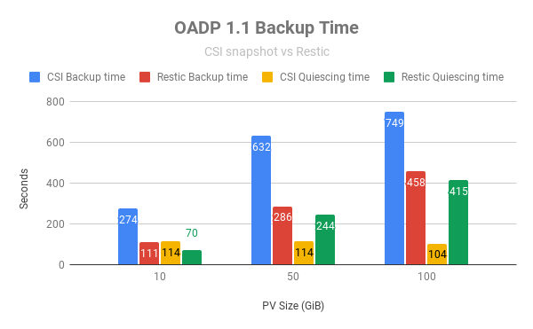

Even though when using CSI snapshots the total backup time is higher, we can see the amount of time our applications is set as read-only is lower than when using restic.

Also, we have verified when using CSI snapshots that the number of files is independent on the amount of time we must set our application as read-only, as it is taking near two minutes of quiescing independently of the amount and size of the files inside our PV.

**NOTE:** Usually taking a snapshot is very fast, we have inquired OADP engineering team to clarify if the amount of quiescing time can be reduced.

* **OADP 1.2:**

In OADP 1.2 we have repeated this testing and we can see a noticeable reduction on the time it takes to backup our data.

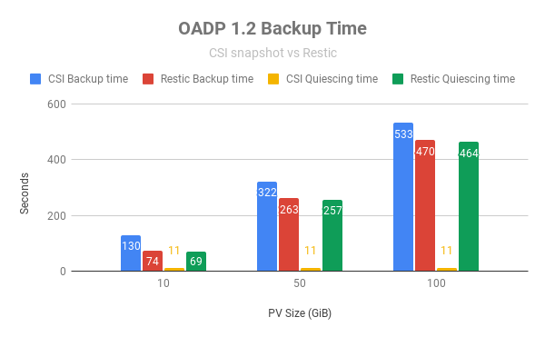

Especially, we can notice how the amount of time to take a snapshot using OADP 1.2 have been reduced from two minutes to 11 seconds consistently which is a great notice as we are reducing the amount of time our application must be on read-only to ensure an application-consistent snapshot. Also, as we have seen in OADP 1.1, when using CSI snapshots the amount of time our application is on read-only is independent of the PV size or the number of files in our PVC.

# OpenShift/K8s quota regarding CSI snapshots

One of the main questions regarding CSI snapshots is how the OpenShift administrator can set limits and quotas, as they are controlled directly by the users but has a direct impact in global resources (such as the ODF internal or the external RHCS cluster).

We have performed a bit of testing to check if `volumeSnapshots` consumes storage quota as we have not been able to create new object counts quotas regarding `volumeSnapshots`

## Does `volumeSnapshot` compute for storage quota?

First approach was to create a new storage quota in our project and create a new `volumeSnapshot` to check if the storage quota increases:

* Create a new namespace `ns-snapshot-quota`:

```
$ oc new-project ns-snapshot-quota
```

* Create storage quota with the following specifications:
  * RBD:
    * PVC: 2
    * Storage: 50Gi
  * CephFS:
    * PVC: 2
    * Storage: 50Gi

```
$ cat << EOF > ~/storage-consumption-ns-snapshot-quota.yaml
apiVersion: v1
kind: ResourceQuota
metadata:
  name: storage-consumption-ns-snapshot-quota
  namespace: ns-snapshot-quota
spec:
  hard:
    ocs-storagecluster-ceph-rbd.storageclass.storage.k8s.io/persistentvolumeclaims: "2"
    ocs-storagecluster-ceph-rbd.storageclass.storage.k8s.io/requests.storage: "50Gi"
    ocs-storagecluster-cephfs.storage.k8s.io/persistentvolumeclaims: "2"
    ocs-storagecluster-cephfs.storageclass.storage.k8s.io/requests.storage: "50Gi"
EOF
$ oc create -f ~/storage-consumption-ns-snapshot-quota.yaml
```

* Create a new `persistentVolumeClaim`:

```
$ cat << EOF > ~/pv1.yaml
apiVersion: v1
kind: PersistentVolumeClaim
metadata:
  name: pv1
spec:
  storageClassName: ocs-storagecluster-ceph-rbd
  accessModes:
  - ReadWriteOnce
  resources:
    requests:
      storage: 10Gi
EOF
$ oc create -f ~/pv1.yaml
```

* Create a new `volumeSnapshot` of our `pv1` PV:

```
$ cat << EOF > ~/pv1-snapshot.yaml
apiVersion: snapshot.storage.k8s.io/v1
kind: VolumeSnapshot
metadata:
  name: pv1-snapshot
  namespace: ns-snapshot-quota
spec:
  volumeSnapshotClassName: ocs-storagecluster-rbdplugin-snapclass
  source:
    persistentVolumeClaimName: pv1
EOF
$ oc create -f ~/pv1-snapshot.yaml
```

* Examine our quota usage:

```
$ oc describe resourcequotas
Name:                                                                           storage-consumption-ns-snapshot-quota
Namespace:                                                                      ns-snapshot-quota
Resource                                                                        Used  Hard
--------                                                                        ----  ----
ocs-storagecluster-ceph-rbd.storageclass.storage.k8s.io/persistentvolumeclaims  1     2
ocs-storagecluster-ceph-rbd.storageclass.storage.k8s.io/requests.storage        10Gi  50Gi
ocs-storagecluster-cephfs.storage.k8s.io/persistentvolumeclaims                 0     2
ocs-storagecluster-cephfs.storageclass.storage.k8s.io/requests.storage          0     50Gi
```

As we have observed, `volumeSnapshot` objects do not compute as objects regarding storage quota usages.

## Is it possible to create resource quotas regarding `volumeSnapshot`?

The next thing we have tried is to create new resource quotas regarding `volumeSnapshot` using the approach obtained in this [KCS](https://access.redhat.com/solutions/5973781). As we have created the namespace `ns-snapshot-quota` we can skip this part.

* Create a new storage quota limiting the number of `volumeSnapshot` to 2:

```
$ cat << EOF > ~/ns-object-counts.yaml
apiVersion: v1
kind: ResourceQuota
metadata:
  name: snapshot-quota
  namespace: ns-snapshot-quota
spec:
  hard:
    count/volumesnapshots.snapshot.storage.k8s.io: 2
EOF
$ oc create -f ~/ns-object-counts.yaml
```

* Create a new `volumeSnapshot` of our `pv1` PV:

```
$ cat << EOF > ~/pv1-snapshot.yaml
apiVersion: snapshot.storage.k8s.io/v1
kind: VolumeSnapshot
metadata:
  name: pv1-snapshot
  namespace: ns-snapshot-quota
spec:
  volumeSnapshotClassName: ocs-storagecluster-rbdplugin-snapclass
  source:
    persistentVolumeClaimName: pv1
EOF
$ oc create -f ~/pv1-snapshot.yaml
```

* Examine our quota usage:

```
$ oc describe resourcequotas
Name:                                          snapshot-quota
Namespace:                                     ns-snapshot-quota
Resource                                       Used  Hard
--------                                       ----  ----
count/volumesnapshots.snapshot.storage.k8s.io  1     2


Name:                                                                           storage-consumption-ns-snapshot-quota
Namespace:                                                                      ns-snapshot-quota
Resource                                                                        Used  Hard
--------                                                                        ----  ----
ocs-storagecluster-ceph-rbd.storageclass.storage.k8s.io/persistentvolumeclaims  1     2
ocs-storagecluster-ceph-rbd.storageclass.storage.k8s.io/requests.storage        10Gi  50Gi
ocs-storagecluster-cephfs.storage.k8s.io/persistentvolumeclaims                 0     2
ocs-storagecluster-cephfs.storageclass.storage.k8s.io/requests.storage          0     50Gi
```

As we have observed, `volumeSnapshot` objects compute as objects regarding quota usages. The only downside we can foresee with this approach is the `volumeSnapshot` object is unique, so it is not possible to limit `volumeSnapshot` objects per `volumeSnapshotClass`. We have created a new [RFE](https://access.redhat.com/support/cases/#/case/02948001) in order to enable this kind of flexibility in OpenShift.

Finally, clean up the environment:

```
$ oc delete namespace ns-snapshot-quota
```

# Executing backups and restores with multiple PVs

One of the great new features of the Data Mover in OADP 1.2 is the introduction of concurrent workers to enhance the performance of our backup and restore operations when using CSI Snapshots and the Data Mover. In this section we are going to measure the backup duration improvements when using multiple workers in the Data Mover, of course we are going to track the amount of resources we are consuming while incrementing the amount of concurrent workers.

The first task is to deploy in OpenShift a MySQL database:

**NOTE:** The storage class used in this example is `ocs-storagecluster-ceph-rbd`. In case your storage class name is different, change the parameter `storageClassName` in the `multiple-pvs-template.yaml` file.

```
$ wget https://gitlab.consulting.redhat.com/ddomingu/oadp/-/raw/main/files/multiple-pvs/multiple-pvs-template.yaml -O multiple-pvs-template.yaml
$ oc create -f multiple-pvs-template.yaml
```

This example will create the following OpenShift resources:
* **Namespace:** multiple-pvs
* **Secret:** mysql
* **Service:** mysql1, mysql2, mysql3, mysql4, mysql5
* **PersistentVolumeClaim:** mysql1, mysql2, mysql3, mysql4, mysql5 (RBD, 10 GiB each)
* **Deployment:** mysql1, mysql2, mysql3, mysql4, mysql5

Before triggering our backup, ensure all these resources have been properly created:

```
$ oc -n multiple-pvs get all,pvc
NAME                          READY   STATUS    RESTARTS      AGE
pod/mysql1-6ff677fd94-vg7tj   1/1     Running   1 (33s ago)   75s
pod/mysql2-7d7dcfd79d-7fxtx   1/1     Running   1 (33s ago)   75s
pod/mysql3-6f9c57c554-9kwnc   1/1     Running   1 (34s ago)   75s
pod/mysql4-79c78f4cdb-qbwz5   1/1     Running   1 (33s ago)   75s
pod/mysql5-5bb474f6c8-4zbg6   1/1     Running   1 (33s ago)   75s

NAME             TYPE        CLUSTER-IP       EXTERNAL-IP   PORT(S)    AGE
service/mysql1   ClusterIP   172.30.208.156   <none>        3306/TCP   75s
service/mysql2   ClusterIP   172.30.220.35    <none>        3306/TCP   75s
service/mysql3   ClusterIP   172.30.168.51    <none>        3306/TCP   75s
service/mysql4   ClusterIP   172.30.125.63    <none>        3306/TCP   75s
service/mysql5   ClusterIP   172.30.119.38    <none>        3306/TCP   75s

NAME                     READY   UP-TO-DATE   AVAILABLE   AGE
deployment.apps/mysql1   1/1     1            1           75s
deployment.apps/mysql2   1/1     1            1           75s
deployment.apps/mysql3   1/1     1            1           75s
deployment.apps/mysql4   1/1     1            1           75s
deployment.apps/mysql5   1/1     1            1           75s

NAME                                DESIRED   CURRENT   READY   AGE
replicaset.apps/mysql1-6ff677fd94   1         1         1       75s
replicaset.apps/mysql2-7d7dcfd79d   1         1         1       75s
replicaset.apps/mysql3-6f9c57c554   1         1         1       75s
replicaset.apps/mysql4-79c78f4cdb   1         1         1       75s
replicaset.apps/mysql5-5bb474f6c8   1         1         1       75s

NAME                           STATUS   VOLUME                                     CAPACITY   ACCESS MODES   STORAGECLASS                  AGE
persistentvolumeclaim/mysql1   Bound    pvc-78719ed7-67ec-40da-a037-af017b01421c   10Gi       RWO            ocs-storagecluster-ceph-rbd   75s
persistentvolumeclaim/mysql2   Bound    pvc-f943546f-54bd-474f-a7d5-fb234ee16286   10Gi       RWO            ocs-storagecluster-ceph-rbd   75s
persistentvolumeclaim/mysql3   Bound    pvc-73905456-f5e9-4b47-9c6d-95664f56e95a   10Gi       RWO            ocs-storagecluster-ceph-rbd   75s
persistentvolumeclaim/mysql4   Bound    pvc-90d28ef1-bf6d-4ccb-b20e-cc672407a4cc   10Gi       RWO            ocs-storagecluster-ceph-rbd   75s
persistentvolumeclaim/mysql5   Bound    pvc-2d7a4790-38dd-4204-bc1f-7c8040bd3383   10Gi       RWO            ocs-storagecluster-ceph-rbd   75s
```

Once we have verified our deployment is properly set up, we would like to create a 5 GiB file on each persistent volume:

```
$ for i in {1..5};do oc -n multiple-pvs exec -it $(oc -n multiple-pvs get pods -l app=mysql${i} -o name) -- dd if=/dev/urandom of=/var/lib/mysql/big_file bs=1M count=5000;done
5000+0 records in
5000+0 records out
5242880000 bytes (5.2 GB, 4.9 GiB) copied, 34.8326 s, 151 MB/s
5000+0 records in
5000+0 records out
5242880000 bytes (5.2 GB, 4.9 GiB) copied, 35.2548 s, 149 MB/s
5000+0 records in
5000+0 records out
5242880000 bytes (5.2 GB, 4.9 GiB) copied, 35.1313 s, 149 MB/s
5000+0 records in
5000+0 records out
5242880000 bytes (5.2 GB, 4.9 GiB) copied, 35.3173 s, 148 MB/s
5000+0 records in
5000+0 records out
5242880000 bytes (5.2 GB, 4.9 GiB) copied, 35.0549 s, 150 MB/s
```

* First iteration (`maxConcurrentBackupVolumes=1`):

Trigger the backup in our recently created `multiple-pvs` namespace and measure the amount of time and resources (CPU/Mem) it takes when working with this configuration:

```
$ wget https://gitlab.consulting.redhat.com/ddomingu/oadp/-/raw/main/files/multiple-pvs/multiple-pvs-backup1.yaml -O multiple-pvs-backup1.yaml
$ oc create -f multiple-pvs-backup1.yaml
```

Make sure the backup has completed:

```
$ oc -n openshift-adp get backup multiple-pvs1 -o jsonpath='{.status.phase}'
Completed
$ oc -n openshift-adp get backup multiple-pvs1 -o jsonpath='{.status}' | jq
{
  "backupItemOperationsAttempted": 5,
  "backupItemOperationsCompleted": 5,
  "completionTimestamp": "2023-08-08T08:18:52Z",
  "csiVolumeSnapshotsAttempted": 5,
  "csiVolumeSnapshotsCompleted": 5,
  "expiration": "2023-09-07T08:11:57Z",
  "formatVersion": "1.1.0",
  "phase": "Completed",
  "startTimestamp": "2023-08-08T08:11:57Z",
  "version": 1
}
```

Get backup creation and termination time:

```
$ oc -n openshift-adp get backup multiple-pvs1 -o jsonpath='{.metadata.creationTimestamp}'
2023-08-08T08:11:57Z
$ oc -n openshift-adp get backup multiple-pvs1 -o jsonpath='{.status.completionTimestamp}'
2023-08-08T08:18:52Z
```

So, as we have seen it took 6 minutes and 55 seconds (415 seconds) to get our backup using `maxConcurrentBackupVolumes=1`.

In terms of resource consumption, we can see that:
* CPU resource consumption is inappreciable so we can discard it.
* Namespace total memory consumption: 900 MiB.

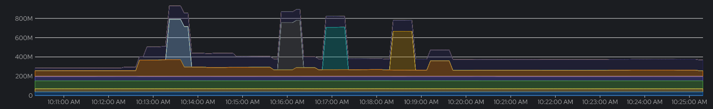

* Second iteration (`maxConcurrentBackupVolumes=2`):

Trigger the backup in our recently created `multiple-pvs` namespace and measure the amount of time and resources (CPU/Mem) it takes when working with this configuration:

```
$ wget https://gitlab.consulting.redhat.com/ddomingu/oadp/-/raw/main/files/multiple-pvs/multiple-pvs-backup2.yaml -O multiple-pvs-backup2.yaml
$ oc create -f multiple-pvs-backup2.yaml
```

Make sure the backup has completed:

```
$ oc -n openshift-adp get backup multiple-pvs2 -o jsonpath='{.status.phase}'
Completed
$ oc -n openshift-adp get backup multiple-pvs2 -o jsonpath='{.status}' | jq
{
  "backupItemOperationsAttempted": 5,
  "backupItemOperationsCompleted": 5,
  "completionTimestamp": "2023-08-08T09:22:23Z",
  "csiVolumeSnapshotsAttempted": 5,
  "csiVolumeSnapshotsCompleted": 5,
  "expiration": "2023-09-07T09:18:27Z",
  "formatVersion": "1.1.0",
  "phase": "Completed",
  "startTimestamp": "2023-08-08T09:18:27Z",
  "version": 1
}
```

Get backup creation and termination time:

```
$ oc -n openshift-adp get backup multiple-pvs2 -o jsonpath='{.metadata.creationTimestamp}'
2023-08-08T09:18:27Z
$ oc -n openshift-adp get backup multiple-pvs2 -o jsonpath='{.status.completionTimestamp}'
2023-08-08T09:22:23Z
```

So, as we have seen it took 3 minutes and 56 seconds (236 seconds) to get our backup using `maxConcurrentBackupVolumes=2`.

In terms of resource consumption, we can see that:
* CPU resource consumption is inappreciable so we can discard it.
* Namespace total memory consumption: 900 MiB.

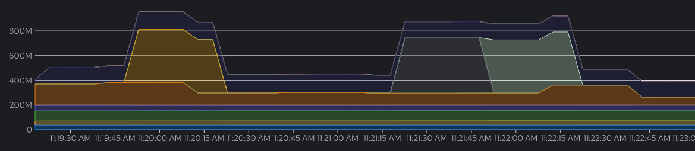

* Third iteration (`maxConcurrentBackupVolumes=3`):

Trigger the backup in our recently created `multiple-pvs` namespace and measure the amount of time and resources (CPU/Mem) it takes when working with this configuration:

```
$ wget https://gitlab.consulting.redhat.com/ddomingu/oadp/-/raw/main/files/multiple-pvs/multiple-pvs-backup3.yaml -O multiple-pvs-backup3.yaml
$ oc create -f multiple-pvs-backup3.yaml
```

Make sure the backup has completed:

```
$ oc -n openshift-adp get backup multiple-pvs3 -o jsonpath='{.status.phase}'
Completed
$ oc -n openshift-adp get backup multiple-pvs3 -o jsonpath='{.status}' | jq
{
  "backupItemOperationsAttempted": 5,
  "backupItemOperationsCompleted": 5,
  "completionTimestamp": "2023-08-08T09:50:07Z",
  "csiVolumeSnapshotsAttempted": 5,
  "csiVolumeSnapshotsCompleted": 5,
  "expiration": "2023-09-07T09:46:21Z",
  "formatVersion": "1.1.0",
  "phase": "Completed",
  "startTimestamp": "2023-08-08T09:46:21Z",
  "version": 1
}
```

Get backup creation and termination time:

```
$ oc -n openshift-adp get backup multiple-pvs3 -o jsonpath='{.metadata.creationTimestamp}'
2023-08-08T09:46:21Z
$ oc -n openshift-adp get backup multiple-pvs3 -o jsonpath='{.status.completionTimestamp}'
2023-08-08T09:50:07Z
```

So, as we have seen it took 3 minutes and 46 seconds (226 seconds) to get our backup using `maxConcurrentBackupVolumes=3`.

In terms of resource consumption, we can see that:
* CPU resource consumption is inappreciable so we can discard it.
* Namespace total memory consumption: 1620 MiB.

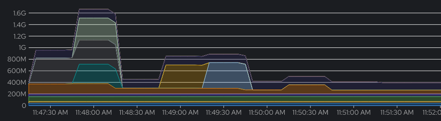

* Fourth iteration (`maxConcurrentBackupVolumes=4`):

Trigger the backup in our recently created `multiple-pvs` namespace and measure the amount of time and resources (CPU/Mem) it takes when working with this configuration:

```
$ wget https://gitlab.consulting.redhat.com/ddomingu/oadp/-/raw/main/files/multiple-pvs/multiple-pvs-backup4.yaml -O multiple-pvs-backup4.yaml
$ oc create -f multiple-pvs-backup4.yaml
```

Make sure the backup has completed:

```
$ oc -n openshift-adp get backup multiple-pvs4 -o jsonpath='{.status.phase}'
Completed
$ oc -n openshift-adp get backup multiple-pvs4 -o jsonpath='{.status}' | jq
{
  "backupItemOperationsAttempted": 5,
  "backupItemOperationsCompleted": 5,
  "completionTimestamp": "2023-08-08T10:17:33Z",
  "csiVolumeSnapshotsAttempted": 5,
  "csiVolumeSnapshotsCompleted": 5,
  "expiration": "2023-09-07T10:14:02Z",
  "formatVersion": "1.1.0",
  "phase": "Completed",
  "startTimestamp": "2023-08-08T10:14:02Z",
  "version": 1
}
```

Get backup creation and termination time:

```
$ oc -n openshift-adp get backup multiple-pvs4 -o jsonpath='{.metadata.creationTimestamp}'
2023-08-08T10:14:02Z
$ oc -n openshift-adp get backup multiple-pvs4 -o jsonpath='{.status.completionTimestamp}'
2023-08-08T10:17:33Z
```

So, as we have seen it took 3 minutes and 31 seconds (211 seconds) to get our backup using `maxConcurrentBackupVolumes=4`.

In terms of resource consumption, we can see that:
* CPU resource consumption is inappreciable so we can discard it.
* Namespace total memory consumption: 1620 MiB.

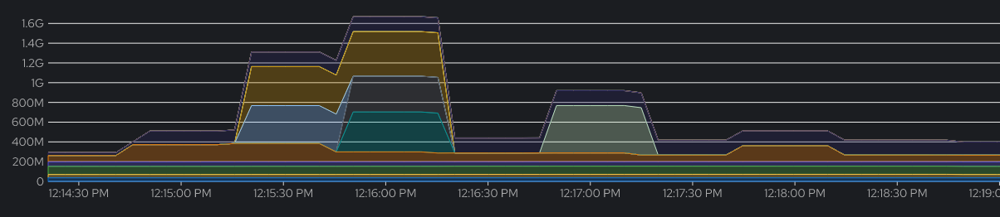

* Fifth iteration (`maxConcurrentBackupVolumes=5`):

Trigger the backup in our recently created `multiple-pvs` namespace and measure the amount of time and resources (CPU/Mem) it takes when working with this configuration:

```
$ wget https://gitlab.consulting.redhat.com/ddomingu/oadp/-/raw/main/files/multiple-pvs/multiple-pvs-backup5.yaml -O multiple-pvs-backup5.yaml
$ oc create -f multiple-pvs-backup5.yaml
```

Make sure the backup has completed:

```
$ oc -n openshift-adp get backup multiple-pvs5 -o jsonpath='{.status.phase}'
Completed
$ oc -n openshift-adp get backup multiple-pvs5 -o jsonpath='{.status}' | jq
{
  "backupItemOperationsAttempted": 5,
  "backupItemOperationsCompleted": 5,
  "completionTimestamp": "2023-08-08T10:27:21Z",
  "csiVolumeSnapshotsAttempted": 5,
  "csiVolumeSnapshotsCompleted": 5,
  "expiration": "2023-09-07T10:24:32Z",
  "formatVersion": "1.1.0",
  "phase": "Completed",
  "startTimestamp": "2023-08-08T10:24:32Z",
  "version": 1
}
```

Get backup creation and termination time:

```
$ oc -n openshift-adp get backup multiple-pvs5 -o jsonpath='{.metadata.creationTimestamp}'
2023-08-08T10:24:32Z
$ oc -n openshift-adp get backup multiple-pvs5 -o jsonpath='{.status.completionTimestamp}'
2023-08-08T10:27:21Z
```

So, as we have seen it took 2 minutes and 49 seconds (169 seconds) to get our backup using `maxConcurrentBackupVolumes=5`.

In terms of resource consumption, we can see that:
* CPU resource consumption is inappreciable so we can discard it.
* Namespace total memory consumption: 2100 MiB.

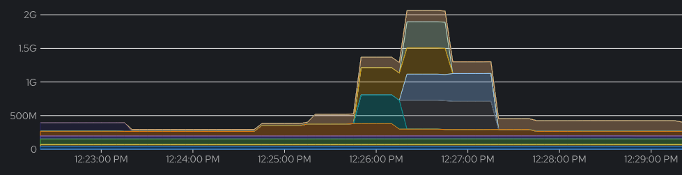

As a summary, we have demonstrated the direct relation between the duration of our backups and the memory consumption in the `openshift-adp` namespace when working with multiple concurrent workers in the OADP Data Mover, check the following table and diagram:

| **Data Mover concurrent workers** | **Backup duration (seconds)** | **Memory consumption (MiB)** |
|:---------------------------------:|:-----------------------------:|:----------------------------:|
|                1                  |              415              |              900             |
|                2                  |              236              |              900             |
|                3                  |              226              |             1620             |
|                4                  |              211              |             1620             |
|                5                  |              169              |             2100             |

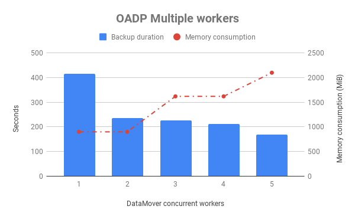

# Schedule backups

Sometimes it is useful to schedule our backups. Using the [schedule CR](https://velero.io/docs/v1.9/backup-reference/#schedule-a-backup) in `velero` allows us to create a backup of our data at a specified time. The semantics of the schedule CR is very similar to a cronjob scheduler:

```
┌───────────── minute (0 - 59)
│ ┌───────────── hour (0 - 23)
│ │ ┌───────────── day of the month (1 - 31)
│ │ │ ┌───────────── month (1 - 12)
│ │ │ │ ┌───────────── day of the week (0 - 6) (Sunday to Saturday; 7 is also Sunday on some systems)
│ │ │ │ │
* * * * *
```

For example, setting the following schedule CR in `velero` will create a daily backup at 9AM of the `mysql` namespace:

```
$ cat << EOF > ~/backup-schedule-daily.yaml
apiVersion: velero.io/v1
kind: Schedule
metadata:
  name: backup-schedule-mysql-daily
  namespace: openshift-adp
spec:
  schedule: '0 9 * * *'
  template:
      hooks: {}
      includedNamespaces:
      - mysql
      storageLocation: velero-dpa-1
      ttl: 720h0m0s
EOF
``` 

In this example we are not using hooks so the backup we are taking is only crash-consistent, not an application-consistent backup.

Also, you can check the following example to take a backup of our `mysql` namespace weekly on Sunday at 9AM using the scheduler CR:

```
$ cat << EOF > ~/backup-schedule-weekly.yaml
apiVersion: velero.io/v1
kind: Schedule
metadata:
  name: backup-schedule-mysql-weekly
  namespace: openshift-adp
spec:
  schedule: '0 9 * * 0'
  template:
      hooks: {}
      includedNamespaces:
      - mysql
      storageLocation: velero-dpa-1
      ttl: 720h0m0s
EOF
```

Finally, here is an example using the schedule CR to take a snapshot hourly:

```
$ cat << EOF > ~/backup-schedule-hourly.yaml
apiVersion: velero.io/v1
kind: Schedule
metadata:
  name: backup-schedule-mysql-hourly
  namespace: openshift-adp
spec:
  schedule: '30 * * * *'
  template:
      hooks: {}
      includedNamespaces:
      - mysql
      storageLocation: velero-dpa-1
      ttl: 720h0m0s
EOF
```

We can check the schedule of our backups using the `oc` or `velero` commands:

```
$ oc -n openshift-adp get schedule
NAME                           STATUS    SCHEDULE     LASTBACKUP   AGE
backup-schedule-mysql-hourly   Enabled   30 * * * *                79s
$ alias velero='oc -n openshift-adp exec deployment/velero -c velero -it -- ./velero'
$ velero schedule get 
NAME                           STATUS    CREATED                         SCHEDULE     BACKUP TTL   LAST BACKUP   SELECTOR
backup-schedule-mysql-hourly   Enabled   2023-05-17 07:13:58 +0000 UTC   30 * * * *   720h0m0s     n/a           <none>
```

Also, we can observe how our backups has been performed hourly using the schedule CR:

```
$ velero backup get
NAME                                          STATUS      ERRORS   WARNINGS   CREATED                         EXPIRES   STORAGE LOCATION   SELECTOR
backup-schedule-mysql-hourly-20230517083004   Completed   0        0          2023-05-17 08:30:04 +0000 UTC   29d       velero-dpa-1       <none>
backup-schedule-mysql-hourly-20230517073004   Completed   0        0          2023-05-17 07:30:04 +0000 UTC   29d       velero-dpa-1       <none>
```

**NOTE:** If by any reason the schedule CR is deleted, the related backups CR (Just backup CR is deleted. Backup data still exists in object store and snapshots) will be deleted by k8s GC controller, too, but Velero controller will sync these backups from object store’s metadata into k8s. Then k8s GC controller and Velero controller will fight over whether these backups should exist all through. Please check the [limitation](https://velero.io/docs/v1.9/backup-reference/#limitation) section at velero backup reference documentation.

# Deleting backups

To delete our backups we have two different options:

* If using the `oc delete backup` command only the backup custom resource will be deleted but not the content or data in our object storage location:

```
$ oc -n openshift-adp delete backup <backupName>
```

For example, we have the `nginx-stateless`:

```
$ oc -n openshift-adp get backup nginx-stateless
NAME              AGE
nginx-stateless   6d22h
$ s3cmd -c ~/object.s3cfg ls s3://oadp-s3-bucket/velero/backups/nginx-stateless/
2023-05-09 11:55        29   s3://oadp-s3-bucket/velero/backups/nginx-stateless/nginx-stateless-csi-volumesnapshotclasses.json.gz
2023-05-09 11:55        29   s3://oadp-s3-bucket/velero/backups/nginx-stateless/nginx-stateless-csi-volumesnapshotcontents.json.gz
2023-05-09 11:55        29   s3://oadp-s3-bucket/velero/backups/nginx-stateless/nginx-stateless-csi-volumesnapshots.json.gz
2023-05-09 11:55      9154   s3://oadp-s3-bucket/velero/backups/nginx-stateless/nginx-stateless-logs.gz
2023-05-09 11:55        29   s3://oadp-s3-bucket/velero/backups/nginx-stateless/nginx-stateless-podvolumebackups.json.gz
2023-05-09 11:55       649   s3://oadp-s3-bucket/velero/backups/nginx-stateless/nginx-stateless-resource-list.json.gz
2023-05-09 11:55        29   s3://oadp-s3-bucket/velero/backups/nginx-stateless/nginx-stateless-volumesnapshots.json.gz
2023-05-09 11:55    191322   s3://oadp-s3-bucket/velero/backups/nginx-stateless/nginx-stateless.tar.gz
2023-05-09 11:55      2586   s3://oadp-s3-bucket/velero/backups/nginx-stateless/velero-backup.json
```

If we delete the backup using the `oc delete` command we can see how the content in our object storage location is not deleted, and as we still have all the backup information in the object storage location, the backup custom resource will be recreated back overtime:

```
$ oc -n openshift-adp delete backup nginx-stateless
backup.velero.io "nginx-stateless" deleted
$ oc -n openshift-adp get backup nginx-stateless 
Error from server (NotFound): backups.velero.io "nginx-stateless" not found
$ oc -n openshift-adp get backup nginx-stateless
NAME              AGE
nginx-stateless   41s
$ s3cmd -c ~/object.s3cfg ls s3://oadp-s3-bucket/velero/backups/nginx-stateless/
2023-05-09 11:55        29   s3://oadp-s3-bucket/velero/backups/nginx-stateless/nginx-stateless-csi-volumesnapshotclasses.json.gz
2023-05-09 11:55        29   s3://oadp-s3-bucket/velero/backups/nginx-stateless/nginx-stateless-csi-volumesnapshotcontents.json.gz
2023-05-09 11:55        29   s3://oadp-s3-bucket/velero/backups/nginx-stateless/nginx-stateless-csi-volumesnapshots.json.gz
2023-05-09 11:55      9154   s3://oadp-s3-bucket/velero/backups/nginx-stateless/nginx-stateless-logs.gz
2023-05-09 11:55        29   s3://oadp-s3-bucket/velero/backups/nginx-stateless/nginx-stateless-podvolumebackups.json.gz
2023-05-09 11:55       649   s3://oadp-s3-bucket/velero/backups/nginx-stateless/nginx-stateless-resource-list.json.gz
2023-05-09 11:55        29   s3://oadp-s3-bucket/velero/backups/nginx-stateless/nginx-stateless-volumesnapshots.json.gz
2023-05-09 11:55    191322   s3://oadp-s3-bucket/velero/backups/nginx-stateless/nginx-stateless.tar.gz
2023-05-09 11:55      2586   s3://oadp-s3-bucket/velero/backups/nginx-stateless/velero-backup.json
```

* But if we use the `velero backup delete` command we will delete the backup resource, including all data in our object storage location:

```
$ alias velero='oc -n openshift-adp exec deployment/velero -c velero -it -- ./velero'
$ velero backup delete <backupName>
```

* We can also set an alias to access the restic command:

```
$ alias restic='oc -n openshift-adp exec deployment/velero -c velero -it -- /usr/bin/restic'
```

We are going to use the same `nginx-stateless` backup from before:

```
$ oc -n openshift-adp get backup nginx-stateless
NAME              AGE
nginx-stateless   2m47s
$ s3cmd -c ~/object.s3cfg ls s3://oadp-s3-bucket/velero/backups/nginx-stateless/
2023-05-09 11:55        29   s3://oadp-s3-bucket/velero/backups/nginx-stateless/nginx-stateless-csi-volumesnapshotclasses.json.gz
2023-05-09 11:55        29   s3://oadp-s3-bucket/velero/backups/nginx-stateless/nginx-stateless-csi-volumesnapshotcontents.json.gz
2023-05-09 11:55        29   s3://oadp-s3-bucket/velero/backups/nginx-stateless/nginx-stateless-csi-volumesnapshots.json.gz
2023-05-09 11:55      9154   s3://oadp-s3-bucket/velero/backups/nginx-stateless/nginx-stateless-logs.gz
2023-05-09 11:55        29   s3://oadp-s3-bucket/velero/backups/nginx-stateless/nginx-stateless-podvolumebackups.json.gz
2023-05-09 11:55       649   s3://oadp-s3-bucket/velero/backups/nginx-stateless/nginx-stateless-resource-list.json.gz
2023-05-09 11:55        29   s3://oadp-s3-bucket/velero/backups/nginx-stateless/nginx-stateless-volumesnapshots.json.gz
2023-05-09 11:55    191322   s3://oadp-s3-bucket/velero/backups/nginx-stateless/nginx-stateless.tar.gz
2023-05-09 11:55      2586   s3://oadp-s3-bucket/velero/backups/nginx-stateless/velero-backup.json
```

If we delete the backup using the `velero backup delete` command we can see how backup custom resource and the content in our object storage location is deleted, thus it will not be recreated overtime:

```
$ velero backup delete nginx-stateless
Are you sure you want to continue (Y/N)? Y
Request to delete backup "nginx-stateless" submitted successfully.
The backup will be fully deleted after all associated data (disk snapshots, backup files, restores) are removed.
$ oc -n openshift-adp get backup nginx-stateless
Error from server (NotFound): backups.velero.io "nginx-stateless" not found
$ s3cmd -c ~/object.s3cfg ls s3://oadp-s3-bucket/velero/backups/nginx-stateless/
```

For further information, please check the [Deleting Backups](https://velero.io/docs/v1.9/backup-reference/#deleting-backups) section at velero backup reference documentation.

**NOTE:** We have observed that even when using the `velero` command to delete our backups, the snapshot content uploaded by the Data Mover is not deleted from our object storage location. Also, the content uploaded by restic (PV data itself) is not deleted either.

Also in the following links: https://github.com/vmware-tanzu/velero/issues/5366 and https://github.com/vmware-tanzu/velero/issues/1408

```
Restic backup data basically include two parts: the snapshot and the data content (in the data folder as you shared). The snapshot is a collection of references to the data contents.

For a Restic backup deletion process, which also implements Velero's backup deletion, it deletes the snapshot itself only and doesn't touch the data content. After the snapshot is deleted, the related data content will be orphan, and once a maintenance/prune process runs, the orphan data content will be deleted.

That is to say, it is the expected behavior that you don't see files in the data folder been deleted.
```

# Deleting our backups automatically (setting TTL)

In order to automatically delete our backups after a certain period of time, we can use the TTL (Time To Live) directive when creating our backups. Once an existing backup resource expires, OADP will remove:

* The backup resource
* The backup file from cloud object storage
* All PersistentVolume snapshots
* All associated Restores

The TTL flag allows the user to specify the backup retention period with the value specified in hours, minutes and seconds in the form `--ttl 24h0m0s`. If not specified, a default TTL value of 30 days will be applied. Further information can be found at [velero upstream documentation](https://velero.io/docs/v1.4/how-velero-works/#set-a-backup-to-expire)

**NOTE:** Velero GC controller which detects expired backups and deletes them, only runs once per hour. So, if you have a backup with a TTL of 5m, it may take up to 65m for it to be deleted. Further info at this [upstream issue](https://github.com/vmware-tanzu/velero/issues/2277)

In the following example we are going to create a new backup with a TTL of 1 hour and verify OADP automatically delete all resources after its expiration.

The first task is to deploy in OpenShift a MySQL database:

**NOTE:** The storage class used in this example is `ocs-storagecluster-ceph-rbd`. In case your storage class name is different, change the parameter `storageClassName` in the `mysql-persistent-template.yaml` file.

```
$ wget https://gitlab.consulting.redhat.com/ddomingu/oadp/-/raw/main/files/mysql-ttl/mysql-persistent-template.yaml -O mysql-persistent-template.yaml
$ oc create -f mysql-persistent-template.yaml
```

This example will create the following OpenShift resources:
* **Namespace:** mysql-ttl
* **Secret:** mysql
* **Service:** mysql
* **PersistentVolumeClaim:** mysql (RBD)
* **Deployment:** mysql

Before triggering our backup, ensure all these resources have been properly created:

```
$ oc -n mysql-ttl get all,pvc
NAME                         READY   STATUS    RESTARTS   AGE
pod/mysql-66cb6cc587-wr59n   1/1     Running   0          28s

NAME            TYPE        CLUSTER-IP       EXTERNAL-IP   PORT(S)    AGE
service/mysql   ClusterIP   172.30.150.202   <none>        3306/TCP   28s

NAME                    READY   UP-TO-DATE   AVAILABLE   AGE
deployment.apps/mysql   1/1     1            1           28s

NAME                               DESIRED   CURRENT   READY   AGE
replicaset.apps/mysql-66cb6cc587   1         1         1       28s

NAME                          STATUS   VOLUME                                     CAPACITY   ACCESS MODES   STORAGECLASS                  AGE
persistentvolumeclaim/mysql   Bound    pvc-e1cb67a1-fd13-4130-a068-bf65aac1bf01   10Gi       RWO            ocs-storagecluster-ceph-rbd   29s
```

Once we have verified our deployment is properly set up, trigger the backup in our recently created `mysql-ttl` namespace:

```
$ wget https://gitlab.consulting.redhat.com/ddomingu/oadp/-/raw/main/files/mysql-ttl/mysql-persistent-backup.yaml -O mysql-persistent-backup.yaml
$ oc create -f mysql-persistent-backup.yaml
```

Make sure the backup has completed:

```
$ oc -n openshift-adp get backup mysql-ttl -o jsonpath='{.status.phase}'
Completed
$ oc -n openshift-adp get backup mysql-ttl -o jsonpath='{.status}' | jq
{
  "completionTimestamp": "2023-05-22T10:02:15Z",
  "csiVolumeSnapshotsAttempted": 1,
  "csiVolumeSnapshotsCompleted": 1,
  "expiration": "2023-05-22T10:59:11Z",
  "formatVersion": "1.1.0",
  "phase": "Completed",
  "progress": {
    "itemsBackedUp": 48,
    "totalItems": 48
  },
  "startTimestamp": "2023-05-22T09:59:11Z",
  "version": 1
}
```

Using the `velero` command, get our backups:

```
$ alias velero='oc -n openshift-adp exec deployment/velero -c velero -it -- ./velero'
$ velero backup get
NAME        STATUS      ERRORS   WARNINGS   CREATED                         EXPIRES   STORAGE LOCATION   SELECTOR
mysql-ttl   Completed   0        0          2023-05-22 09:59:11 +0000 UTC   56m       velero-dpa-1       <none>
```

Check the content of our backup in the cloud object storage:

```
$ s3cmd -c ~/object.s3cfg ls s3://ddomingu-oadp/velero/backups/mysql-ttl/
2023-05-22 10:02          491  s3://ddomingu-oadp/velero/backups/mysql-ttl/mysql-ttl-csi-volumesnapshotclasses.json.gz
2023-05-22 10:02          777  s3://ddomingu-oadp/velero/backups/mysql-ttl/mysql-ttl-csi-volumesnapshotcontents.json.gz
2023-05-22 10:02           29  s3://ddomingu-oadp/velero/backups/mysql-ttl/mysql-ttl-csi-volumesnapshots.json.gz
2023-05-22 10:02        10537  s3://ddomingu-oadp/velero/backups/mysql-ttl/mysql-ttl-logs.gz
2023-05-22 10:02           29  s3://ddomingu-oadp/velero/backups/mysql-ttl/mysql-ttl-podvolumebackups.json.gz
2023-05-22 10:02          755  s3://ddomingu-oadp/velero/backups/mysql-ttl/mysql-ttl-resource-list.json.gz
2023-05-22 10:02           29  s3://ddomingu-oadp/velero/backups/mysql-ttl/mysql-ttl-volumesnapshots.json.gz
2023-05-22 10:02       159807  s3://ddomingu-oadp/velero/backups/mysql-ttl/mysql-ttl.tar.gz
2023-05-22 10:02         2652  s3://ddomingu-oadp/velero/backups/mysql-ttl/velero-backup.json
$ s3cmd -c ~/object.s3cfg ls s3://ddomingu-oadp/openshift-adp/snapcontent-c2c59816-3ac1-4210-9652-2abe5d9da1fd-pvc/
                          DIR  s3://ddomingu-oadp/openshift-adp/snapcontent-c2c59816-3ac1-4210-9652-2abe5d9da1fd-pvc/data/
                          DIR  s3://ddomingu-oadp/openshift-adp/snapcontent-c2c59816-3ac1-4210-9652-2abe5d9da1fd-pvc/index/
                          DIR  s3://ddomingu-oadp/openshift-adp/snapcontent-c2c59816-3ac1-4210-9652-2abe5d9da1fd-pvc/keys/
                          DIR  s3://ddomingu-oadp/openshift-adp/snapcontent-c2c59816-3ac1-4210-9652-2abe5d9da1fd-pvc/snapshots/
2023-05-22 10:01          155  s3://ddomingu-oadp/openshift-adp/snapcontent-c2c59816-3ac1-4210-9652-2abe5d9da1fd-pvc/config
```

After 2 hours, we want to verify that our backup has been deleted as it is expired. Using the `velero` command, get our backups:

```
$ velero backup get
```

Also, check the content of our backup in the cloud object storage and verify it has been deleted:

```
$ s3cmd -c ~/object.s3cfg ls s3://ddomingu-oadp/velero/backups/mysql-ttl/
$ s3cmd -c ~/object.s3cfg ls s3://ddomingu-oadp/openshift-adp/snapcontent-c2c59816-3ac1-4210-9652-2abe5d9da1fd-pvc/
                          DIR  s3://ddomingu-oadp/openshift-adp/snapcontent-c2c59816-3ac1-4210-9652-2abe5d9da1fd-pvc/data/
                          DIR  s3://ddomingu-oadp/openshift-adp/snapcontent-c2c59816-3ac1-4210-9652-2abe5d9da1fd-pvc/index/
                          DIR  s3://ddomingu-oadp/openshift-adp/snapcontent-c2c59816-3ac1-4210-9652-2abe5d9da1fd-pvc/keys/
                          DIR  s3://ddomingu-oadp/openshift-adp/snapcontent-c2c59816-3ac1-4210-9652-2abe5d9da1fd-pvc/snapshots/
2023-05-22 10:01          155  s3://ddomingu-oadp/openshift-adp/snapcontent-c2c59816-3ac1-4210-9652-2abe5d9da1fd-pvc/config
```

**NOTE:** We have observed that even when our backup expires, the backup content is deleted from our object storage location but not the snapshot content uploaded by the Data Mover.

# Backup of RWX PVCs (using CephFS) with millions of files

In these tests we want to measure how long it takes to create snapshots of PVs backed by CephFS when dealing with millions of files. We are going to use two different technologies and compare them: CSI snapshot and restic.

Using OCP/ODF 4.10 and OADP 1.1 we were not able to make work properly when dealing with millions of files in CephFS PVCs. In OCP/ODF 4.12 and OADP 1.2 we can make use of the `ShallowCopy` volumes in CephFS.

## Configuring OADP 1.2 to use CephFS ShallowCopy volumes

From this [document](https://github.com/openshift/oadp-operator/blob/master/docs/examples/datamover_advanced_voloptions.md) we can get the different steps we need to perform in order to configure OADP 1.2 to use the CephFS `ShallowCopy` volumes.

* Prerequisites:
  * **OpenShift version:** >= 4.11
  * **ODF version:** >= 4.12
  * **OADP version:** 1.2

* Ensure the configuration on the CephFS `VolumeSnapshotClass`:
  * deletionPolicy: `Retain`
  * annotations: `snapshot.storage.kubernetes.io/is-default-class="true"`
  * labels: `velero.io/csi-volumesnapshot-class="true"`

```
$ oc get volumesnapshotclass ocs-storagecluster-cephfsplugin-snapclass -o yaml
apiVersion: snapshot.storage.k8s.io/v1
deletionPolicy: Retain
driver: openshift-storage.cephfs.csi.ceph.com
kind: VolumeSnapshotClass
metadata:
  annotations:
    snapshot.storage.kubernetes.io/is-default-class: "true"
  labels:
    velero.io/csi-volumesnapshot-class: "true"
  name: ocs-storagecluster-cephfsplugin-snapclass
parameters:
  clusterID: openshift-storage
  csi.storage.k8s.io/snapshotter-secret-name: rook-csi-cephfs-provisioner
  csi.storage.k8s.io/snapshotter-secret-namespace: openshift-storage
```

If you need to change the `deletionPolicy` parameter you can use the following command:

```
$ oc patch volumesnapshotclass ocs-storagecluster-cephfsplugin-snapclass -p '{"deletionPolicy":"Retain"}' --type merge
```

If you need to create the annotation, you can use the following command:

**NOTE:** Make sure all the other `VolumeSnapshotClass` has the annotation `snapshot.storage.kubernetes.io/is-default-class="false"`

```
$ oc annotate VolumeSnapshotClass ocs-storagecluster-cephfsplugin-snapclass snapshot.storage.kubernetes.io/is-default-class="true"
$ oc annotate VolumeSnapshotClass ocs-storagecluster-rbdplugin-snapclass snapshot.storage.kubernetes.io/is-default-class="false"
$ oc annotate VolumeSnapshotClass csi-aws-vsc snapshot.storage.kubernetes.io/is-default-class="false" --overwrite
```

If you need to create the velero label, you can use the following command:

```
$ oc label VolumeSnapshotClass ocs-storagecluster-cephfsplugin-snapclass velero.io/csi-volumesnapshot-class=true
```

* Ensure the configuration on the CephFS `StorageClass`:
** annotations: `storageclass.kubernetes.io/is-default-class="true"`

If you need to modify the default storage class you can use the following commands:

```
$ oc annotate storageclass ocs-storagecluster-cephfs storageclass.kubernetes.io/is-default-class="true"
$ oc annotate storageclass gp2 storageclass.kubernetes.io/is-default-class-
```

* Create an additional CephFS `StorageClass` to make use of the `shallowCopy` feature:
** backingSnapshot: `"true"`

```
$ cat << EOF > ~/ocs-storagecluster-cephfs-shallow.yaml
kind: StorageClass
apiVersion: storage.k8s.io/v1
metadata:
  name: ocs-storagecluster-cephfs-shallow
  annotations:
    description: Provides RWO and RWX Filesystem volumes
    storageclass.kubernetes.io/is-default-class: 'false'
provisioner: openshift-storage.cephfs.csi.ceph.com
parameters:
  csi.storage.k8s.io/provisioner-secret-namespace: openshift-storage
  csi.storage.k8s.io/provisioner-secret-name: rook-csi-cephfs-provisioner
  csi.storage.k8s.io/node-stage-secret-name: rook-csi-cephfs-node
  csi.storage.k8s.io/controller-expand-secret-name: rook-csi-cephfs-provisioner
  clusterID: openshift-storage
  fsName: ocs-storagecluster-cephfilesystem
  csi.storage.k8s.io/controller-expand-secret-namespace: openshift-storage
  backingSnapshot: 'true'
  csi.storage.k8s.io/node-stage-secret-namespace: openshift-storage
reclaimPolicy: Delete
allowVolumeExpansion: true
volumeBindingMode: Immediate
EOF
$ oc create -f ~/ocs-storagecluster-cephfs-shallow.yaml
```

* **IMPORTANT:**
  * Make sure the default `VolumeSnapshotClass` and `StorageClass` are the same provisioner.
  * The `VolumeSnapshotClass` must have the `deletionPolicy` set to `Retain`.
  * The `VolumeSnapshotClass` must have the label `velero.io/csi-volumesnapshot-class: "true"`
  * The latest VolSync operator is installed.
  * As we are using VolSync's Restic option, a restic secret has been properly configured.

* Modify the DPA to have something similar to:
  * `.spec.features.dataMover.volumeOptionsForStorageClasses.ocs-storagecluster-cephfs.sourceVolumeOptions.accessMode`: `ReadOnlyMany`
  * `.spec.features.dataMover.volumeOptionsForStorageClasses.ocs-storagecluster-cephfs.sourceVolumeOptions.cacheAccessMode`: `ReadWriteMany`
  * `.spec.features.dataMover.volumeOptionsForStorageClasses.ocs-storagecluster-cephfs.sourceVolumeOptions.cacheStorageClassName`: `ocs-storagecluster-cephfs`
  * `.spec.features.dataMover.volumeOptionsForStorageClasses.ocs-storagecluster-cephfs.sourceVolumeOptions.storageClassName`: `ocs-storagecluster-cephfs-shallow`
  * `.spec.features.dataMover.volumeOptionsForStorageClasses.ocs-storagecluster-ceph-rbd.sourceVolumeOptions.storageClassName`: `ocs-storagecluster-ceph-rbd`
  * `.spec.features.dataMover.volumeOptionsForStorageClasses.ocs-storagecluster-ceph-rbd.sourceVolumeOptions.cacheStorageClassName`: `ocs-storagecluster-ceph-rbd`
  * `.spec.features.dataMover.volumeOptionsForStorageClasses.ocs-storagecluster-ceph-rbd.destinationVolumeOptions.storageClassName`: `ocs-storagecluster-ceph-rbd`
  * `.spec.features.dataMover.volumeOptionsForStorageClasses.ocs-storagecluster-ceph-rbd.destinationVolumeOptions.cacheStorageClassName`: `ocs-storagecluster-ceph-rbd`

If you need to modify the OADP DPA, you can use `oc edit dpa` or you can use the following commands:

```
$ oc -n openshift-adp patch dpa velero-dpa --type merge --patch '{"spec": {"features": {"dataMover": {"volumeOptionsForStorageClasses": {"ocs-storagecluster-cephfs": {"sourceVolumeOptions": {"accessMode": "ReadOnlyMany","cacheAccessMode": "ReadWriteMany","cacheStorageClassName": "ocs-storagecluster-cephfs","storageClassName": "ocs-storagecluster-cephfs-shallow"}}}}}}}'
$ oc -n openshift-adp patch dpa velero-dpa --type merge --patch '{"spec": {"features": {"dataMover": {"volumeOptionsForStorageClasses": {"ocs-storagecluster-ceph-rbd": {"sourceVolumeOptions": {"storageClassName": "ocs-storagecluster-ceph-rbd","cacheStorageClassName": "ocs-storagecluster-ceph-rbd"}}}}}}}'
$ oc -n openshift-adp patch dpa velero-dpa --type merge --patch '{"spec": {"features": {"dataMover": {"volumeOptionsForStorageClasses": {"ocs-storagecluster-ceph-rbd": {"destinationVolumeOptions": {"storageClassName": "ocs-storagecluster-ceph-rbd","cacheStorageClassName": "ocs-storagecluster-ceph-rbd"}}}}}}}'
```

You need to have something similar to this on your OADP DPA:

```
...
  spec:
...
    features:
      dataMover:
        credentialName: dm-restic-secret
        enable: true
        maxConcurrentBackupVolumes: "4"
        maxConcurrentRestoreVolumes: "4"
        pruneInterval: "1"
        volumeOptionsForStorageClasses:
          ocs-storagecluster-ceph-rbd:
            destinationVolumeOptions:
              cacheStorageClassName: ocs-storagecluster-ceph-rbd
              storageClassName: ocs-storagecluster-ceph-rbd
            sourceVolumeOptions:
              cacheStorageClassName: ocs-storagecluster-ceph-rbd
              storageClassName: ocs-storagecluster-ceph-rbd
          ocs-storagecluster-cephfs:
            sourceVolumeOptions:
              accessMode: ReadOnlyMany
              cacheAccessMode: ReadWriteMany
              cacheStorageClassName: ocs-storagecluster-cephfs
              storageClassName: ocs-storagecluster-cephfs-shallow
```

As the last step, we recommend to test your backups with RBD and CephFS PVCs.

## Backup using CSI snapshots: One million files

In the following example we are going to create the following OpenShift resources:
* **Namespace:** mysql-cephfs-csi-snapshot
* **Secret:** mysql
* **Service:** mysql
* **PersistentVolumeClaim:** mysql (CephFS)
* **Deployment:** mysql

**NOTE:** The storage class used in this example is `ocs-storagecluster-cephfs`. In case your storage class name is different, change the parameter `storageClassName` in the `mysql-cephfs-csi-snapshot-template.yaml` file.

```
$ wget https://gitlab.consulting.redhat.com/ddomingu/oadp/-/raw/main/files/mysql-cephfs-csi-snapshot/mysql-cephfs-csi-snapshot-template.yaml -O mysql-cephfs-csi-snapshot-template.yaml
$ oc create -f mysql-cephfs-csi-snapshot-template.yaml
```

Ensure all the resources have been properly created:

```
$ oc -n mysql-cephfs-csi-snapshot get all,pvc
NAME                         READY   STATUS    RESTARTS   AGE
pod/mysql-856bc8d85f-lzvw4   1/1     Running   0          72m

NAME            TYPE        CLUSTER-IP      EXTERNAL-IP   PORT(S)    AGE
service/mysql   ClusterIP   172.30.31.107   <none>        3306/TCP   72m

NAME                    READY   UP-TO-DATE   AVAILABLE   AGE
deployment.apps/mysql   1/1     1            1           72m

NAME                               DESIRED   CURRENT   READY   AGE
replicaset.apps/mysql-856bc8d85f   1         1         1       72m

NAME                          STATUS   VOLUME                                     CAPACITY   ACCESS MODES   STORAGECLASS                AGE
persistentvolumeclaim/mysql   Bound    pvc-7c6321ce-bb1b-48db-a1eb-dfd17d14b772   200Gi      RWX            ocs-storagecluster-cephfs   72m
```

In order to be able to measure how long it takes our backup and the amount of time we set our application as read-only, we have included `velero` pre and post hooks in the definition of our MySQL workload:

```
...
spec:
...
  template:
    metadata:
      annotations:
        pre.hook.backup.velero.io/command: '["/bin/echo", "Executing pre-hook: Freeze"]'
        post.hook.backup.velero.io/command: '["/bin/echo", "Executing post-hook: Unfreeze"]'
...
```

Between executions with different number of files we are redeploying our MySQL workload in order to start fresh.

Once we have verified our deployment is properly set up, we would like to create one million 1KB files in our persistent volume:

```
$ oc -n mysql-cephfs-csi-snapshot rsh $(oc -n mysql-cephfs-csi-snapshot get pods -l app=mysql -o name)
$ dd if=/dev/urandom of=/var/lib/mysql/masterfile bs=1K count=1000000
1000000+0 records in
1000000+0 records out
1024000000 bytes (1.0 GB, 977 MiB) copied, 8.41587 s, 122 MB/s
$ mkdir /var/lib/mysql/files-1
$ split -b 1K /var/lib/mysql/masterfile /var/lib/mysql/files-1/file-
$ rm -f /var/lib/mysql/masterfile
```

Now we can trigger the backup in our recently created `mysql-cephfs-csi-snapshot` namespace and measure the amount of time it takes when working with CSI snapshots:

```
$ wget https://gitlab.consulting.redhat.com/ddomingu/oadp/-/raw/main/files/mysql-cephfs-csi-snapshot/mysql-cephfs-csi-snapshot-backup-1m-files.yaml -O mysql-cephfs-csi-snapshot-backup-1m-files.yaml
$ oc create -f mysql-cephfs-csi-snapshot-backup-1m-files.yaml
```

* **OADP 1.1:**

Make sure the backup has completed:

```
$ oc -n openshift-adp get backup mysql-cephfs-csi-snapshot-backup-1m-files -o jsonpath='{.status.phase}'
PartiallyFailed
$ oc -n openshift-adp get backup mysql-cephfs-csi-snapshot-backup-1m-files -o jsonpath='{.status}' | jq
{
  "completionTimestamp": "2023-05-23T10:40:55Z",
  "csiVolumeSnapshotsAttempted": 1,
  "csiVolumeSnapshotsCompleted": 1,
  "errors": 1,
  "expiration": "2023-06-22T10:28:16Z",
  "formatVersion": "1.1.0",
  "phase": "PartiallyFailed",
  "progress": {
    "itemsBackedUp": 49,
    "totalItems": 49
  },
  "startTimestamp": "2023-05-23T10:28:16Z",
  "version": 1
}
```

Get backup creation and termination time:

```
$ oc -n openshift-adp get backup mysql-cephfs-csi-snapshot-backup-1m-files -o jsonpath='{.metadata.creationTimestamp}'
2023-05-23T10:28:16Z
$ oc -n openshift-adp get backup mysql-cephfs-csi-snapshot-backup-1m-files -o jsonpath='{.status.completionTimestamp}'
2023-05-23T10:40:55Z
```

So, as we have seen our backup have not finished properly as when creating the clone PVC from the CephFS snapshot when storing millions of files takes a long time and the backup partially fails as the Data Mover is not able to mount the clone PVC to upload the content. To further debug this issue, I recommend to check the wonderful [OADP Data Mover Backup Workflow](https://source.redhat.com/communities/communities_of_practice/infrastructure/storage_cop/storage_community_of_practice_blog/oadp_data_mover_backup_workflow) document written by Daniel Parkes:

* Get the info from the `VolumeSnapshotBackup` resource in the `mysql-cephfs-csi-snapshot` namespace:

```
$ oc -n mysql-cephfs-csi-snapshot describe vsb
Name:         vsb-jcq6z
Namespace:    mysql-cephfs-csi-snapshot
Labels:       datamover.io/vsb-volumesnapshotcontent=snapcontent-a394456d-787a-4abb-a168-1669ff3a323c
              velero.io/backup-name=mysql-cephfs-csi-snapshot-backup-1m-files
Annotations:  <none>
API Version:  datamover.oadp.openshift.io/v1alpha1
Kind:         VolumeSnapshotBackup
Metadata:
  Creation Timestamp:  2023-05-23T10:29:06Z
  Generate Name:       vsb-
  Generation:          1
  Managed Fields:
    API Version:  datamover.oadp.openshift.io/v1alpha1
    Fields Type:  FieldsV1
    fieldsV1:
      f:metadata:
        f:generateName:
        f:labels:
          .:
          f:datamover.io/vsb-volumesnapshotcontent:
          f:velero.io/backup-name:
      f:spec:
        .:
        f:protectedNamespace:
        f:resticSecretRef:
          .:
          f:name:
        f:volumeSnapshotContent:
          .:
          f:name:
    Manager:      velero-plugin-for-csi
    Operation:    Update
    Time:         2023-05-23T10:29:06Z
    API Version:  datamover.oadp.openshift.io/v1alpha1
    Fields Type:  FieldsV1
    fieldsV1:
      f:status:
        .:
        f:conditions:
        f:phase:
        f:resticrepository:
        f:sourcePVCData:
          .:
          f:name:
          f:size:
          f:storageClassName:
        f:volumeSnapshotClassName:
    Manager:         manager
    Operation:       Update
    Subresource:     status
    Time:            2023-05-23T10:43:45Z
  Resource Version:  2009823
  UID:               a67d7484-c4c8-4924-b929-6d4f04615514
Spec:
  Protected Namespace:  openshift-adp
  Restic Secret Ref:
    Name:  velero-dpa-1-volsync-restic
  Volume Snapshot Content:
    Name:  snapcontent-a394456d-787a-4abb-a168-1669ff3a323c
Status:
  Conditions:
    Last Transition Time:  2023-05-23T10:43:45Z
    Message:               cannot obtain source volumesnapshot mysql-cephfs-csi-snapshot/velero-mysql-b2gfw
    Reason:                Error
    Status:                False
    Type:                  Reconciled
  Phase:                   PartiallyFailed
  Resticrepository:        s3:s3.amazonaws.com/ddomingu-oadp/openshift-adp/snapcontent-a394456d-787a-4abb-a168-1669ff3a323c-pvc
  Source PVC Data:
    Name:                      mysql
    Size:                      200Gi
    Storage Class Name:        ocs-storagecluster-cephfs
  Volume Snapshot Class Name:  ocs-storagecluster-cephfsplugin-snapclass
Events:                        <none>
```

* Check the status of the cloned PVC in the `openshift-adp` namespace:

**NOTE:** It took 3 hours to successfully cloned the PVC in the `openshift-adp` namespace. Obviously, the backup operation failed way before.

```
$ oc -n openshift-adp get pvc 
NAME                                                   STATUS    VOLUME                                     CAPACITY   ACCESS MODES   STORAGECLASS                  AGE
snapcontent-a394456d-787a-4abb-a168-1669ff3a323c-pvc   Pending                                                                        ocs-storagecluster-cephfs     57m
```

Taking the snapshot is not the problem in this case, the main problem is when trying to clone the PVC used by the Data Mover from the CSI snapshot. In terms of how long was my application as read-only in order to ensure an application-consistent snapshot we have to check the logs from the `velero` pod to get the amount of seconds between the execution of the pre and post hooks:

```
$ oc -n openshift-adp logs $(oc -n openshift-adp get pods -l app.kubernetes.io/name=velero -o name) | grep -i freeze
time="2023-05-23T10:28:55Z" level=info msg="stderr: " backup=openshift-adp/mysql-cephfs-csi-snapshot-backup-1m-files hookCommand="[/bin/echo Executing pre-hook: Freeze]" hookContainer=mysql hookName="<from-annotation>" hookOnError=Fail hookPhase=pre hookSource=annotation hookTimeout="{30s}" hookType=exec logSource="/remote-source/velero/app/pkg/podexec/pod_command_executor.go:174" name=mysql-856bc8d85f-lzvw4 namespace=mysql-cephfs-csi-snapshot resource=pods
time="2023-05-23T10:30:49Z" level=info msg="running exec hook" backup=openshift-adp/mysql-cephfs-csi-snapshot-backup-1m-files hookCommand="[/bin/echo Executing post-hook: Unfreeze]" hookContainer=mysql hookName="<from-annotation>" hookOnError=Fail hookPhase=post hookSource=annotation hookTimeout="{30s}" hookType=exec logSource="/remote-source/velero/app/pkg/podexec/pod_command_executor.go:126" name=mysql-856bc8d85f-lzvw4 namespace=mysql-cephfs-csi-snapshot resource=pods
```

As we can see, it took almost two minutes to create the snapshot, at least this is the time between executions of pre and post hooks in `velero`.

For further information regarding this issue, I recommend to check this internal [Red Hat Doc](https://docs.google.com/document/d/1zXnTMY1uD4f3n_SHMW29nmObKFULR3ByqEoChw4RQds/edit?usp=sharing) or the following issues:

* [CephFS: Log Failure details if subvolume clone fails](https://bugzilla.redhat.com/show_bug.cgi?id=2042320): Solved in [RHCS 5.2](https://access.redhat.com/errata/RHSA-2022:5997)
* [CephFS: Log Failure details if subvolume clone fails](https://bugzilla.redhat.com/show_bug.cgi?id=2042318): Solved in [ODF 4.12](https://access.redhat.com/errata/RHBA-2023:0551)
* [CephFS: mgr/volumes: Show clone-progress details in 'subvolume clone status' command](https://bugzilla.redhat.com/show_bug.cgi?id=2072495): Not resolved yet.
* [CephFS: efficient read-only snapshots as volumes](https://github.com/ceph/ceph-csi/issues/2142): Resolved in Ceph-CSI 3.7 (included in ODF 4.12).
* [Snapshots as shallow read-only volumes](https://github.com/ceph/ceph-csi/blob/devel/docs/design/proposals/cephfs-snapshot-shallow-ro-vol.md#reference-counting-for-shallow-volumes): Resolved in Ceph-CSI 3.7 (included in ODF 4.12).
* [Performance issues when creating a PVC from VolumeSnapshotContent](https://issues.redhat.com/browse/STOR-1124): Resolved in Ceph-CSI 3.7 (included in ODF 4.12). OADP 1.2 will use new shallow volumes feature.
* [Provisioning and mounting CephFS snapshot-backed volumes](https://github.com/ceph/ceph-csi/blob/devel/docs/cephfs-snapshot-backed-volumes.md)
* [cephfs: use shallow volumes for the ROX accessModes](https://github.com/ceph/ceph-csi/issues/3603)
* [OADP Data Mover 1.2 Advanced Volume Options](https://github.com/openshift/oadp-operator/blob/master/docs/examples/datamover_advanced_voloptions.md)

As we have faced this issue directly on this test it is pointless to execute the 5 and 10 million files tests.

* **OADP 1.2:**

Make sure the backup has completed:

```
$ oc -n openshift-adp get backup mysql-cephfs-csi-snapshot-backup-1m-files -o jsonpath='{.status.phase}'
$ oc -n openshift-adp get backup mysql-cephfs-csi-snapshot-backup-1m-files -o jsonpath='{.status}' | jq
```

Get backup creation and termination time:

```
$ oc -n openshift-adp get backup mysql-cephfs-csi-snapshot-backup-1m-files -o jsonpath='{.metadata.creationTimestamp}'
$ oc -n openshift-adp get backup mysql-cephfs-csi-snapshot-backup-1m-files -o jsonpath='{.status.completionTimestamp}'
```

So, as we have seen it took 7 minutes and 38 seconds to get our backup using restic. But the main question is, how long was my application as read-only in order to ensure an application-consistent backup? We have to check the logs from the `velero` pod to get the amount of seconds between the execution of the pre and post hooks:

```
$ oc -n openshift-adp logs $(oc -n openshift-adp get pods -l app.kubernetes.io/name=velero -o name) | grep -i freeze
time="2023-06-29T08:45:34Z" level=info msg="stderr: " backup=openshift-adp/mysql-cephfs-csi-snapshot-backup-1m-files hookCommand="[/bin/echo Executing pre-hook: Freeze]" hookContainer=mysql hookName="<from-annotation>" hookOnError=Fail hookPhase=pre hookSource=annotation hookTimeout="{30s}" hookType=exec logSource="/remote-source/velero/app/pkg/podexec/pod_command_executor.go:174" name=mysql-677db96dd6-s5s6j namespace=mysql-cephfs-csi-snapshot resource=pods
time="2023-06-29T08:45:45Z" level=info msg="running exec hook" backup=openshift-adp/mysql-cephfs-csi-snapshot-backup-1m-files hookCommand="[/bin/echo Executing post-hook: Unfreeze]" hookContainer=mysql hookName="<from-annotation>" hookOnError=Fail hookPhase=post hookSource=annotation hookTimeout="{30s}" hookType=exec logSource="/remote-source/velero/app/pkg/podexec/pod_command_executor.go:126" name=mysql-677db96dd6-s5s6j namespace=mysql-cephfs-csi-snapshot resource=pods
```

As we can see, it took almost 11 seconds to create the snapshot, at least this is the time between executions of pre and post hooks in `velero`.

## Backup using restic: One million files

In the following example we are going to create the following OpenShift resources:
* **Namespace:** mysql-cephfs-restic
* **Secret:** mysql
* **Service:** mysql
* **PersistentVolumeClaim:** mysql (CephFS)
* **Deployment:** mysql


**NOTE:** The storage class used in this example is `ocs-storagecluster-cephfs`. In case your storage class name is different, change the parameter `storageClassName` in the `mysql-cephfs-restic-template.yaml` file.

```
$ wget https://gitlab.consulting.redhat.com/ddomingu/oadp/-/raw/main/files/mysql-cephfs-restic/mysql-cephfs-restic-template.yaml -O mysql-cephfs-restic-template.yaml
$ oc create -f mysql-cephfs-restic-template.yaml
```

Ensure all the resources have been properly created:

```
$ oc -n mysql-cephfs-restic get all,pvc
NAME                         READY   STATUS    RESTARTS   AGE
pod/mysql-7c948b68f8-7mp6d   1/1     Running   0          4m55s

NAME            TYPE        CLUSTER-IP      EXTERNAL-IP   PORT(S)    AGE
service/mysql   ClusterIP   172.30.35.209   <none>        3306/TCP   4m57s

NAME                    READY   UP-TO-DATE   AVAILABLE   AGE
deployment.apps/mysql   1/1     1            1           4m57s

NAME                               DESIRED   CURRENT   READY   AGE
replicaset.apps/mysql-7c948b68f8   1         1         1       4m57s

NAME                          STATUS   VOLUME                                     CAPACITY   ACCESS MODES   STORAGECLASS                AGE
persistentvolumeclaim/mysql   Bound    pvc-0196bbfd-e744-4a4f-bf98-434e86dc49c6   200Gi      RWX            ocs-storagecluster-cephfs   4m57s
```

In order to be able to measure how long it takes our backup and the amount of time we set our application as read-only, we have included `velero` pre and post hooks in the definition of our MySQL workload:

```
...
spec:
...
  template:
    metadata:
      annotations:
        pre.hook.backup.velero.io/command: '["/bin/echo", "Executing pre-hook: Freeze"]'
        post.hook.backup.velero.io/command: '["/bin/echo", "Executing post-hook: Unfreeze"]'
...
```

Between executions with different number of files we are redeploying our MySQL workload in order to start fresh.

Also, to force `velero` to use restic instead of the CSI snapshot capabilities, we are including in our deployment the following annotation. Further info can be found at [restic](https://velero.io/docs/v1.9/restic/#using-opt-in-pod-volume-backup) documentation:

```
...
spec:
...
  template:
    metadata:
      annotations:
        backup.velero.io/backup-volumes: mysql-data
...
```

Once we have verified our deployment is properly set up, we would like to create one million 1KB files in our persistent volume:

```
$ oc -n mysql-cephfs-restic rsh $(oc -n mysql-cephfs-restic get pods -l app=mysql -o name)
$ dd if=/dev/urandom of=/var/lib/mysql/masterfile bs=1K count=1000000
1000000+0 records in
1000000+0 records out
1024000000 bytes (1.0 GB, 977 MiB) copied, 8.41587 s, 122 MB/s
$ mkdir /var/lib/mysql/files-1
$ split -b 1K /var/lib/mysql/masterfile /var/lib/mysql/files-1/file-
$ rm -f /var/lib/mysql/masterfile
```

Now we can trigger the backup in our recently created `mysql-cephfs-restic` namespace and measure the amount of time it takes when working with restic:

```
$ wget https://gitlab.consulting.redhat.com/ddomingu/oadp/-/raw/main/files/mysql-cephfs-restic/mysql-cephfs-restic-backup-1m-files.yaml -O mysql-cephfs-restic-backup-1m-files.yaml
$ oc create -f mysql-cephfs-restic-backup-1m-files.yaml
```

Make sure the backup has completed:

```
$ oc -n openshift-adp get backup mysql-cephfs-restic-backup-1m-files -o jsonpath='{.status.phase}'
Completed
$ oc -n openshift-adp get backup mysql-cephfs-restic-backup-1m-files -o jsonpath='{.status}' | jq
{
  "completionTimestamp": "2023-05-23T14:29:33Z",
  "expiration": "2023-06-22T14:20:04Z",
  "formatVersion": "1.1.0",
  "phase": "Completed",
  "progress": {
    "itemsBackedUp": 43,
    "totalItems": 43
  },
  "startTimestamp": "2023-05-23T14:20:04Z",
  "version": 1
}
```

Get backup creation and termination time:

```
$ oc -n openshift-adp get backup mysql-cephfs-restic-backup-1m-files -o jsonpath='{.metadata.creationTimestamp}'
2023-05-23T14:20:04Z
$ oc -n openshift-adp get backup mysql-cephfs-restic-backup-1m-files -o jsonpath='{.status.completionTimestamp}'
2023-05-23T14:29:33Z
```

So, as we have seen it took 8 minutes and 59 seconds to get our backup using restic. But the main question is, how long was my application as read-only in order to ensure an application-consistent backup? We have to check the logs from the `velero` pod to get the amount of seconds between the execution of the pre and post hooks:

```
$ oc -n openshift-adp logs $(oc -n openshift-adp get pods -l app.kubernetes.io/name=velero -o name) | grep -i freeze
time="2023-05-23T14:20:40Z" level=info msg="stderr: " backup=openshift-adp/mysql-cephfs-restic-backup-1m-files hookCommand="[/bin/echo Executing pre-hook: Freeze]" hookContainer=mysql hookName="<from-annotation>" hookOnError=Fail hookPhase=pre hookSource=annotation hookTimeout="{30s}" hookType=exec logSource="/remote-source/velero/app/pkg/podexec/pod_command_executor.go:174" name=mysql-7c948b68f8-7mp6d namespace=mysql-cephfs-restic resource=pods
time="2023-05-23T14:29:30Z" level=info msg="running exec hook" backup=openshift-adp/mysql-cephfs-restic-backup-1m-files hookCommand="[/bin/echo Executing post-hook: Unfreeze]" hookContainer=mysql hookName="<from-annotation>" hookOnError=Fail hookPhase=post hookSource=annotation hookTimeout="{30s}" hookType=exec logSource="/remote-source/velero/app/pkg/podexec/pod_command_executor.go:126" name=mysql-7c948b68f8-7mp6d namespace=mysql-cephfs-restic resource=pods
```

As we can see, it took almost 9 minutes to create the backup, at least this is the time between executions of pre and post hooks in `velero`.

We have also restored the backup and it took 1 hour and 22 minutes as we can see in the restic pod:

```
$ oc -n openshift-adp logs -f restic-cjk5m
time="2023-05-23T14:58:26Z" level=info msg="Restore starting" PodVolumeRestore=openshift-adp/mysql-cephfs-restic-1m-files-4bxk9 controller=PodVolumeRestore logSource="/remote-source/velero/app/pkg/controller/pod_volume_restore_controller.go:106" pod=mysql-cephfs-restic/mysql-7c948b68f8-7mp6d restore=openshift-adp/mysql-cephfs-restic-1m-files
time="2023-05-23T16:20:26Z" level=info msg="Ran command=restic restore --repo=s3:s3-us-east-2.amazonaws.com/ddomingu-oadp/velero/restic/mysql-cephfs-restic --password-file=/tmp/credentials/openshift-adp/velero-restic-credentials-repository-password --cache-dir=/scratch/.cache/restic b87f7439 --target=. --delete --skip-unchanged, stdout=Skip Unchanged True\nrestoring <Snapshot b87f7439 of [/host_pods/94b4ead6-3bd9-4fa5-bae0-53ddc480c301/volumes/kubernetes.io~csi/pvc-0196bbfd-e744-4a4f-bf98-434e86dc49c6/mount] at 2023-05-23 14:20:44.432983503 +0000 UTC by root@velero> to .\n, stderr=" PodVolumeRestore=openshift-adp/mysql-cephfs-restic-1m-files-4bxk9 controller=PodVolumeRestore logSource="/remote-source/velero/app/pkg/controller/pod_volume_restore_controller.go:301" pod=mysql-cephfs-restic/mysql-7c948b68f8-7mp6d restore=openshift-adp/mysql-cephfs-restic-1m-files
time="2023-05-23T16:20:26Z" level=info msg="Restore completed" PodVolumeRestore=openshift-adp/mysql-cephfs-restic-1m-files-4bxk9 controller=PodVolumeRestore logSource="/remote-source/velero/app/pkg/controller/pod_volume_restore_controller.go:131" pod=mysql-cephfs-restic/mysql-7c948b68f8-7mp6d restore=openshift-adp/mysql-cephfs-restic-1m-files
```

## Backup using restic: Five million files

Once we have verified our deployment is properly set up, we would like to create five million 1KB files in our persistent volume:

```
$ oc -n mysql-cephfs-restic rsh $(oc -n mysql-cephfs-restic get pods -l app=mysql -o name)
$ dd if=/dev/urandom of=/var/lib/mysql/masterfile bs=1K count=5000000
5000000+0 records in
5000000+0 records out
5120000000 bytes (5.1 GB, 4.8 GiB) copied, 55.0303 s, 93.0 MB/s
$ mkdir /var/lib/mysql/files-5
$ split -b 1K /var/lib/mysql/masterfile /var/lib/mysql/files-5/file-
$ rm -f /var/lib/mysql/masterfile
```

**NOTE:** This backup failed in our first attempt. We have increased the following [parameters](https://www.ibm.com/docs/en/cloud-paks/cp-data/4.6.x?topic=iobru-installing-cloud-pak-data-oadp-backup-restore-utility-components):

| **Parameter** | **Default** | **Tuned** |
|:-------------:|:-----------:|:---------:|
| Timeout       | 1h          | 6h        |
| requests.cpu  | 500m        | 500m      |
| requests.mem  | 128Mi       | 256Mi     |
| limits.cpu    | N/A         | 2         |
| limits.mem    | N/A         | 8Gi       |

```
$ oc -n openshift-adp edit dpa
...
spec:
...
  configuration:
    restic:
      enable: true
      timeout: 6h0m0s
      podConfig:
        resourceAllocations:
          limits:
            cpu: "2"
            memory: 2Gi
          requests:
            cpu: 500m
            memory: 256Mi
...
```

Now we can trigger the backup in our recently created `mysql-cephfs-restic` namespace and measure the amount of time it takes when working with restic:

```
$ wget https://gitlab.consulting.redhat.com/ddomingu/oadp/-/raw/main/files/mysql-cephfs-restic/mysql-cephfs-restic-backup-5m-files.yaml -O mysql-cephfs-restic-backup-5m-files.yaml
$ oc create -f mysql-cephfs-restic-backup-5m-files.yaml
```

We were not able to successfully take a backup of our workloads while storing 5 millions of files. We were trying with different timeouts for restic (4, 6 and 24 hours) but all backups finished as `PartiallyFailed` as restic were not able to upload all the objects/content to our object storage endpoint.

## Time comparison (CephFS)

As we were not able to properly finish these tests, it is pointless to offer any time comparison between using restic when backing up our data or the CSI snapshots.

# Incremental backups

When working with incremental or differential backups, you don't need to copy as much data as with full backups. You also require less storage space and shorter backup windows. Also, keep in mind that restoring data from incremental or differential backups can be time-consuming. If you need further information about full, differential and incremental backups check this [blog post](https://www.acronis.com/en-us/blog/posts/incremental-differential-backups/).

In the following sections we will show how only restic is able to work properly with incremental backups, as currently when using CSI snapshots and the Data Mover each backup is considered a full backup. In the table below you can find a summary of the situation:

|      **Backup type**      | **Backup 1 time** | **Quiescing 1 time** | **Backup 2 time** | **Quiescing 2 time** | **Total size in S3 bucket** |
|:-------------------------:|:-----------------:|:--------------------:|:-----------------:|:--------------------:|:---------------------------:|
| CSI Snapshot & Data Mover | 95 seconds        | 11 seconds           | 96 seconds        | 11 seconds           | 10.8 GiB                    |
| Restic                    | 38 seconds        | 32 seconds           | 16 seconds        | 9 seconds            | 5.9 GiB                     |

We have created the following [velero upstream feature enhancement request](https://github.com/vmware-tanzu/velero/issues/6526) and the following [RFE](https://issues.redhat.com/browse/OADP-2299) to implement incremental and differential backups when working with CSI snapshots and the Data Mover.

To make sure how important is to have the possibility to use incremental backups available, especially in terms of the amount of storage used in our Object Storage location, we can check the following table and diagram. Please, bear in mind that we are working in an scenario with the following assumptions:
* Our dataset is 10 GB.
* We are performing daily backups.
* Each backup is associated with a retention policy (TTL) of 1 month (28 days).
* We have different scenarios:
  * Scenario A:
    * Using the restic plugin in OADP.
    * Our workload is not modifying the original dataset.
  * Scenario B:
    * Using the restic plugin in OADP.
    * Our workload is modifying ~10% of the original dataset per day.
  * Scenario C:
    * Using the restic plugin in OADP.
    * Our workload is modifying ~20% of the original dataset per day.
  * Scenario D:
    * Using the restic plugin in OADP.
    * Our workload is modifying ~30% of the original dataset per day.
  * Scenario E:
    * Using the CSI snapshots and Data Mover plugins in OADP.
    * It does not matter if our workload is modifying or not the original dataset, as we are taking full backups each time.

|                               **Backup type**                                | **Initial backup** | **Week 1** | **Week 2** | **Week 3** | **Week 4** |
|:----------------------------------------------------------------------------:|:------------------:|:----------:|:----------:|:----------:|:----------:|
| Scenario A (Restic): Workload modifies 0% of data per day                    | 10 GiB             | 10 GiB     | 10 GiB     | 10 GiB     | 10 GiB     |
| Scenario B (Restic): Workload modifies 10% of data per day                   | 10 GiB             | 17 GiB     | 24 GiB     | 31 GiB     | 38 GiB     |
| Scenario C (Restic): Workload modifies 20% of data per day                   | 10 GiB             | 24 GiB     | 38 GiB     | 52 GiB     | 66 GiB     |
| Scenario D (Restic): Workload modifies 30% of data per day                   | 10 GiB             | 31 GiB     | 52 GiB     | 73 GiB     | 94 GiB     |
| Scenario E (CSI Snapshot & Data Mover): Workload modifies X% of data per day | 10 GiB             | 80 GiB     | 150 GiB    | 220 GiB    | 290 GiB    |

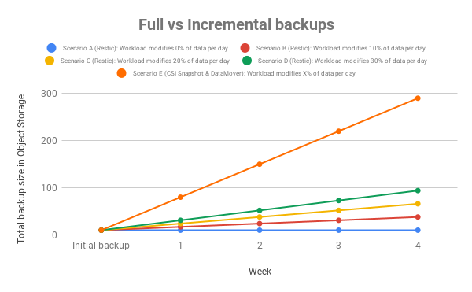

**NOTE:** Please, keep all these numbers in mind when setting the TTL of your backups.

## Incremental backups using CSI snapshots and the Data Mover

In the following example we are going to create the following OpenShift resources:
* **Namespace:** mysql-incremental-csi-snapshot
* **Secret:** mysql
* **Service:** mysql
* **PersistentVolumeClaim:** mysql (RBD)
* **Deployment:** mysql

**NOTE:** The storage class used in this example is `ocs-storagecluster-ceph-rbd`. In case your storage class name is different, change the parameter `storageClassName` in the `mysql-incremental-csi-snapshot-template.yaml` file.

```
$ wget https://gitlab.consulting.redhat.com/ddomingu/oadp/-/raw/main/files/incremental-backups/csi-snapshot/mysql-incremental-csi-snapshot-template.yaml -O mysql-incremental-csi-snapshot-template.yaml
$ oc create -f mysql-incremental-csi-snapshot-template.yaml
```

Ensure all the resources have been properly created:

```
$ oc -n mysql-incremental-csi-snapshot get all,pvc
NAME                        READY   STATUS    RESTARTS   AGE
pod/mysql-56894d47b-jz7x8   1/1     Running   0          37s

NAME            TYPE        CLUSTER-IP      EXTERNAL-IP   PORT(S)    AGE
service/mysql   ClusterIP   172.30.25.184   <none>        3306/TCP   37s

NAME                    READY   UP-TO-DATE   AVAILABLE   AGE
deployment.apps/mysql   1/1     1            1           37s

NAME                              DESIRED   CURRENT   READY   AGE
replicaset.apps/mysql-56894d47b   1         1         1       37s

NAME                          STATUS   VOLUME                                     CAPACITY   ACCESS MODES   STORAGECLASS                  AGE
persistentvolumeclaim/mysql   Bound    pvc-18aadc63-b1c4-4b5b-bc2d-413e22a7d684   50Gi       RWO            ocs-storagecluster-ceph-rbd   37s
```

In order to be able to measure how long it takes our backup and the amount of time we set our application as read-only, we have included `velero` pre and post hooks in the definition of our MySQL workload:

```
...
spec:
...
  template:
    metadata:
      annotations:
        pre.hook.backup.velero.io/command: '["/bin/echo", "Executing pre-hook: Freeze"]'
        post.hook.backup.velero.io/command: '["/bin/echo", "Executing post-hook: Unfreeze"]'
...
```

Once we have verified our deployment is properly set up, we would like to create five 1 GB files in our persistent volume:

```
$ oc -n mysql-incremental-csi-snapshot rsh $(oc -n mysql-incremental-csi-snapshot get pods -l app=mysql -o name)
$ bash
1000710000@mysql-5665894b97-7bj6p:/$ for i in {0..4};do dd if=/dev/urandom of=/var/lib/mysql/big_file_${i} bs=1M count=1000;done
1000+0 records in
1000+0 records out
1048576000 bytes (1.0 GB, 1000 MiB) copied, 6.98184 s, 150 MB/s
1000+0 records in
1000+0 records out
1048576000 bytes (1.0 GB, 1000 MiB) copied, 7.23832 s, 145 MB/s
1000+0 records in
1000+0 records out
1048576000 bytes (1.0 GB, 1000 MiB) copied, 7.20123 s, 146 MB/s
1000+0 records in
1000+0 records out
1048576000 bytes (1.0 GB, 1000 MiB) copied, 7.14575 s, 147 MB/s
1000+0 records in
1000+0 records out
1048576000 bytes (1.0 GB, 1000 MiB) copied, 7.07886 s, 148 MB/s
```

Now we can trigger the backup in our recently created `mysql-incremental-csi-snapshot` namespace and measure the amount of time it takes and the amount of space we are consuming when working with CSI snapshots and the Data Mover:

```
$ wget https://gitlab.consulting.redhat.com/ddomingu/oadp/-/raw/main/files/incremental-backups/csi-snapshot/mysql-incremental-csi-snapshot-backup-1.yaml -O mysql-incremental-csi-snapshot-backup-1.yaml
$ oc create -f mysql-incremental-csi-snapshot-backup-1.yaml
```

Make sure the backup has completed:

```
$ oc -n openshift-adp get backup mysql-incremental-csi-snapshot-1 -o jsonpath='{.status.phase}'
Completed
$ oc -n openshift-adp get backup mysql-incremental-csi-snapshot-1 -o jsonpath='{.status}' | jq
{
  "backupItemOperationsAttempted": 1,
  "backupItemOperationsCompleted": 1,
  "completionTimestamp": "2023-07-18T05:16:31Z",
  "csiVolumeSnapshotsAttempted": 1,
  "csiVolumeSnapshotsCompleted": 1,
  "expiration": "2023-08-17T05:14:56Z",
  "formatVersion": "1.1.0",
  "phase": "Completed",
  "startTimestamp": "2023-07-18T05:14:56Z",
  "version": 1
}
```

Get backup creation and termination time:

```
$ oc -n openshift-adp get backup mysql-incremental-csi-snapshot-1 -o jsonpath='{.metadata.creationTimestamp}'
2023-07-18T05:14:56Z
$ oc -n openshift-adp get backup mysql-incremental-csi-snapshot-1 -o jsonpath='{.status.completionTimestamp}'
2023-07-18T05:16:31Z
```

So, as we have seen it took 1 minute and 35 seconds to get our backup using CSI snapshots and the Data Mover. Checking the velero logs we know that our application was set as read-only for 11 seconds, at least this is the amount of seconds between the execution of the pre and post hooks:

```
$ oc -n openshift-adp logs $(oc -n openshift-adp get pods -l app.kubernetes.io/name=velero -o name) | grep -i freeze
time="2023-07-18T05:15:02Z" level=info msg="stderr: " backup=openshift-adp/mysql-incremental-csi-snapshot-1 hookCommand="[/bin/echo Executing pre-hook: Freeze]" hookContainer=mysql hookName="<from-annotation>" hookOnError=Fail hookPhase=pre hookSource=annotation hookTimeout="{30s}" hookType=exec logSource="/remote-source/velero/app/pkg/podexec/pod_command_executor.go:174" name=mysql-56894d47b-jz7x8 namespace=mysql-incremental-csi-snapshot resource=pods
time="2023-07-18T05:15:13Z" level=info msg="running exec hook" backup=openshift-adp/mysql-incremental-csi-snapshot-1 hookCommand="[/bin/echo Executing post-hook: Unfreeze]" hookContainer=mysql hookName="<from-annotation>" hookOnError=Fail hookPhase=post hookSource=annotation hookTimeout="{30s}" hookType=exec logSource="/remote-source/velero/app/pkg/podexec/pod_command_executor.go:126" name=mysql-56894d47b-jz7x8 namespace=mysql-incremental-csi-snapshot resource=pods
```

Finally, get the storage space consumption in the S3 bucket:

```
$ aws s3 ls --recursive --human-readable --summarize s3://ddomingu-oadp/openshift-adp/snapcontent-97f480c7-7af6-476e-9b4b-6fa4c9705d5e-pvc/
...
Total Objects: 296
   Total Size: 4.9 GiB
```

Once we have our full backup, we are going to create a new 1 GB file in our application:

```
$ oc -n mysql-incremental-csi-snapshot rsh $(oc -n mysql-incremental-csi-snapshot get pods -l app=mysql -o name)
$ bash
1000710000@mysql-5665894b97-7bj6p:/$ dd if=/dev/urandom of=/var/lib/mysql/big_file_5 bs=1M count=1000
1000+0 records in
1000+0 records out
1048576000 bytes (1.0 GB, 1000 MiB) copied, 7.13261 s, 147 MB/s
```

Now we can trigger another backup of the `mysql-incremental-csi-snapshot` namespace and measure the amount of time it takes and the amount of space we are consuming when working with CSI snapshots and the Data Mover:

```
$ wget https://gitlab.consulting.redhat.com/ddomingu/oadp/-/raw/main/files/incremental-backups/csi-snapshot/mysql-incremental-csi-snapshot-backup-2.yaml -O mysql-incremental-csi-snapshot-backup-2.yaml
$ oc create -f mysql-incremental-csi-snapshot-backup-2.yaml
```

Make sure the backup has completed:

```
$ oc -n openshift-adp get backup mysql-incremental-csi-snapshot-2 -o jsonpath='{.status.phase}'
Completed
$ oc -n openshift-adp get backup mysql-incremental-csi-snapshot-2 -o jsonpath='{.status}' | jq
{
  "backupItemOperationsAttempted": 1,
  "backupItemOperationsCompleted": 1,
  "completionTimestamp": "2023-07-18T05:29:01Z",
  "csiVolumeSnapshotsAttempted": 1,
  "csiVolumeSnapshotsCompleted": 1,
  "expiration": "2023-08-17T05:27:25Z",
  "formatVersion": "1.1.0",
  "phase": "Completed",
  "startTimestamp": "2023-07-18T05:27:25Z",
  "version": 1
}
```

Get backup creation and termination time:

```
$ oc -n openshift-adp get backup mysql-incremental-csi-snapshot-2 -o jsonpath='{.metadata.creationTimestamp}'
2023-07-18T05:27:25Z
$ oc -n openshift-adp get backup mysql-incremental-csi-snapshot-2 -o jsonpath='{.status.completionTimestamp}'
2023-07-18T05:29:01Z
```

So, as we have seen it took 1 minute and 36 seconds to get our second backup using CSI snapshots and the Data Mover. Checking the velero logs we know that our application was set as read-only for 11 seconds, at least this is the amount of seconds between the execution of the pre and post hooks:

```
$ oc -n openshift-adp logs $(oc -n openshift-adp get pods -l app.kubernetes.io/name=velero -o name) | grep -i freeze
time="2023-07-18T05:27:31Z" level=info msg="stderr: " backup=openshift-adp/mysql-incremental-csi-snapshot-2 hookCommand="[/bin/echo Executing pre-hook: Freeze]" hookContainer=mysql hookName="<from-annotation>" hookOnError=Fail hookPhase=pre hookSource=annotation hookTimeout="{30s}" hookType=exec logSource="/remote-source/velero/app/pkg/podexec/pod_command_executor.go:174" name=mysql-56894d47b-jz7x8 namespace=mysql-incremental-csi-snapshot resource=pods
time="2023-07-18T05:27:42Z" level=info msg="running exec hook" backup=openshift-adp/mysql-incremental-csi-snapshot-2 hookCommand="[/bin/echo Executing post-hook: Unfreeze]" hookContainer=mysql hookName="<from-annotation>" hookOnError=Fail hookPhase=post hookSource=annotation hookTimeout="{30s}" hookType=exec logSource="/remote-source/velero/app/pkg/podexec/pod_command_executor.go:126" name=mysql-56894d47b-jz7x8 namespace=mysql-incremental-csi-snapshot resource=pods
```

Finally, get the storage space consumption in the S3 bucket:

```
$ aws s3 ls --recursive --human-readable --summarize s3://ddomingu-oadp/openshift-adp/snapcontent-97f480c7-7af6-476e-9b4b-6fa4c9705d5e-pvc/
...
Total Objects: 296
   Total Size: 4.9 GiB
$ aws s3 ls --recursive --human-readable --summarize s3://ddomingu-oadp/openshift-adp/snapcontent-e70930bf-0d0b-42c4-a095-ae5f3ef88c05-pvc/
...
Total Objects: 358
   Total Size: 5.9 GiB
```

## Incremental backups using Restic

For creating a backup, restic scans the source directory for all files, sub-directories and other entries. Check the [restic documentation](https://restic.readthedocs.io/en/v0.3.3/Design/#backups-and-deduplication) for further info. Basically, as we can see at [OADP FAQ](https://access.redhat.com/articles/5456281#how-does-oadps-restic-option-manage-incremental-backups-13): *Velero looks for the most recent Restic backup for the current volume that is in the same backup location. If one is found, Velero then passes the Restic snapshot ID to the Restic CLI. This means that Restic will only retrieve files that have changed since the most recent backup, and uses the existing files for the rest.*

In the following example we are going to create the following OpenShift resources:
* **Namespace:** mysql-incremental-restic
* **Secret:** mysql
* **Service:** mysql
* **PersistentVolumeClaim:** mysql (RBD)
* **Deployment:** mysql

**NOTE:** The storage class used in this example is `ocs-storagecluster-ceph-rbd`. In case your storage class name is different, change the parameter `storageClassName` in the `mysql-incremental-restic-template.yaml` file.

```
$ wget https://gitlab.consulting.redhat.com/ddomingu/oadp/-/raw/main/files/incremental-backups/restic/mysql-incremental-restic-template.yaml -O mysql-incremental-restic-template.yaml
$ oc create -f mysql-incremental-restic-template.yaml
```

Ensure all the resources have been properly created:

```
$ oc -n mysql-incremental-restic get all,pvc
NAME                         READY   STATUS    RESTARTS   AGE
pod/mysql-5665894b97-7bj6p   1/1     Running   0          31s

NAME            TYPE        CLUSTER-IP       EXTERNAL-IP   PORT(S)    AGE
service/mysql   ClusterIP   172.30.146.110   <none>        3306/TCP   32s

NAME                    READY   UP-TO-DATE   AVAILABLE   AGE
deployment.apps/mysql   1/1     1            1           31s

NAME                               DESIRED   CURRENT   READY   AGE
replicaset.apps/mysql-5665894b97   1         1         1       31s

NAME                          STATUS   VOLUME                                     CAPACITY   ACCESS MODES   STORAGECLASS                  AGE
persistentvolumeclaim/mysql   Bound    pvc-46764138-c370-42fb-a062-74db78179e71   50Gi       RWO            ocs-storagecluster-ceph-rbd   32s
```

In order to be able to measure how long it takes our backup and the amount of time we set our application as read-only, we have included `velero` pre and post hooks in the definition of our MySQL workload:

```
...
spec:
...
  template:
    metadata:
      annotations:
        pre.hook.backup.velero.io/command: '["/bin/echo", "Executing pre-hook: Freeze"]'
        post.hook.backup.velero.io/command: '["/bin/echo", "Executing post-hook: Unfreeze"]'
...
```

Also, to force `velero` to use restic instead of the CSI snapshot capabilities, we are including in our deployment the following annotation. Further info can be found at [restic](https://velero.io/docs/v1.9/restic/#using-opt-in-pod-volume-backup) documentation:

```
...
spec:
...
  template:
    metadata:
      annotations:
        backup.velero.io/backup-volumes: mysql-data
...
```

Once we have verified our deployment is properly set up, we would like to create five 1 GB files in our persistent volume:

```
$ oc -n mysql-incremental-restic rsh $(oc -n mysql-incremental-restic get pods -l app=mysql -o name)
$ bash
1000710000@mysql-5665894b97-7bj6p:/$ for i in {0..4};do dd if=/dev/urandom of=/var/lib/mysql/big_file_${i} bs=1M count=1000;done
1000+0 records in
1000+0 records out
1048576000 bytes (1.0 GB, 1000 MiB) copied, 7.12326 s, 147 MB/s
1000+0 records in
1000+0 records out
1048576000 bytes (1.0 GB, 1000 MiB) copied, 7.17826 s, 146 MB/s
1000+0 records in
1000+0 records out
1048576000 bytes (1.0 GB, 1000 MiB) copied, 7.20279 s, 146 MB/s
1000+0 records in
1000+0 records out
1048576000 bytes (1.0 GB, 1000 MiB) copied, 7.1093 s, 147 MB/s
1000+0 records in
1000+0 records out
1048576000 bytes (1.0 GB, 1000 MiB) copied, 7.21377 s, 145 MB/s
```

Now we can trigger the backup in our recently created `mysql-incremental-restic` namespace and measure the amount of time it takes and the amount of space we are consuming when working with restic:

```
$ wget https://gitlab.consulting.redhat.com/ddomingu/oadp/-/raw/main/files/incremental-backups/restic/mysql-incremental-restic-backup-1.yaml -O mysql-incremental-restic-backup-1.yaml
$ oc create -f mysql-incremental-restic-backup-1.yaml
```

Make sure the backup has completed:

```
$ oc -n openshift-adp get backup mysql-incremental-restic-1 -o jsonpath='{.status.phase}'
Completed
$ oc -n openshift-adp get backup mysql-incremental-restic-1 -o jsonpath='{.status}' | jq
{
  "completionTimestamp": "2023-07-17T14:45:53Z",
  "expiration": "2023-08-16T14:45:15Z",
  "formatVersion": "1.1.0",
  "phase": "Completed",
  "startTimestamp": "2023-07-17T14:45:15Z",
  "version": 1
}
```

Get backup creation and termination time:

```
$ oc -n openshift-adp get backup mysql-incremental-restic-1 -o jsonpath='{.metadata.creationTimestamp}'
2023-07-17T14:45:15Z
$ oc -n openshift-adp get backup mysql-incremental-restic-1 -o jsonpath='{.status.completionTimestamp}'
2023-07-17T14:45:53Z
```

So, as we have seen it took 38 seconds to get our backup using restic. Checking the velero logs we know that our application was set as read-only for 32 seconds, at least this is the amount of seconds between the execution of the pre and post hooks:

```
$ oc -n openshift-adp logs $(oc -n openshift-adp get pods -l app.kubernetes.io/name=velero -o name) | grep -i freeze
time="2023-07-17T14:45:20Z" level=info msg="stderr: " backup=openshift-adp/mysql-incremental-restic-1 hookCommand="[/bin/echo Executing pre-hook: Freeze]" hookContainer=mysql hookName="<from-annotation>" hookOnError=Fail hookPhase=pre hookSource=annotation hookTimeout="{30s}" hookType=exec logSource="/remote-source/velero/app/pkg/podexec/pod_command_executor.go:174" name=mysql-5665894b97-7bj6p namespace=mysql-incremental-restic resource=pods
time="2023-07-17T14:45:52Z" level=info msg="running exec hook" backup=openshift-adp/mysql-incremental-restic-1 hookCommand="[/bin/echo Executing post-hook: Unfreeze]" hookContainer=mysql hookName="<from-annotation>" hookOnError=Fail hookPhase=post hookSource=annotation hookTimeout="{30s}" hookType=exec logSource="/remote-source/velero/app/pkg/podexec/pod_command_executor.go:126" name=mysql-5665894b97-7bj6p namespace=mysql-incremental-restic resource=pods
```

Finally, get the storage space consumption in the S3 bucket:

```
$ aws s3 ls --recursive --human-readable --summarize s3://ddomingu-oadp/velero/restic/mysql-incremental-restic/
...
Total Objects: 300
   Total Size: 4.9 GiB
```

Once we have our full backup, we are going to create a new 1 GB file in our application:

```
$ oc -n mysql-incremental-restic rsh $(oc -n mysql-incremental-restic get pods -l app=mysql -o name)
$ bash
1000710000@mysql-5665894b97-7bj6p:/$ dd if=/dev/urandom of=/var/lib/mysql/big_file_5 bs=1M count=1000
1000+0 records in
1000+0 records out
1048576000 bytes (1.0 GB, 1000 MiB) copied, 7.27184 s, 144 MB/s
```

Now we can trigger another backup of the `mysql-incremental-restic` namespace and measure the amount of time it takes and the amount of space we are consuming when working with restic:

```
$ wget https://gitlab.consulting.redhat.com/ddomingu/oadp/-/raw/main/files/incremental-backups/restic/mysql-incremental-restic-backup-2.yaml -O mysql-incremental-restic-backup-2.yaml
$ oc create -f mysql-incremental-restic-backup-2.yaml
```

Make sure the backup has completed:

```
$ oc -n openshift-adp get backup mysql-incremental-restic-2 -o jsonpath='{.status.phase}'
Completed
$ oc -n openshift-adp get backup mysql-incremental-restic-2 -o jsonpath='{.status}' | jq
{
  "completionTimestamp": "2023-07-17T15:05:36Z",
  "expiration": "2023-08-16T15:05:20Z",
  "formatVersion": "1.1.0",
  "phase": "Completed",
  "startTimestamp": "2023-07-17T15:05:20Z",
  "version": 1
}
```

Get backup creation and termination time:

```
$ oc -n openshift-adp get backup mysql-incremental-restic-2 -o jsonpath='{.metadata.creationTimestamp}'
2023-07-17T15:05:20Z
$ oc -n openshift-adp get backup mysql-incremental-restic-2 -o jsonpath='{.status.completionTimestamp}'
2023-07-17T15:05:36Z
```

So, as we have seen it took 16 seconds to get our second backup using restic. Checking the velero logs we know that our application was set as read-only for 9 seconds, at least this is the amount of seconds between the execution of the pre and post hooks:

```
$ oc -n openshift-adp logs $(oc -n openshift-adp get pods -l app.kubernetes.io/name=velero -o name) | grep -i freeze
time="2023-07-17T15:05:26Z" level=info msg="stderr: " backup=openshift-adp/mysql-incremental-restic-2 hookCommand="[/bin/echo Executing pre-hook: Freeze]" hookContainer=mysql hookName="<from-annotation>" hookOnError=Fail hookPhase=pre hookSource=annotation hookTimeout="{30s}" hookType=exec logSource="/remote-source/velero/app/pkg/podexec/pod_command_executor.go:174" name=mysql-5665894b97-7bj6p namespace=mysql-incremental-restic resource=pods
time="2023-07-17T15:05:35Z" level=info msg="running exec hook" backup=openshift-adp/mysql-incremental-restic-2 hookCommand="[/bin/echo Executing post-hook: Unfreeze]" hookContainer=mysql hookName="<from-annotation>" hookOnError=Fail hookPhase=post hookSource=annotation hookTimeout="{30s}" hookType=exec logSource="/remote-source/velero/app/pkg/podexec/pod_command_executor.go:126" name=mysql-5665894b97-7bj6p namespace=mysql-incremental-restic resource=pods
```

Finally, get the storage space consumption in the S3 bucket:

```
$ aws s3 ls --recursive --human-readable --summarize s3://ddomingu-oadp/velero/restic/mysql-incremental-restic/
...
Total Objects: 363
   Total Size: 5.9 GiB
```

# Backup of ObjectBucketClaim

One of the typical questions we have when working with OADP and Velero is if we can have a backup of our Object Storage buckets. In OpenShift we have the `ObjectBucketClaim` or OBC resource to dynamically provision Object Storage buckets. Backing up S3 buckets is very hard and there are almost no storage providers able to properly backup these kind of resources.

From the OADP side, backing up OBCs or in the near future [COSI](https://kubernetes.io/blog/2022/09/02/cosi-kubernetes-object-storage-management/) resources is out of scope. Check this [RFE](https://issues.redhat.com/browse/OADP-1745) for further info.

Nevertheless, we have different options to backup our S3 buckets, sometimes depending on the technology we are using underneath.

**NOTE:** When replicating/backing up our objects to AWS S3, we need to ensure that bucket versioning and MFA delete features are enabled in the destination bucket in order to keep our data safe by not propagating any update/delete operations to our data in AWS S3. Check the following resources for further info:
* [Red Hat GChat thread](https://chat.google.com/room/AAAA4rC8L6g/2VBNE3LPUdI)
* [How to enable MFA delete S3 bucket feature?](https://blog.searce.com/how-to-enable-mfa-delete-s3-bucket-feature-ad3abb965301)
* [AWS S3 Configuring MFA delete](https://docs.aws.amazon.com/AmazonS3/latest/userguide/MultiFactorAuthenticationDelete.html)
* [How do I turn on MFA delete for my Amazon S3 bucket?](https://repost.aws/knowledge-center/s3-bucket-mfa-delete)

## Backup of OBCs using OADP

We want to test how OADP behaves when backing up OBC resources, either when using the MultiCloud Gateway or the RadosGW Storage Class. The first thing we have to do is to create a new namespace and create two OBC resources, one using the noobaa storage class and the other one using the RadosGW storage class:

```
$ oc new-project oadp-obc-backup
$ cat << EOF > ~/01-noobaa-obc1.yaml
apiVersion: objectbucket.io/v1alpha1
kind: ObjectBucketClaim
metadata:
  name: noobaa-obc1
  namespace: oadp-obc-backup
spec:
  generateBucketName: test-bucket
  storageClassName: openshift-storage.noobaa.io
EOF
$ oc create -f ~/01-noobaa-obc1.yaml
$ cat << EOF > ~/02-radosgw-obc1.yaml
apiVersion: objectbucket.io/v1alpha1
kind: ObjectBucketClaim
metadata:
  name: radosgw-obc1
  namespace: oadp-obc-backup
spec:
  generateBucketName: test-bucket
  storageClassName: ocs-storagecluster-ceph-rgw
EOF
$ oc create -f ~/02-radosgw-obc1.yaml
```

Verify the OBCs have been created successfully:

```
$ oc get obc
NAME           STORAGE-CLASS                 PHASE   AGE
noobaa-obc1    openshift-storage.noobaa.io   Bound   4s
radosgw-obc1   ocs-storagecluster-ceph-rgw   Bound   2s
```

Retrieve the credentials for both OBCs:

```
$ RGW_ENDPOINT=$(oc -n openshift-storage get route s3-rgw -o jsonpath='{.spec.host}')
$ NOOBAA_ENDPOINT=$(oc -n openshift-storage get route s3 -o jsonpath='{.spec.host}')
$ RGW_ACCESS_KEY=$(oc -n oadp-obc-backup get secrets radosgw-obc1 -o go-template='{{.data.AWS_ACCESS_KEY_ID | base64decode }}')
$ RGW_SECRET_KEY=$(oc -n oadp-obc-backup get secrets radosgw-obc1 -o go-template='{{.data.AWS_SECRET_ACCESS_KEY | base64decode }}')
$ NOOBAA_ACCESS_KEY=$(oc -n oadp-obc-backup get secrets noobaa-obc1 -o go-template='{{.data.AWS_ACCESS_KEY_ID | base64decode }}')
$ NOOBAA_SECRET_KEY=$(oc -n oadp-obc-backup get secrets noobaa-obc1 -o go-template='{{.data.AWS_SECRET_ACCESS_KEY | base64decode }}')
```

Configure s3cmd to use the buckets we have created:

```
$ cat << EOF > ~/.radosgw.s3cfg
[default]
access_key = ${RGW_ACCESS_KEY}
secret_key = ${RGW_SECRET_KEY}
host_base = ${RGW_ENDPOINT}
host_bucket = ${RGW_ENDPOINT}
use_https = True
EOF
$ cat << EOF > ~/.noobaa.s3cfg
[default]
access_key = ${NOOBAA_ACCESS_KEY}
secret_key = ${NOOBAA_SECRET_KEY}
host_base = ${NOOBAA_ENDPOINT}
host_bucket = ${NOOBAA_ENDPOINT}
use_https = True
EOF
$ s3cmd -c ~/.radosgw.s3cfg ls
2023-08-03 15:07  s3://test-bucket-497214a2-52cf-4d53-947f-763eb9ac9783
$ s3cmd -c ~/.noobaa.s3cfg ls
2023-08-03 15:21  s3://test-bucket-6e8d2bde-88a5-4993-b064-c09d58a86385
```

Upload some content to our buckets:

```
$ s3cmd -c ~/.radosgw.s3cfg put /etc/redhat-release s3://test-bucket-497214a2-52cf-4d53-947f-763eb9ac9783/
upload: '/etc/redhat-release' -> 's3://test-bucket-497214a2-52cf-4d53-947f-763eb9ac9783/redhat-release'  [1 of 1]
 45 of 45   100% in    0s     3.81 KB/s  done
$ s3cmd -c ~/.noobaa.s3cfg put /etc/redhat-release s3://test-bucket-6e8d2bde-88a5-4993-b064-c09d58a86385
upload: '/etc/redhat-release' -> 's3://test-bucket-6e8d2bde-88a5-4993-b064-c09d58a86385/redhat-release'  [1 of 1]
 45 of 45   100% in    0s    66.25 B/s  done
```

Trigger the backup in our recently created `oadp-obc-backup` namespace:

```
$ wget https://gitlab.consulting.redhat.com/ddomingu/oadp/-/raw/main/files/obc/oadp-obc-backup.yaml -O oadp-obc-backup.yaml 
$ oc create -f oadp-obc-backup.yaml
```

Make sure the backup has completed:

```
$ oc -n openshift-adp get backup oadp-obc-backup -o jsonpath='{.status.phase}'
Completed
$ oc -n openshift-adp get backup oadp-obc-backup -o jsonpath='{.status}' | jq
{
  "completionTimestamp": "2023-08-03T15:27:19Z",
  "expiration": "2023-09-02T15:27:12Z",
  "formatVersion": "1.1.0",
  "phase": "Completed",
  "startTimestamp": "2023-08-03T15:27:12Z",
  "version": 1
}
```

Once we have ensured the backup has completed, we want to test the restore process. First, delete completely the `oadp-obc-backup` project:

```
$ oc delete ns oadp-obc-backup
```

Trigger the restore process of our backup:

```
$ wget https://gitlab.consulting.redhat.com/ddomingu/oadp/-/raw/main/files/obc/oadp-obc-restore.yaml -O oadp-obc-restore.yaml 
$ oc create -f oadp-obc-restore.yaml
```

Ensure the restore process has been completed:

```
$ oc -n openshift-adp get restore oadp-obc-backup -o jsonpath='{.status.phase}'
Completed
$ oc -n openshift-adp get restore oadp-obc-backup -o jsonpath='{.status}' | jq
{
  "completionTimestamp": "2023-08-03T15:30:40Z",
  "phase": "Completed",
  "progress": {
    "itemsRestored": 32,
    "totalItems": 32
  },
  "startTimestamp": "2023-08-03T15:30:16Z",
  "warnings": 12
}
```

Finally, verify all our OpenShift resources have been recreated in the restore process:

```
$ oc -n oadp-obc-backup get obc
NAME           STORAGE-CLASS                 PHASE     AGE
noobaa-obc1    openshift-storage.noobaa.io   Pending   60s
radosgw-obc1   ocs-storagecluster-ceph-rgw   Bound     60s
```

As we can see, our OBC created in the MultiCloud Gateway is not reaching the `Bound` state. We can see in the logs the following errors:

```
$ oc -n openshift-storage logs -l noobaa-core=noobaa | grep test-bucket
CONSOLE:: RPC._on_request: ERROR srv bucket_api.read_bucket reqid wss://noobaa-mgmt.openshift-storage.s
vc.cluster.local:443/rpc/-40160 connid ws://[::ffff:10.129.2.6]:42074/(5wqq98t) Error: No such bucket: test-bucket-6e8d2bde-88a5-4993-b064-c09d58a86385
    at find_bucket (/root/node_modules/noobaa-core/src/server/system_services/bucket_server.js:1294:15)
    at read_bucket_sdk_info (/root/node_modules/noobaa-core/src/server/system_services/bucket_server.js:467:20)
    at Object.read_bucket (/root/node_modules/noobaa-core/src/server/system_services/bucket_server.js:462:35)
    at Object.server_func (/root/node_modules/noobaa-core/src/rpc/rpc.js:113:48)
    at /root/node_modules/noobaa-core/src/rpc/rpc.js:340:46
    at RPC._on_request (/root/node_modules/noobaa-core/src/rpc/rpc.js:345:19)
    at runMicrotasks (<anonymous>)
    at processTicksAndRejections (internal/process/task_queues.js:95:5)
```

On the other hand, with RadosGW we can see our OBC as `Bound` but it's not working properly either as a new set of credentials have been created when restoring the OBC:

```
$ s3cmd -c ~/.radosgw.s3cfg ls
ERROR: S3 error: 403 (InvalidAccessKeyId)
```

Even if we get the new credentials RadosGW has generated, we can see our bucket is empty:

```
$ RGW_ACCESS_KEY=$(oc -n oadp-obc-backup get secrets radosgw-obc1 -o go-template='{{.data.AWS_ACCESS_KEY_ID | base64decode }}')
$ RGW_SECRET_KEY=$(oc -n oadp-obc-backup get secrets radosgw-obc1 -o go-template='{{.data.AWS_SECRET_ACCESS_KEY | base64decode }}')
$ cat << EOF > ~/.radosgw.s3cfg
[default]
access_key = ${RGW_ACCESS_KEY}
secret_key = ${RGW_SECRET_KEY}
host_base = ${RGW_ENDPOINT}
host_bucket = ${RGW_ENDPOINT}
use_https = True
EOF
$ s3cmd -c ~/.radosgw.s3cfg ls s3://test-bucket-497214a2-52cf-4d53-947f-763eb9ac9783
```

So, we cannot rely on OADP to perform backups in our Object Storage resources in OpenShift.

## Ceph RadosGW archive zone

Currently, there are few enterprise solution capable of performing data backups using S3 protocol as source, being one of them [Commvault](https://documentation.commvault.com/v11/essential/114934_amazon_s3_simple_storage_service.html). Although, there are many enterprise solutions using S3 protocol for target infrastructure. To solve this situation, [Red Hat](https://www.redhat.com/en), [Inditex](https://www.inditex.com/) and [Igalia](https://www.igalia.com/) partnered to develop a native solution in Ceph RadosGW to automatically backup all objects in a separate cluster. This feature is named RadosGW archive zone and has the following main characteristics:
* Versioning is enabled in all buckets in the RadosGW archive zone.
* Every time a user uploads a new object, this object is asynchronous replicated to the archive zone.
* If an object is modified, a new version is generated in the archive zone.
* If an object is deleted, the object is kept in the archive zone.

**NOTE:** Red Hat is offering the Ceph RadosGW archive zone feature as a Tech Preview solution in the latest RHCS version, which is RHCS 6.1 at the time of writing.

Explaining in this document how the Ceph RadosGW works in detail is out of scope, but if you're interested on this feature, you can check the following documents:
* [Ceph upstream documentation](https://docs.ceph.com/en/latest/radosgw/archive-sync-module/)
* [Red Hat Ceph Object Gateway documentation](https://access.redhat.com/documentation/en-us/red_hat_ceph_storage/6/html/object_gateway_guide/multisite-configuration-and-administration#configuring-the-archive-sync-module_rgw)
* [Testing RHCS4 RadosGW archive zone feature at Inditex (2021)](https://gitlab.consulting.redhat.com/iberia-consulting/inditex/ceph/cer-rhcs4-archive-zone)
* [Testing Ceph Nautilus RadosGW archive zone feature at Inditex (2019)](https://gitlab.consulting.redhat.com/iberia-consulting/inditex/ejs/ej-rgw-archive-zone-nautilus)

## Ceph archival to AWS S3

Another native solution we have in Ceph is to archive the content to AWS S3 using Lifecycle configuration policies. Nevertheless, currently the transition is unidirectional, so data cannot be transitioned back from the remote zone. Also, be aware that when objects transition to the remote zone, the source object gets deleted. Thus, this is not a valid backup solution but can be useful for certain use cases. If you want to get further information of this feature, check the [Ceph upstream documentation](https://docs.ceph.com/en/latest/radosgw/cloud-transition/).

## MCG (NooBaa) replication

Another option we have in ODF is to use the MultiCloud Gateway (NooBaa) to replicate our objects between different providers but beware, bucket replication is not a backup as if any object is deleted or updated, the operation will be propagated to the destination bucket. Also, be aware of the technical limitations we do have in the bucket replication feature:
* Delete operations are not propagated to the destination bucket. Since ODF 4.13, delete operations can be propagated to the destination bucket but only in AWS S3. Check the following resources for further info:
  * [Enabling bucket replication deletion](https://access.redhat.com/documentation/en-us/red_hat_openshift_data_foundation/4.13/html/managing_hybrid_and_multicloud_resources/multicloud_object_gateway_bucket_replication#enabling-bucket-replication-deletion_rhodf)
  * [MCG Bucket Replication - Support deletion](https://issues.redhat.com/browse/RHSTOR-3456)
* A single thread is used to examine and replicate data from your local bucket to the destination bucket. For large datasets or buckets with a large number of objects, this is a concern in terms of performance and scalability.
* The replication thread is triggered every 5 minutes. This parameter is not customizable, thus it is not supported to modify this value.

If you are interested in using this feature in the MultiCloud Gateway, check the [MCG Deep Dive document](https://gitlab.consulting.redhat.com/iberia-consulting/inditex/ocs/ocs-procedures/-/blob/master/resources/content/mcg-deep-dive.md#bucket-replication) we wrote some time ago.

## Backing up S3 buckets using rclone

There are many different S3 clients such as [s3cmd](https://s3tools.org/s3cmd-sync), [awscli](https://docs.aws.amazon.com/cli/latest/reference/s3/sync.html), [S3P](https://www.genui.com/open-source/s3p-massively-parallel-s3-copying), ... with the ability to synchronize content between different buckets. The main problem is that as far as we know, none of these tools are able to work with different set of credentials. This means that these tools can work when copying objects in the same provider, but these tools cannot copy objects between two different providers (including two different ODF clusters or between AWS S3 and a local ODF cluster).

This is the main reason why we need to use [rclone](https://rclone.org/) as the tool when dealing with multiple providers, as we can copy objects in bucket A in provider X to bucket B in provider Y. Another great thing about rclone is that this tool can work with S3-compatible APIs but also with other object storage providers such as Azure Blob.

In this example we are going to replicate data from a bucket in our internal ODF Ceph RadosGW provider to an AWS S3 bucket. We are going to work with the following resources:
* Bucket name in ODF Ceph RadosGW: `ceph-bucket`
  * Namespace: `s3cmd-testing`
* Bucket name in AWS S3: `ddomingu-backup-bucket`
  * **NOTE:** If we want to keep our data safe, we need to enable bucket versioning and MFA delete features in this AWS S3 bucket.

The first thing we have to do is creating a namespace and OBC in our local ODF cluster:

```
$ oc new-project s3cmd-testing
$ cat << EOF > ~/01-obc-rclone-testing.yaml
apiVersion: objectbucket.io/v1alpha1
kind: ObjectBucketClaim
metadata:
  name: ceph-bucket
  namespace: rclone-testing
spec:
  bucketName: ceph-bucket
  storageClassName: ocs-storagecluster-ceph-rgw
EOF
$ oc create -f ~/01-obc-rclone-testing.yaml
```

Retrieve the credentials we need to configure rclone:

```
$ S3_ENDPOINT=$(oc -n openshift-storage get route s3-rgw -o jsonpath='{.spec.host}')
$ ODF_ACCESS_KEY_ID=$(oc -n rclone-testing get secrets ceph-bucket -o go-template='{{.data.AWS_ACCESS_KEY_ID | base64decode }}')
$ ODF_SECRET_KEY_ID=$(oc -n rclone-testing get secrets ceph-bucket -o go-template='{{.data.AWS_SECRET_ACCESS_KEY | base64decode }}')
```

Then, we are going to create a new bucket in AWS S3 using the AWS cli and enable bucket versioning:

**NOTE:** We are not setting the MFA delete feature on this test, but it is highly recommended when dealing with real data in production environments.

```
$ aws s3 mb s3://ddomingu-backup-bucket
$ aws s3api put-bucket-versioning --bucket ddomingu-backup-bucket --versioning-configuration MFADelete=Disabled,Status=Enabled
$ aws s3api get-bucket-versioning --bucket ddomingu-backup-bucket
{
    "Status": "Enabled",
    "MFADelete": "Disabled"
}
```

Once we have created our different S3 buckets, we need to install rclone in our local machine:

**NOTE:** rclone is not provided by Red Hat, so any misuse, bug or error of this software is out of the scope of Red Hat support

```
$ sudo dnf install -y https://downloads.rclone.org/v1.63.1/rclone-v1.63.1-linux-amd64.rpm
```

Configure the rclone client:

```
$ mkdir -p ~/.config/rclone/
$ cat << EOF > ~/.config/rclone/rclone.conf
[local-odf]
type = s3
provider = Ceph
access_key_id = ${ODF_ACCESS_KEY_ID}
secret_access_key = ${ODF_SECRET_KEY_ID}
endpoint = https://${S3_ENDPOINT}
acl = private

[external-aws]
type = s3
provider = AWS
region = ${AWS_DEFAULT_REGION}
access_key_id = ${AWS_ACCESS_KEY_ID}
secret_access_key = ${AWS_SECRET_ACCESS_KEY}
acl = private
EOF
```

Create some test files in our local file system:

```
$ mkdir -p /tmp/s3_backup_example/dir_{0..9}
$ for i in {0..9}; do for j in {0..99};do echo "This is file_${j}.txt at dir_${i}" > /tmp/s3_backup_example/dir_${i}/file_${j}.txt;done;done
```

Synchronize the local file system with the bucket in our local ODF cluster using rclone:

```
$ rclone sync /tmp/s3_backup_example/ local-odf:ceph-bucket
```

Now, using rclone we want to backup our objects to the external AWS S3 endpoint. We can do so by streaming the objects between the S3 buckets, without the need to use local storage to store the objects.

```
$ rclone sync local-odf:ceph-bucket external-aws:ddomingu-backup-bucket
```

Verify we have the same content in both buckets:

```
$ aws --profile local-odf s3 ls --recursive --human-readable --summarize s3://ceph-bucket/
Total Objects: 1000
   Total Size: 28.2 KiB
$ aws --profile external-aws s3 ls --recursive --human-readable --summarize s3://ddomingu-backup-bucket
Total Objects: 1000
   Total Size: 28.2 KiB
```

Now, we are going to delete the directory `dir_1/*` in our local ODF cluster and we are going to modify all files in the directory `dir_2/*`:

```
$ for i in {0..99}; do aws --profile local-odf s3 rm s3://ceph-bucket/dir_1/file_${i}.txt;done
$ for i in {0..99}; do echo "This is a modification of file_${i}.txt at dir_2" > /tmp/s3_backup_example/dir_2/file_${i}.txt;done
$ rclone sync /tmp/s3_backup_example/dir_2 local-odf:ceph-bucket/dir_2
```

Now that we have modified (even deleting) certain files, create a new backup to the external AWS S3 endpoint, but please be aware:
* By default rclone delete files from destination to match source. If you don't want this behaviour use the `rclone copy` command instead. More info at [rclone documentation](https://rclone.org/commands/rclone_sync/).
* In our case is ok as we have enabled versioning in our destination bucket.

```
$ rclone sync local-odf:ceph-bucket external-aws:ddomingu-backup-bucket
```

Verify we can't see the directory `dir_1` that we have deleted previously:

```
$ aws --profile external-aws s3 ls s3://ddomingu-backup-bucket/
                           PRE dir_0/
                           PRE dir_2/
                           PRE dir_3/
                           PRE dir_4/
                           PRE dir_5/
                           PRE dir_6/
                           PRE dir_7/
                           PRE dir_8/
                           PRE dir_9/
```

Verify we can see the modifications performed at `dir_2`:

```
$ aws --profile external-aws s3 cp s3://ddomingu-backup-bucket/dir_2/file_1.txt -
This is a modification of file_1.txt at dir_2
```

As we have enabled bucket versioning in our external AWS S3 endpoint, verify we still have a version of our modified and deleted objects:

```
$ aws --profile external-aws s3api list-object-versions --bucket ddomingu-backup-bucket --prefix dir_1/file_1.txt
{
    "Versions": [
        {
            "ETag": "\"83607fae8d3eb39742b59a206bcd6e2f\"",
            "Size": 28,
            "StorageClass": "STANDARD",
            "Key": "dir_1/file_1.txt",
            "VersionId": "Sw3uR.7cK0AZzxXJDZPWAzrirqFtUddt",
            "IsLatest": false,
            "LastModified": "2023-08-03T10:53:45.000Z",
            "Owner": {
                "ID": "3e99df19f9a10ed9f3118ab86d63e3df42fb3c134e1fd877a96515e4e6099a8b"
            }
        }
    ],
    "DeleteMarkers": [
        {
            "Owner": {
                "ID": "3e99df19f9a10ed9f3118ab86d63e3df42fb3c134e1fd877a96515e4e6099a8b"
            },
            "Key": "dir_1/file_1.txt",
            "VersionId": "Y6sSB1h6afx4DcmX2mWekIn7s5vjXEIq",
            "IsLatest": true,
            "LastModified": "2023-08-03T11:15:49.000Z"
        }
    ]
}
$ aws --profile external-aws s3api get-object --bucket ddomingu-backup-bucket --key dir_1/file_1.txt --version-id "Sw3uR.7cK0AZzxXJDZPWAzrirqFtUddt" /dev/stdout 2>/dev/null 
This is file_1.txt at dir_1
{
    "AcceptRanges": "bytes",
    "LastModified": "Thu, 03 Aug 2023 10:53:45 GMT",
    "ContentLength": 28,
    "ETag": "\"83607fae8d3eb39742b59a206bcd6e2f\"",
    "VersionId": "Sw3uR.7cK0AZzxXJDZPWAzrirqFtUddt",
    "ContentType": "text/plain; charset=utf-8",
    "ServerSideEncryption": "AES256",
    "Metadata": {
        "mtime": "1690986041.003950677"
    }
}
$ aws --profile external-aws s3api list-object-versions --bucket ddomingu-backup-bucket --prefix dir_2/file_1.txt
{
    "Versions": [
        {
            "ETag": "\"a3c0126afd0e507cb968a790b1df580c\"",
            "Size": 46,
            "StorageClass": "STANDARD",
            "Key": "dir_2/file_1.txt",
            "VersionId": "Kq2Zjz6FbREYv6zjGuH7STyMez7adc3P",
            "IsLatest": true,
            "LastModified": "2023-08-03T11:15:47.000Z",
            "Owner": {
                "ID": "3e99df19f9a10ed9f3118ab86d63e3df42fb3c134e1fd877a96515e4e6099a8b"
            }
        },
        {
            "ETag": "\"dfe25321a6b5b95e019dfaf04f879690\"",
            "Size": 28,
            "StorageClass": "STANDARD",
            "Key": "dir_2/file_1.txt",
            "VersionId": "Ba1VTL9twer75pEkxF0C2.0Gi9cwnOsA",
            "IsLatest": false,
            "LastModified": "2023-08-03T10:53:43.000Z",
            "Owner": {
                "ID": "3e99df19f9a10ed9f3118ab86d63e3df42fb3c134e1fd877a96515e4e6099a8b"
            }
        }
    ]
}
$ aws --profile external-aws s3api get-object --bucket ddomingu-backup-bucket --key dir_2/file_1.txt --version-id "Ba1VTL9twer75pEkxF0C2.0Gi9cwnOsA" /dev/stdout 2>/dev/null 
This is file_1.txt at dir_2
{
    "AcceptRanges": "bytes",
    "LastModified": "Thu, 03 Aug 2023 10:53:43 GMT",
    "ContentLength": 28,
    "ETag": "\"dfe25321a6b5b95e019dfaf04f879690\"",
    "VersionId": "Ba1VTL9twer75pEkxF0C2.0Gi9cwnOsA",
    "ContentType": "text/plain; charset=utf-8",
    "ServerSideEncryption": "AES256",
    "Metadata": {
        "mtime": "1690986041.010950666"
    }
}
```

Now, it is time to recover the content we had before deleting `dir_1/*` and modifying the files at `dir_2/*`. We can use rclone to do this but we need to it in different steps:
* As we were doing our modifications on 03 August 2023 at 11:15, we want to recover the content of our bucket at 11:00 but when listing versions using rclone we can see the file name has changed:

```
$ rclone ls --s3-version-at "2023-08-03 11:00:00" external-aws:ddomingu-backup-bucket/dir_1
       28 file_0-v2023-08-03-105345-000.txt
       28 file_1-v2023-08-03-105345-000.txt
       ...
       29 file_99-v2023-08-03-105347-000.txt
```

* As we want to keep the same file as before, we need to rename the files but this cannot be done "on the flight" so we need to use some shell tricks:

**NOTE:** This is valid for my example but you might need to change and adapt it to the name of your files/directories. We are also using the `--s3-no-check-bucket` parameter to avoid errors when uploading objects to the local ODF cluster. Also, in terms of performance using this method is not the best as listing all objects in one bucket and issuing individual S3 copy requests is not ideal.

```
$ for file in $(rclone ls --s3-versions external-aws:/ddomingu-backup-bucket/dir_1 | awk '{print $2}');do rclone copyto --s3-versions --s3-no-check-bucket external-aws:ddomingu-backup-bucket/dir_1/${file} local-odf:ceph-bucket/dir_1/${file/-v[0-9]*/.txt};done
$ for file in $(rclone ls --s3-versions external-aws:/ddomingu-backup-bucket/dir_2 | awk '{print $2}');do rclone copyto --s3-versions --s3-no-check-bucket external-aws:ddomingu-backup-bucket/dir_2/${file} local-odf:ceph-bucket/dir_2/${file/-v[0-9]*/.txt};done
```

* Check in our local ODF cluster that we have restored successfully our objects from our backup:

```
$ aws --profile local-odf s3 cp s3://ceph-bucket/dir_1/file_1.txt -
This is file_1.txt at dir_1
$ aws --profile local-odf s3 cp s3://ceph-bucket/dir_2/file_1.txt -
This is file_1.txt at dir_2
```

If you want to automate the periodical execution of your backups using `rclone sync`, you can either use Linux or OpenShift Cronjobs.

# Backup of OpenShift workloads when working with the LVM Storage Operator

For certain OpenShift deployments such as Single Node OpenShift (SNO) we cannot use ODF as it is not supported, so we have to use the LVM Storage operator.

Installing and configuring the LVM Storage operator is out of the scope of this document, but as a requirement we need to have the following `StorageClass` available in our OpenShift cluster:

```
$ oc get sc
NAME                                   PROVISIONER                             RECLAIMPOLICY   VOLUMEBINDINGMODE      ALLOWVOLUMEEXPANSION   AGE
lvms-vg1                               topolvm.io                              Delete          WaitForFirstConsumer   true                   18h
```

## Using CSI snapshots and Data Mover

The first task is to deploy in OpenShift a MySQL database:

**NOTE:** The storage class used in this example is `lvms-vg1`. In case your storage class name is different, change the parameter `storageClassName` in the `mysql-sno-template.yaml` file.

```
$ wget https://gitlab.consulting.redhat.com/ddomingu/oadp/-/raw/main/files/sno/mysql-sno-template.yaml -O mysql-sno-template.yaml
$ oc create -f mysql-sno-template.yaml
```

This example will create the following OpenShift resources:
* **Namespace:** mysql-sno
* **Secret:** mysql
* **Service:** mysql
* **PersistentVolumeClaim:** mysql (RBD)
* **Deployment:** mysql

Before triggering our backup, ensure all these resources have been properly created:

```
$ oc -n mysql-sno get all,pvc
NAME                        READY   STATUS    RESTARTS   AGE
pod/mysql-744b57754-bszcc   1/1     Running   0          16s

NAME            TYPE        CLUSTER-IP      EXTERNAL-IP   PORT(S)    AGE
service/mysql   ClusterIP   172.30.232.82   <none>        3306/TCP   16s

NAME                    READY   UP-TO-DATE   AVAILABLE   AGE
deployment.apps/mysql   1/1     1            1           16s

NAME                              DESIRED   CURRENT   READY   AGE
replicaset.apps/mysql-744b57754   1         1         1       16s

NAME                          STATUS   VOLUME                                     CAPACITY   ACCESS MODES   STORAGECLASS   AGE
persistentvolumeclaim/mysql   Bound    pvc-e09e9d77-a489-4cd8-a597-099fb7e94355   10Gi       RWO            lvms-vg1       17s
```

Once we have verified our deployment is properly set up, we would like to enter some data in our MySQL database to ensure the backup and restore process is done properly:

```
$ mkdir /tmp/mysql
$ wget https://downloads.mysql.com/docs/world-db.tar.gz -O /tmp/mysql/world-db.tar.gz
$ oc -n mysql-sno rsync /tmp/mysql/ $(oc -n mysql-sno get pods -l app=mysql -o name):/tmp/
$ oc -n mysql-sno rsh $(oc -n mysql-sno get pods -l app=mysql -o name)
bash$ tar -xzvf /tmp/world-db.tar.gz -C /tmp/
bash$ mysql -u root
mysql> source /tmp/world-db/world.sql;
mysql> use world;
mysql> show tables;
+-----------------+
| Tables_in_world |
+-----------------+
| city            |
| country         |
| countrylanguage |
+-----------------+
3 rows in set (0.00 sec)
```

Once we have data in our MySQL database, trigger the backup in our recently created `mysql-sno` namespace:

```
$ wget https://gitlab.consulting.redhat.com/ddomingu/oadp/-/raw/main/files/sno/mysql-sno-backup.yaml -O mysql-sno-backup.yaml
$ oc create -f mysql-sno-backup.yaml
```

Make sure the backup has completed:

```
$ oc -n openshift-adp get backup mysql-sno -o jsonpath='{.status.phase}'
PartiallyFailed
$ oc -n openshift-adp get backup mysql-sno -o jsonpath='{.status}' | jq
{
  "completionTimestamp": "2023-07-21T14:38:55Z",
  "backupItemOperationsAttempted": 1,
  "csiVolumeSnapshotsAttempted": 1,
  "csiVolumeSnapshotsCompleted": 1,
  "expiration": "2023-08-20T13:46:26Z",
  "formatVersion": "1.1.0",
  "phase": "PartiallyFailed",
  "startTimestamp": "2023-07-21T13:46:26Z",
  "version": 1
}
```

As we can see, our backup using CSI snapshots and the Data Mover is not working properly. We can see the following errors when exploring the events in the `openshift-adp` namespace:

```
$ oc get events -n openshift-adp --sort-by='.metadata.creationTimestamp'
3m12s       Normal    SnapshotCreated                                volumesnapshot/snapcontent-690218fd-b4cf-4362-8ea6-88832cf24ca3-clone-volumesnapshot   Snapshot openshift-adp/snapcontent-690218fd-b4cf-4362-8ea6-88832cf24ca3-clone-volumesnapshot was successfully created by the CSI driver.
3m12s       Normal    SnapshotReady                                  volumesnapshot/snapcontent-690218fd-b4cf-4362-8ea6-88832cf24ca3-clone-volumesnapshot   Snapshot openshift-adp/snapcontent-690218fd-b4cf-4362-8ea6-88832cf24ca3-clone-volumesnapshot is ready to use.
3m12s       Normal    VolumeSnapshotReconciled                       volumesnapshot/snapcontent-690218fd-b4cf-4362-8ea6-88832cf24ca3-clone-volumesnapshot   performed created on volumesnapshot snapcontent-690218fd-b4cf-4362-8ea6-88832cf24ca3-clone-volumesnapshot
3m5s        Warning   FailedMount                                    pod/vsb-9mlb4-pod                                                                      MountVolume.SetUp failed for volume "pvc-9a8a96c6-8ac0-4c03-8d11-305c10f121d7" : rpc error: code = Internal desc = chmod 2777 failed: target=/var/lib/kubelet/pods/1e0b2cf9-55bc-4092-a023-8031487bf263/volumes/kubernetes.io~csi/pvc-9a8a96c6-8ac0-4c03-8d11-305c10f121d7/mount, error=chmod /var/lib/kubelet/pods/1e0b2cf9-55bc-4092-a023-8031487bf263/volumes/kubernetes.io~csi/pvc-9a8a96c6-8ac0-4c03-8d11-305c10f121d7/mount: read-only file system
3m1s        Normal    ProvisioningSucceeded                          persistentvolumeclaim/volsync-vsb-9mlb4-rep-src-cache                                  Successfully provisioned volume pvc-b61bf4f5-0ef8-4f38-a4e3-88c433bb34ed
51s         Warning   FailedMount                                    pod/volsync-src-vsb-9mlb4-rep-src-fj28z                                                MountVolume.SetUp failed for volume "pvc-9a8a96c6-8ac0-4c03-8d11-305c10f121d7" : rpc error: code = Internal desc = mount failed: volume=07bb65b4-4441-4c4a-9433-2e5aad1fd8fe, error=mount failed: exit status 32...
58s         Warning   FailedMount                                    pod/volsync-src-vsb-9mlb4-rep-src-fj28z                                                Unable to attach or mount volumes: unmounted volumes=[data], unattached volumes=[kube-api-access-2pq22 data cache tempdir]: timed out waiting for the condition
```

**NOTE:** After speaking with our engineering team, working with OADP using CSI snapshots and the Data Mover is not tested neither supported.

## Using restic

The first task is to deploy in OpenShift a MySQL database:

**NOTE:** The storage class used in this example is `lvms-vg1`. In case your storage class name is different, change the parameter `storageClassName` in the `mysql-sno-template.yaml` file.

```
$ wget https://gitlab.consulting.redhat.com/ddomingu/oadp/-/raw/main/files/sno/mysql-sno-restic-template.yaml -O mysql-sno-restic-template.yaml
$ oc create -f mysql-sno-restic-template.yaml
```

This example will create the following OpenShift resources:
* **Namespace:** mysql-sno-restic
* **Secret:** mysql
* **Service:** mysql
* **PersistentVolumeClaim:** mysql (RBD)
* **Deployment:** mysql

As we want to force velero to use restic instead of CSI snapshots, we are including in our deployment the following annotation. Further info can be found at [restic](https://velero.io/docs/v1.9/restic/#using-opt-in-pod-volume-backup) documentation:

```
...
spec:
...
  template:
    metadata:
      annotations:
        backup.velero.io/backup-volumes: mysql-data
...
```

Ensure all the resources have been properly created:

```
$ oc -n mysql-sno-restic get all,pvc
NAME                         READY   STATUS    RESTARTS      AGE
pod/mysql-574c886d8d-ns9jt   1/1     Running   1 (23s ago)   61s

NAME            TYPE        CLUSTER-IP      EXTERNAL-IP   PORT(S)    AGE
service/mysql   ClusterIP   172.30.54.159   <none>        3306/TCP   62s

NAME                    READY   UP-TO-DATE   AVAILABLE   AGE
deployment.apps/mysql   1/1     1            1           62s

NAME                               DESIRED   CURRENT   READY   AGE
replicaset.apps/mysql-574c886d8d   1         1         1       62s

NAME                          STATUS   VOLUME                                     CAPACITY   ACCESS MODES   STORAGECLASS   AGE
persistentvolumeclaim/mysql   Bound    pvc-be3cbd26-8170-4081-88b8-09453c5205a9   10Gi       RWO            lvms-vg1       64s
```

Once we have verified our deployment is properly set up, we would like to enter some data in our MySQL database to ensure the backup and restore process is done properly:

```
$ mkdir /tmp/mysql
$ wget https://downloads.mysql.com/docs/world-db.tar.gz -O /tmp/mysql/world-db.tar.gz
$ oc -n mysql-sno-restic rsync /tmp/mysql/ $(oc -n mysql-sno-restic get pods -l app=mysql -o name):/tmp/
$ oc -n mysql-sno-restic rsh $(oc -n mysql-sno-restic get pods -l app=mysql -o name)
bash$ tar -xzvf /tmp/world-db.tar.gz -C /tmp/
bash$ mysql -u root
mysql> source /tmp/world-db/world.sql;
mysql> use world;
mysql> show tables;
+-----------------+
| Tables_in_world |
+-----------------+
| city            |
| country         |
| countrylanguage |
+-----------------+
3 rows in set (0.00 sec)
```

Once we have data in our MySQL database, trigger the backup in our recently created `mysql-sno-restic` namespace:

```
$ wget https://gitlab.consulting.redhat.com/ddomingu/oadp/-/raw/main/files/sno/mysql-sno-restic-backup.yaml -O mysql-sno-restic-backup.yaml
$ oc create -f mysql-sno-restic-backup.yaml
```

Make sure the backup has completed:

```
$ oc -n openshift-adp get backup mysql-sno-restic -o jsonpath='{.status.phase}'
Completed
$ oc -n openshift-adp get backup mysql-sno-restic -o jsonpath='{.status}' | jq
{
  "completionTimestamp": "2023-07-21T14:21:29Z",
  "expiration": "2023-08-20T14:21:16Z",
  "formatVersion": "1.1.0",
  "phase": "Completed",
  "startTimestamp": "2023-07-21T14:21:16Z",
  "version": 1
}
```

Once we have ensured the backup has completed, we want to test the restore process. First, delete completely the `mysql-sno-restic` project:

```
$ oc delete -f mysql-sno-restic-template.yaml
```

Trigger the restore process of our backup:

```
$ wget https://gitlab.consulting.redhat.com/ddomingu/oadp/-/raw/main/files/sno/mysql-sno-restic-restore.yaml -O mysql-sno-restic-restore.yaml
$ oc create -f mysql-sno-restic-restore.yaml
```

Ensure the restore process has been completed:

```
$ oc -n openshift-adp get restore mysql-sno-restic -o jsonpath='{.status.phase}'
Completed
$ oc -n openshift-adp get restore mysql-sno-restic -o jsonpath='{.status}' | jq
{
  "completionTimestamp": "2023-07-21T14:24:36Z",
  "phase": "Completed",
  "progress": {
    "itemsRestored": 30,
    "totalItems": 30
  },
  "startTimestamp": "2023-07-21T14:23:57Z",
  "warnings": 12
}
```

Verify all our OpenShift resources have been recreated in the restore process:

```
$ oc -n mysql-sno-restic get all,pvc
NAME                         READY   STATUS    RESTARTS   AGE
pod/mysql-574c886d8d-ns9jt   1/1     Running   0          62s

NAME            TYPE        CLUSTER-IP    EXTERNAL-IP   PORT(S)    AGE
service/mysql   ClusterIP   172.30.1.43   <none>        3306/TCP   63s

NAME                    READY   UP-TO-DATE   AVAILABLE   AGE
deployment.apps/mysql   1/1     1            1           63s

NAME                               DESIRED   CURRENT   READY   AGE
replicaset.apps/mysql-574c886d8d   1         1         1       63s

NAME                          STATUS   VOLUME                                     CAPACITY   ACCESS MODES   STORAGECLASS   AGE
persistentvolumeclaim/mysql   Bound    pvc-c4bdeb1b-cc3f-4f90-8c3a-357388ff3d13   10Gi       RWO            lvms-vg1       65s
```

Ensure the data we have previously imported in our MySQL database is there after the restore process:

```
$ oc -n mysql-sno-restic rsh $(oc -n mysql-sno-restic get pods -l app=mysql -o name)
bash$ mysql -u root
mysql> use world;
mysql> show tables;
+-----------------+
| Tables_in_world |
+-----------------+
| city            |
| country         |
| countrylanguage |
+-----------------+
3 rows in set (0.00 sec)
```

# Restoring our backups to another OpenShift cluster

In this case we need to deploy OADP using the same DPA in two different OpenShift clusters. Follow the [Installing the OADP operator](#installing-the-oadp-operator), [Enable CSI snapshot feature](#enable-csi-snapshot-feature), [Enabling the Data Mover feature](#enabling-the-data-mover-feature) and [Deploying DPA (Data Protection Application)](#deploying-dpa-data-protection-application) sections in both OpenShift clusters.

In our case, after successfully installed OADP, we are using the following DPA resource with the same information in both clusters:

```
$ cat << EOF > ~/dpa.yaml
apiVersion: oadp.openshift.io/v1alpha1
kind: DataProtectionApplication
metadata:
  name: velero-dpa
  namespace: openshift-adp
spec:
  features:
    dataMover:
      credentialName: dm-restic-secret
      enable: true
      maxConcurrentBackupVolumes: "4"
      maxConcurrentRestoreVolumes: "4"
      pruneInterval: "1"
  configuration:
    velero:
      defaultPlugins:
        - aws
        - openshift
        - csi
        - vsm
    restic:
      enable: true 
  backupLocations:
    - velero:
        config:
          profile: "default"
          region: us-east-2
        provider: aws
        default: true
        credential:
          key: cloud
          name: cloud-credentials 
        objectStorage:
          bucket: ddomingu-oadp
          prefix: velero
EOF
$ oc create -f ~/dpa.yaml
```

What we are going to do in this section is to deploy a MySQL database on the first cluster, entering some data in our database and then restore all the workloads and the content on our  second cluster.

The first task is to deploy in the first OpenShift cluster a MySQL database:

**NOTE:** The storage class used in this example is `ocs-storagecluster-ceph-rbd`. In
 case your storage class name is different, change the parameter `storageClassName` i
n the `mysql-persistent-template.yaml` file.

```
cluster1 $ wget https://gitlab.consulting.redhat.com/ddomingu/oadp/-/raw/main/files/mysql/mysql-persistent-template.yaml -O mysql-persistent-template.yaml
cluster1 $ oc create -f mysql-persistent-template.yaml
```

This example will create the following resource in the first OpenShift cluster:
* **Namespace:** mysql-persistent
* **Secret:** mysql
* **Service:** mysql
* **PersistentVolumeClaim:** mysql (RBD)
* **Deployment:** mysql

Before triggering our backup, ensure all these resources have been properly created:

```
cluster1 $ oc -n mysql-persistent get all,pvc
NAME                         READY   STATUS    RESTARTS     AGE
pod/mysql-66cb6cc587-2pdww   1/1     Running   1 (9s ago)   48s

NAME            TYPE        CLUSTER-IP      EXTERNAL-IP   PORT(S)    AGE
service/mysql   ClusterIP   172.30.149.41   <none>        3306/TCP   48s

NAME                    READY   UP-TO-DATE   AVAILABLE   AGE
deployment.apps/mysql   1/1     1            1           48s

NAME                               DESIRED   CURRENT   READY   AGE
replicaset.apps/mysql-66cb6cc587   1         1         1       48s

NAME                          STATUS   VOLUME                                     CAPACITY   ACCESS MODES   STORAGECLASS                  AGE
persistentvolumeclaim/mysql   Bound    pvc-14013d4e-67a6-4d18-bc6e-b58a62f123f3   10Gi       RWO            ocs-storagecluster-ceph-rbd   48s
```

Once we have verified our deployment is properly set up in the first OpenShift cluster, we would like to enter some data in our MySQL database to ensure the backup and restore process in the second OpenShift cluster is done properly:

```
cluster1 $ mkdir /tmp/mysql
cluster1 $ wget https://downloads.mysql.com/docs/world-db.tar.gz -O /tmp/mysql/world-db.tar.gz
cluster1 $ oc -n mysql-persistent rsync /tmp/mysql/ $(oc -n mysql-persistent get pods -l app=mysql -o name):/tmp/
cluster1 $ oc -n mysql-persistent rsh $(oc -n mysql-persistent get pods -l app=mysql -o name)
bash$ tar -xzvf /tmp/world-db.tar.gz -C /tmp/
bash$ mysql -u root
mysql> source /tmp/world-db/world.sql;
mysql> use world;
mysql> show tables;
+-----------------+
| Tables_in_world |
+-----------------+
| city            |
| country         |
| countrylanguage |
+-----------------+
3 rows in set (0.00 sec)
```

Once we have data in our MySQL database, trigger the backup in the first OpenShift cluster in our recently created `mysql-persistent` namespace:

```
cluster1 $ wget https://gitlab.consulting.redhat.com/ddomingu/oadp/-/raw/main/files/mysql/mysql-persistent-backup.yaml -O mysql-persistent-backup.yaml
cluster1 $ oc create -f mysql-persistent-backup.yaml
```

Make sure the backup has completed in the first OpenShift cluster:

```
cluster1 $ oc -n openshift-adp get backup mysql-persistent -o jsonpath='{.status.phase}'
Completed
cluster1 $ oc -n openshift-adp get backup mysql-persistent -o jsonpath='{.status}' | jq
{
  "completionTimestamp": "2023-05-22T11:40:56Z",
  "csiVolumeSnapshotsAttempted": 1,
  "csiVolumeSnapshotsCompleted": 1,
  "expiration": "2023-06-21T11:37:23Z",
  "formatVersion": "1.1.0",
  "phase": "Completed",
  "progress": {
    "itemsBackedUp": 48,
    "totalItems": 48
  },
  "startTimestamp": "2023-05-22T11:37:23Z",
  "version": 1
}
```

Once we have ensured the backup has completed, we want to test the restore process in the second OpenShift cluster. Using the `velero` command in the second OpenShift cluster ensure we can see the backup we have created recently:

```
cluster2 $ alias velero='oc -n openshift-adp exec deployment/velero -c velero -it -- ./velero'
cluster2 $ velero backup get
NAME               STATUS      ERRORS   WARNINGS   CREATED                         EXPIRES   STORAGE LOCATION   SELECTOR
mysql-persistent   Completed   0        0          2023-05-22 11:37:23 +0000 UTC   29d       velero-dpa-1       <none>
```

In the second OpenShift cluster, trigger the restore process of our backup:

```
cluster2 $ wget https://gitlab.consulting.redhat.com/ddomingu/oadp/-/raw/main/files/mysql/mysql-persistent-restore.yaml -O mysql-persistent-restore.yaml
cluster2 $ oc create -f mysql-persistent-restore.yaml
```

Ensure the restore process has been completed in the second OpenShift cluster:

```
cluster2 $ oc -n openshift-adp get restore mysql-persistent -o jsonpath='{.status.phase}'
Completed
cluster2 $ oc -n openshift-adp get restore mysql-persistent -o jsonpath='{.status}' | jq
{
  "completionTimestamp": "2023-05-22T12:12:00Z",
  "phase": "Completed",
  "progress": {
    "itemsRestored": 37,
    "totalItems": 37
  },
  "startTimestamp": "2023-05-22T12:10:59Z",
  "warnings": 6
}
```

Verify all our resources have been recreated in the restore process in the second OpenShift cluster:

```
cluster2 $ oc -n mysql-persistent get all,pvc
NAME                        READY   STATUS    RESTARTS   AGE
pod/mysql-7d99fc949-9w848   1/1     Running   0          42s

NAME            TYPE        CLUSTER-IP     EXTERNAL-IP   PORT(S)    AGE
service/mysql   ClusterIP   172.30.78.97   <none>        3306/TCP   42s

NAME                    READY   UP-TO-DATE   AVAILABLE   AGE
deployment.apps/mysql   1/1     1            1           42s

NAME                              DESIRED   CURRENT   READY   AGE
replicaset.apps/mysql-7d99fc949   1         1         1       42s

NAME                          STATUS   VOLUME                                     CAPACITY   ACCESS MODES   STORAGECLASS                  AGE
persistentvolumeclaim/mysql   Bound    pvc-46f71956-f7ea-46c2-9074-a69f683289cd   10Gi       RWO            ocs-storagecluster-ceph-rbd   43s
```

Ensure the data we have previously imported in the first OpenShift cluster in our MySQL database is there after the restore process has been executed in the second OpenShift cluster:

```
cluster2 $ oc -n mysql-persistent rsh $(oc -n mysql-persistent get pods -l app=mysql -o name)
bash$ mysql -u root
mysql> use world;
mysql> show tables;
+-----------------+
| Tables_in_world |
+-----------------+
| city            |
| country         |
| countrylanguage |
+-----------------+
3 rows in set (0.00 sec)
```

# Monitoring backups/restores in OpenShift

At the time of writing, the information described on this section cannot be found yet at the official OADP documentation. Meanwhile, you can get further info from the [OADP GitHub repo](https://github.com/openshift/oadp-operator/blob/master/docs/oadp_monitoring.md).

The first thing we have to do, is to enable [monitoring for user-defined projects](https://access.redhat.com/documentation/en-us/openshift_container_platform/4.12/html/monitoring/enabling-monitoring-for-user-defined-projects#doc-wrapper):

```
$ cat << EOF > ~/enable-user-monitoring.yaml
apiVersion: v1
kind: ConfigMap
metadata:
  name: cluster-monitoring-config
  namespace: openshift-monitoring
data:
  config.yaml: |
    enableUserWorkload: true 
EOF
$ oc create -f ~/enable-user-monitoring.yaml
```

Check that the `prometheus-operator`, `prometheus-user-workload` and `thanos-ruler-user-workload` pods are running in the `openshift-user-workload-monitoring` namespace. It might take a short while for the pods to start:

```
$ oc -n openshift-user-workload-monitoring get pod 
NAME                                   READY   STATUS    RESTARTS   AGE
prometheus-operator-5bb8ff99b4-cdt5m   2/2     Running   0          39s
prometheus-user-workload-0             6/6     Running   0          35s
prometheus-user-workload-1             6/6     Running   0          35s
thanos-ruler-user-workload-0           3/3     Running   0          32s
thanos-ruler-user-workload-1           3/3     Running   0          32s
```

Verify the `user-workload-monitoring-config` ConfigMap exist in the `openshift-user-workload-monitoring` namespace:

```
$ oc get configmap user-workload-monitoring-config -n openshift-user-workload-monitoring
NAME                              DATA   AGE
user-workload-monitoring-config   0      3m39s
```

Next step is to create the OADP Service Monitor:

* Ensure the `openshift-adp-velero-metrics-svc` exists. It should contain `app.kubernetes.io/name=velero` label which will be used as selector for our ServiceMonitor:

```
$ oc get svc -n openshift-adp -l app.kubernetes.io/name=velero
NAME                               TYPE        CLUSTER-IP       EXTERNAL-IP   PORT(S)    AGE
openshift-adp-velero-metrics-svc   ClusterIP   172.30.248.236   <none>        8085/TCP   5d7h
```

* Create the `ServiceMonitor` file that matches our existing SVC label. This `ServiceMonitor` will be created in the `openshift-adp` namespace:

```
$ cat << EOF > ~/oadp-service-monitor.yaml
apiVersion: monitoring.coreos.com/v1
kind: ServiceMonitor
metadata:
  labels:
    app: oadp-service-monitor
  name: oadp-service-monitor
  namespace: openshift-adp
spec:
  endpoints:
  - interval: 30s
    path: /metrics
    targetPort: 8085
    scheme: http
  selector:
    matchLabels:
      app.kubernetes.io/name: "velero"
EOF
$ oc create -f ~/oadp-service-monitor.yaml
```

* Confirm that our `ServiceMonitor` is Up:

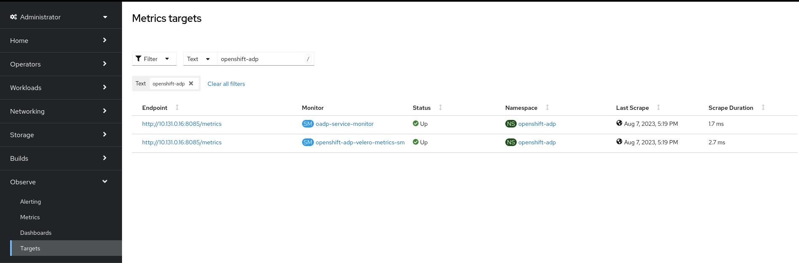

Once that our Service Monitor is created successfully, we can create new alarms. In this case we are going to trigger new alarms when over the last hour we have new:

* Backup failures (`velero_backup_failure_total`).
* Backup deletion failures (`velero_backup_deletion_failure_total`).
* Backups with partial failures (`velero_backup_partial_failure_total`).
* CSI snapshots failures (`velero_csi_snapshot_failure_total`).
* Velero snapshots failures (`velero_volume_snapshot_failure_total`).
* Restore failures (`velero_restore_failed_total`).
* Restores with partial failures (`velero_restore_partial_failure_total`).

```
$ cat << 'EOF' > ~/oadp-alarms.yaml
apiVersion: monitoring.coreos.com/v1
kind: PrometheusRule
metadata:
  name: oadp-backup-failures
  namespace: openshift-adp
spec:
  groups:
  - name: OADP
    rules:
    - alert: OADPBackupFailures
      annotations:
        description: 'OADP had {{$value | humanize}} backup failures over the last hour.'
        summary: 'OADP has issues creating backups'
      expr: |
        increase(velero_backup_failure_total{job="openshift-adp-velero-metrics-svc"}[1h]) > 0
      for: 5m
      labels:
        severity: warning
    - alert: OADPBackupDeletionFailures
      annotations:
        description: 'OADP had {{$value | humanize}} backup deletion failures over the last hour.'
        summary: 'OADP has issues creating backups'
      expr: |
        increase(velero_backup_deletion_failure_total{job="openshift-adp-velero-metrics-svc"}[1h]) > 0
      for: 5m
      labels:
        severity: warning
    - alert: OADPBackupPartialFailures
      annotations:
        description: 'OADP had {{$value | humanize}} backup partial failures over the last hour.'
        summary: 'OADP has issues creating backups'
      expr: |
        increase(velero_backup_partial_failure_total{job="openshift-adp-velero-metrics-svc"}[1h]) > 0
      for: 5m
      labels:
        severity: warning
    - alert: OADPCSISnapshotFailures
      annotations:
        description: 'OADP had {{$value | humanize}} CSI snapshot failures over the last hour.'
        summary: 'OADP has issues creating backups'
      expr: |
        increase(velero_csi_snapshot_failure_total{job="openshift-adp-velero-metrics-svc"}[1h]) > 0
      for: 5m
      labels:
        severity: warning
    - alert: OADPVolumeSnapshotFailures
      annotations:
        description: 'OADP had {{$value | humanize}} volume snapshot failures over the last hour.'
        summary: 'OADP has issues creating backups'
      expr: |
        increase(velero_volume_snapshot_failure_total{job="openshift-adp-velero-metrics-svc"}[1h]) > 0
      for: 5m
      labels:
        severity: warning
    - alert: OADPRestoreFailures
      annotations:
        description: 'OADP had {{$value | humanize}} restore failures over the last hour.'
        summary: 'OADP has issues creating restores'
      expr: |
        increase(velero_restore_failed_total{job="openshift-adp-velero-metrics-svc"}[1h]) > 0
      for: 5m
      labels:
        severity: warning
    - alert: OADPRestorePartialFailures
      annotations:
        description: 'OADP had {{$value | humanize}} restore partial failures over the last hour.'
        summary: 'OADP has issues creating restores'
      expr: |
        increase(velero_restore_partial_failure_total{job="openshift-adp-velero-metrics-svc"}[1h]) > 0
      for: 5m
      labels:
        severity: warning
EOF
$ oc create -f ~/oadp-alarms.yaml
```

Finally, we can see our alarms in the OpenShift Console:

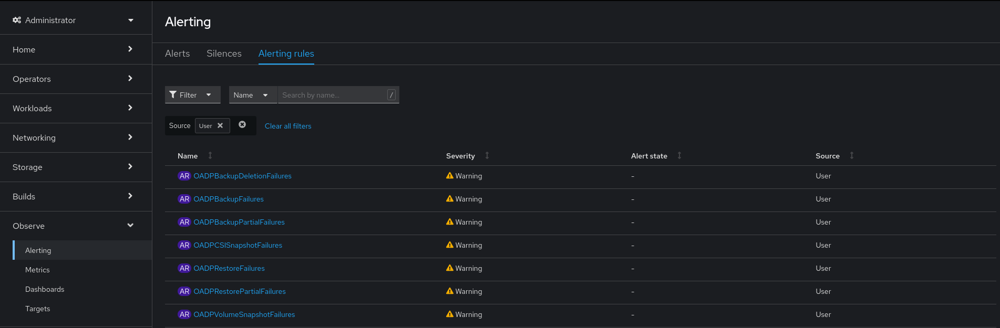
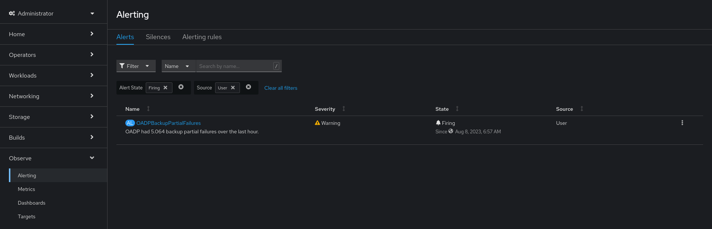

The full list of alarms can be found at the [OADP upstream documentation](https://github.com/openshift/oadp-operator/blob/master/docs/oadp_monitoring.md#metrics). At the time of writing, this is the full list of metrics available:

|            **Metric Name**              |                           **Description**                           | **Type**  |
|:---------------------------------------:|:-------------------------------------------------------------------:|:---------:|
| kopia_content_cache_hit_bytes           | Number of bytes retrieved from the cache                            | Counter   |
| kopia_content_cache_hit_count           | Number of time content was retrieved from the cache                 | Counter   |
| kopia_content_cache_malformed           | Number of times malformed content was read from the cache           | Counter   |
| kopia_content_cache_miss_count          | Number of time content was not found in the cache and fetched       | Counter   |
| kopia_content_cache_missed_bytes        | Number of bytes retrieved from the underlying storage               | Counter   |
| kopia_content_cache_miss_error_count    | Number of time content could not be found in the underlying storage | Counter   |
| kopia_content_cache_store_error_count   | Number of time content could not be saved in the cache              | Counter   |
| kopia_content_get_bytes                 | Number of bytes retrieved using GetContent                          | Counter   |
| kopia_content_get_count                 | Number of time GetContent() was called                              | Counter   |
| kopia_content_get_error_count           | Number of time GetContent() was called and the result was an error  | Counter   |
| kopia_content_get_not_found_count       | Number of time GetContent() was called and the result was not found | Counter   |
| kopia_content_write_bytes               | Number of bytes passed to WriteContent()                            | Counter   |
| kopia_content_write_count               | Number of time WriteContent() was called                            | Counter   |
| velero_backup_attempt_total             | Total number of attempted backups                                   | Counter   |
| velero_backup_deletion_attempt_total    | Total number of attempted backup deletions                          | Counter   |
| velero_backup_deletion_failure_total    | Total number of failed backup deletions                             | Counter   |
| velero_backup_deletion_success_total    | Total number of successful backup deletions                         | Counter   |
| velero_backup_duration_seconds          | Time taken to complete backup, in seconds                           | Histogram |
| velero_backup_failure_total             | Total number of failed backups                                      | Counter   |
| velero_backup_items_errors              | Total number of errors encountered during backup                    | Gauge     |
| velero_backup_items_total               | Total number of items backed up                                     | Gauge     |
| velero_backup_last_status               | Last status of the backup. A value of 1 is success, 0               | Gauge     |
| velero_backup_last_successful_timestamp | Last time a backup ran successfully, Unix timestamp in seconds      | Gauge     |
| velero_backup_partial_failure_total     | Total number of partially failed backups                            | Counter   |
| velero_backup_success_total             | Total number of successful backups                                  | Counter   |
| velero_backup_tarball_size_bytes        | Size, in bytes, of a backup                                         | Gauge     |
| velero_backup_total                     | Current number of existent backups                                  | Gauge     |
| velero_backup_validation_failure_total  | Total number of validation failed backups                           | Counter   |
| velero_backup_warning_total             | Total number of warned backups                                      | Counter   |
| velero_csi_snapshot_attempt_total       | Total number of CSI attempted volume snapshots                      | Counter   |
| velero_csi_snapshot_failure_total       | Total number of CSI failed volume snapshots                         | Counter   |
| velero_csi_snapshot_success_total       | Total number of CSI successful volume snapshots                     | Counter   |
| velero_restore_attempt_total            | Total number of attempted restores                                  | Counter   |
| velero_restore_failed_total             | Total number of failed restores                                     | Counter   |
| velero_restore_partial_failure_total    | Total number of partially failed restores                           | Counter   |
| velero_restore_success_total            | Total number of successful restores                                 | Counter   |
| velero_restore_total                    | Current number of existent restores                                 | Gauge     |
| velero_restore_validation_failed_total  | Total number of failed restores failing validations                 | Counter   |
| velero_volume_snapshot_attempt_total    | Total number of attempted volume snapshots                          | Counter   |
| velero_volume_snapshot_failure_total    | Total number of failed volume snapshots                             | Counter   |
| velero_volume_snapshot_success_total    | Total number of successful volume snapshots                         | Counter   |

Besides monitoring backup and restores in the OpenShift Monitoring dashboards, we can check the status of our backups using the following commands and tools:

* Checking backup status:

```
$ alias velero='oc -n openshift-adp exec deployment/velero -c velero -it -- ./velero'
$ velero backup get
$ oc -n openshift-adp get backup <backup_name> -o jsonpath='{.status.phase}'
$ oc -n openshift-adp get backup <backup_name> -o jsonpath='{.status}' | jq
```

* Checking the progress of Data Mover `VolumeSnapshotBackup` (VSB) resources:

```
$ oc get vsb -n <app-ns>
$ oc get vsb <vsb-name> -n <app-ns> -o jsonpath="{.status.phase}`
```

* Checking restore status:

```
$ velero restore get
$ oc -n openshift-adp get restore <restore_name> -o jsonpath='{.status.phase}'
$ oc -n openshift-adp get restore <restore_name> -o jsonpath='{.status}' | jq
```

* Checking the progress of Data Mover `VolumeSnapshotRestore` (VSR) resources:

```
$ oc get vsr -n <app-ns>
$ oc get vsr <vsr-name> -n <app-ns> -o jsonpath="{.status.phase}
```
